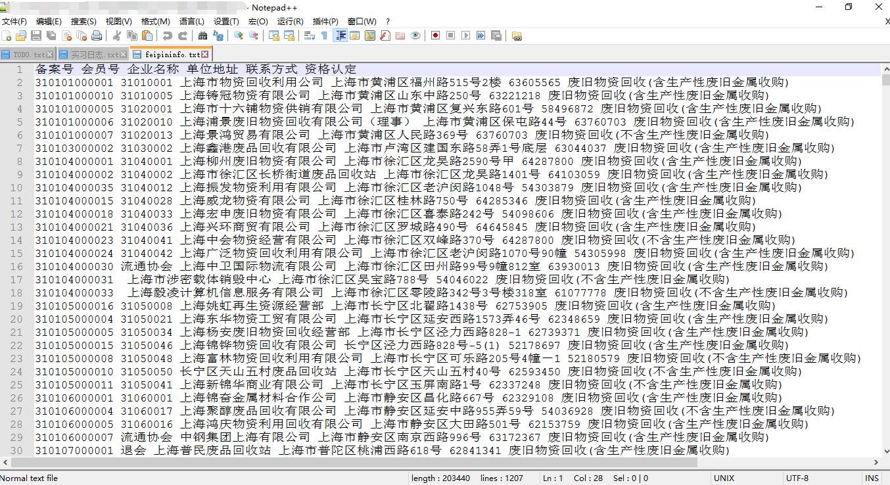

### 前言

一个月前的一次信息抓取，数据不多，信息是上海市的废品回收站。没什么可说的。代码也简单，不过问题还是在代码上。最开始用R，因为rvest包提取表格的效果很好。后来还是不行，就只有用python了。
	



```R
library(rvest)
library(xml2)

makeUrl <- function(i) {
  urllist = list()
  parturl <- "http://www.sh-recycle.org/hyshow.asp?id="
  initurl <- paste(parturl,i,sep = '')
}
webcontent = list()
Origin_InfoData = data.frame("详细"=c("备 案 号", "会 员 号" ,"企业名称" ,"单位地址" ,"联系电话", "资质认定"))

for (i in 1:1518)
{
  webcontent <- read_html(makeUrl(i))
  temp_Table <- webcontent %>% html_table(fill = TRUE)
  if(length(temp_Table)==0){
    print(paste("企业不存在,ID:",i))
  }else{
    temp_InfoData <- data.frame(temp_Table[9][])
    names(temp_InfoData) <- c("详细", i)
    Origin_InfoData <- merge(Origin_InfoData,temp_InfoData,by = "详细")
  }
}

head(Origin_InfoData)
```

代码很简单，但是就是300条之后就不行了，报错不明显，查也查不到。怎么解决也解决不了，十分懊恼。最后直接去看那个ID的信息发现，在这个网站上的内容条目调换了，虽然都是这几样，但是新增了一个属性，并且把顺序改了。因此导致R的数据框合并不了。最后用python获取到。顺便吐槽这个网站的结构真差，全是table,tr,td嵌套。而且嵌套之深深似海。


```python
# -*- coding: UTF-8 -*-
import requests
from bs4 import BeautifulSoup

for i in range(1,1518):   #,1518):
	try:
		url = "http://www.sh-recycle.org/hyshow.asp?id="+str(i)
		html_text = requests.get(url).text
		# print html_text
		soup = BeautifulSoup(html_text, 'lxml')
		infotable = soup.findAll('table')[8]
		info = infotable.findAll('td')
		with open('./ssssss.txt','a') as f:
			for i in info:
				f.write(i.text.encode('utf-8')+"/")
			f.write('\n')

	except Exception as e:
		pass
	finally:
		pass			
```
清洗
`< shanghaiss.txt | awk -F "/" '{for (i=1;i<=NF;i+=2)printf $i "/" ;printf"\n"}'`


### 最后
不得不说异步之厉害。Node.js + Request抓拉勾，分分钟被禁。而且测了一下移动端，5300多条数据好像1秒还是2秒的样子就到手了。最后的最后，不要用公司的网去爬东西。╮(╯▽╰)╭再也不能肆无忌惮了。定个小目标，看看Python下的异步写法。-_-
