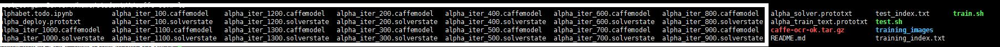

> 一直关注Video++这家公司。自从看到了在招OCR算法工程师，并负责评估TK1上的产品化。恰好毕业设计在做Tk1上的文本识别(算是体会到水了)，就勉强写一下吧。我感觉这个做出来的东西肯定不太便宜，个人不一定玩的起。

> 如我所理解，机器学习只是数据挖掘的一种方法，而数据挖掘最终目的也是在某一个领域内或者多个领域内进行迁移，得到相应的解决方法。因此在在做Robocup 3d simulation 的时候就有意识的往上面应用一些方法，当然我最大的心愿就是Use ML With Penetration. 相信未来安全领域和AI领域以及各种机器人一定一片沃土。


首先：拆掉风扇，风扇这个东西吧，噪音太大，必须拆掉。因为热的并不是很大到不可接受。

两种方案

* A: Tesseract

> 
 [Tesseract.js](http://tesseract.projectnaptha.com/) + [gpu.js](http://gpu.rocks/)

> Tesseract是一款众所周知的开源OCR，但是Tesseract.js可能知道的就不多了，但是他的github的star数比Tesseract多了不少吧。纯浏览器端加载，也可以npm导入作为后端调用。使用简单，效率不凡。由于提到了说要利用GPU的计算能力，初步以为使用gpu.js重写数据结构和计算部分。


* B: DeepLearning with [Caffe](http://caffe.berkeleyvision.org/)

>  这个思路简单，类似交叉编译。就是在自己的机器上把模型训练好，<font color="green">安装GPU模式的caffe到Jeston Tk1 </font>, 然后写代码<font color="green">调用训练好模型</font>处理现在的数据进行OCR即可。

>> 
* 问题1: Jeston Tk1上的caffe安装耗时耗利，且cudnn的版本会导致不能启用GPU模式。
解决方案: docker 部署，直接pull下来docker hub上封装好的GPU模式的caffe。这样对产品化，量产有了一定的保障。但其实Tk1的刷机也比较麻烦，对网络环境的要求是自由的，安装过程中，出现依赖有时候还需要手动安装。

>> 
* 问题2：Jeston Tk1上的docker安装(docker.io ,docker-engine)，docker安装成功之后daemon进程无法启动，始终无法启动。
解决方案:未知，issued(目前由于信息不完善被关闭了，等在这边安定之后，try again)

>> 
* 问题3：汉字不同英文，需要收集的数据集太大。而且数据有需要精准标注，耗费人力物力巨大。且由于不同的书法体，楷体，行楷，隶书等"规矩"的字体还好说，但是向草书，笔走龙蛇之势，普通人都难以辨别，尚需书法家，何况机器。
解决: 未知，不过这个属于算法部分。

最后的最后， 回家三天停电两天，不得不服。另相遇海知，十分开心。

综上:不敢妄下断言。可行度大概七八成。但是考虑到部署和板子本身的成本问题批量生产其实并不乐观。一块板子一千六左右。

<font color="red">update 2016/12/12:</font>

从github上跑的一个[caffe-ocr](https://github.com/pannous/caffe-ocr)，其中会有一部分是不存在的文件，只要删除掉，基本就行了。
可行性还是很高的。印刷体的话基本上是没什么挑战性的。中文的有一个数据集 CAISA-HWDB。来上海的这些天，突然觉得上海的消费水平，相对于这里的生活水平其实这个板子也是便宜的可以了。

```bash
#delete TimesNewRoman-10-4.png TimesNewRoman-10-3.png imesNewRoman-10-1.png TimesNewRoman-10-5.png TimesNewRoman-10-2 TimesNewRoman-6-1.png
$   sed -i '/TimesNewRoman-10-5.png/d' `ls | grep _index`
$ 	sed -i 's/GPU/CPU/g' alpha_solver.prototxt 	#我的是CPU模式的，看你自己的情况
$   caffe train -solver alpha_solver.prototxt
```
 

other: Docker说是不支持armhf的，所以如果安装caffe的话还是需要手动安装。
但是不一定局限于caffe，可以安装Tensorflow，Theano.
