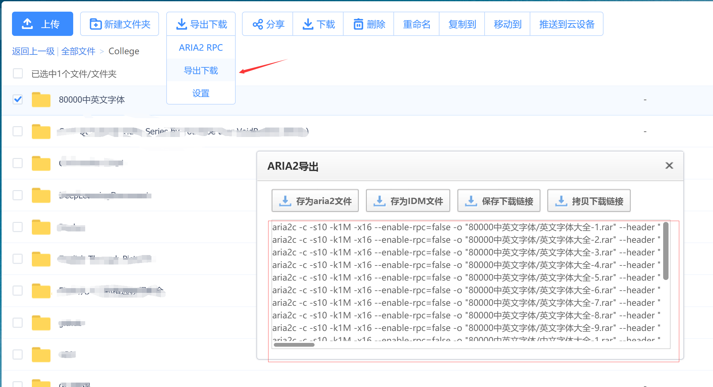
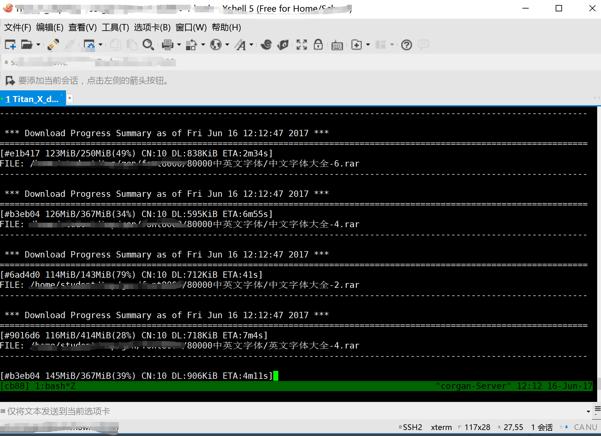

####前言: 都是套路
你一定也是烦的不行不行的，下载百度云限速不说，还不能在linux服务器上搞，下面就介绍下如何在Linux服务器上下载文件，并能突破速度限制。


* [客户端bypy](https://github.com/houtianze/bypy)
* [链接导出助手](https://github.com/acgotaku/BaiduExporter)

出于简便我选择了链接导出，下载下来之后加载插件到`chrome`，然后导出链接并使用`aira2c`下载。 aria2c还有web管理界面，使用起来更方便。而且其中一个是`pyspider`的作者开发的，`binux`简直太厉害了。

* step1:


* step2


 
*step3 



step1,2,3略显白痴，小技巧就是拿到链接放在aria2c时批量下载记得在每个下载后面加`&`。

```bash
#下载磁力链接
$ aria2c "magnet:?xt=urn:btih:dhsudfhisudhfuidshfisdhfiusdhfsdhiufh&dn=aria2"

#打印种子内的内容
$ aria2c -S file.torrent

#使用代理
$ aria2c --all-proxy='http://127.0.0.1:8080' http://host/file

#下载完成后执行某条命令。
$ aria2c --on-download-complete=COMMAND http://example.org/file.iso
```

其实`aria2c`有许多高级的玩法，比`wget`快的多，多线程，可以直接解析磁力链和种子。可以根据官网的信息接着玩。有空接着补。


#### Resources
* [Aria2c](https://aria2.github.io/)
* [Aria2c使用举例](http://sydi.org/posts/linux/aria2c-usage-sample-cns.html)