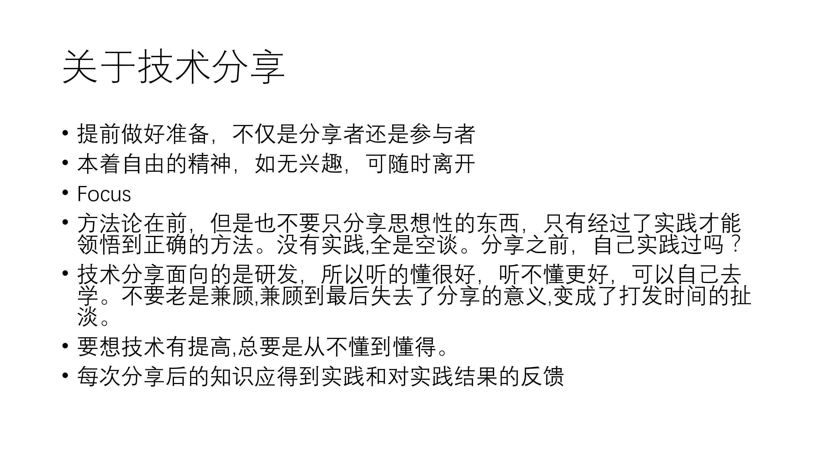

#### 前言：

本文[无干货](../assets/ml_training.pptx)，吐槽加扯淡。

到公司后开始组织技术分享也有一段时间了。本着好意，本着分享，想去提高大家的水平。于是呢，就在上周四，我去给公司一干同事讲了一节课机器学习。题目是上上周四定的，准备了4，5天希望能够尽可能的通俗的基础的去引起他们的兴趣，希望带他们入门。然而事情怎么可能像想象的那么样顺利呢？然后我才明白了任何看起来正常的事情背后需要付出多大的努力。

在之前的公司里，搞搞技术分享很正常，大家也很乐意，会在一定时间内集中精神讲完，都很上进。在这里，一万个不乐意，玩手机的玩手机，假寐的假寐，
真是操蛋。

#### 正文：

**[消耗]**：
5天，完整2天时间，3天每天3小时以上。

> 两个数据集:

* Mnist 
* SMS  

> 三种算法:

* KNN
* SVM
* Naive Bayes

> 两种实现:

* Scikit-Learn
* Tensorflow

> 其他

* 注册了一个域名
* 部署了聊天室作为课前后讨论
* 部署了Jupyter给他们用，运行在线示例
* 打印资料，提前4天提供。

我准备的是两个示例，`mnist`手写数据集识别和`SMS`垃圾文本分类。用的算法也是最简单的，`KNN/SVM`(Mnist),NaiveBayes(SMS text),分别实现了`tensorflow`版本和`scikit-learn`两个版本。主要讲的两个算法是`KNN`和`Bayes`。

**[收获]**：
>
* 加深了对这些概念和算法的掌握，说明和别人讲东西，的确会提高自己的认知。
* 应该得罪了几个人，不过我根本不在乎。如果认知在一个层次的话，就不会这样了。
* 做了大学到现在最长的一次PPT，知道自己很傻逼很浅
* 要成大事，还需要努力努力再努力

#### 后记：

后来，讲完之后，大家还讨论了一下这个技术分享的事情。最后呢。

* 见贤思齐焉，见不贤而内自省也。
> 你心里就没有B数吗？自己就这jb水平，都不能上进些？

* 大家的水平真是参差不齐(一同事说考虑到这多同事的水平)
> 我不是讽刺谁，在座的水平都是垃圾。
>>要是吹牛逼有用，那你们的水平真是比我高多了。

PS：突然发现上面有歧义，以上的一级引用意指这句话可不可这以理解？顺便加上逗比的文字表情包。并没有讽刺谁。为了讽刺谁就没有意义了。只是为了自省。(update 09.20)

* 第二天早上老板说，这效果不好，感觉大家没入门。
> 难道要我喂不成，什么都不看，分享时也不听。能入P的门，何况这本身也不是你一节课就能入得门。我自己学了那么久，也没敢说自己入门。
>> 我把PPT丢给学弟，学弟都能感到这是在是一个入门级别的东西。所以，是我讲的不够简单，还是学弟太聪明？
>> 前两次扯一个异常与错误处理都能吹2个半小时牛逼，扯到天南地北的。

* 我实在不明白为什么有的人什么都不会又tm不想提高自己，不愿意接触不会的知识。
> 想有什么用(海知时杨老师给我讲的，鉴于杨老师的特质，时刻提醒自己)

* 现在看来我们实验室出来的，水平都还是可以的，起码代表了我们学校计算机学院的水平。希望学弟能拿到腾讯的offer，也给我涨涨脸。

做人啊，好难。敬，自由。
