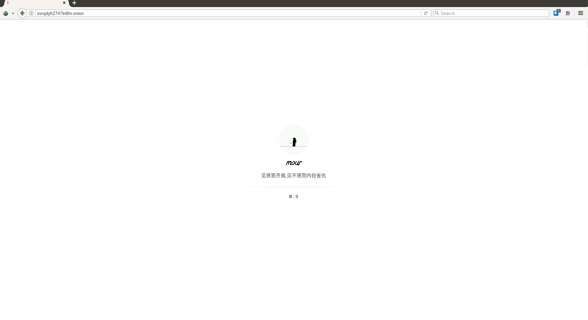

# 前言

Tor上的博客关掉了.为什么拿这个放在最前面呢,是想要表示,怎么样才能匿名的在网络上存在下去,当然当我发出这篇文章的时候,我就不再是匿名的了.就像那谁说的,当你观测一个物体时,他会因为你的观测而改变.我知道自己知道的越来越少.自己的水平几斤几两,心里还是有点B数的.然而思考良久,还是打算记录下来.所以,仅以此文将本人对互联网隐私和思考记录于此.

# 那些消失前的数据

大概有哪些数据呢,被运营商记录的数据,被各大厂商记录下的数据,例如有邮件纪录,流量纪录.设备信息等等等.对于最原始的互联网捡垃圾来说,一个好的目标选择或许就能获利不少.就ES而言.批量侦测回来的数据有大概有以下内容,在上一次侦测之前不乏有一些大公司的数据在里面.

* 淘宝的顾客住址电话信息(已经消失...)
* 门禁卡数据(住址,用户信息,门禁卡信息)
* 住址电话信息(住址和电话的信息)
* 社工库数据(若干社工库的集合,密码邮箱,以及个人详细信息(国外))
* wifi密码数据(具有地理位置标识别的wifi数据)
* 姓名和身份证(征信数据,历史遗留)
* 政企申报公司数据(公司和申报人信息)
* 学校报名信息,班级课程及学生信息
* 若干公司的程序打的log,还挺用用,还有一家是什么云平台

虽然ES通常只是用来进行分析聚合后的日志,但是很多公司都拿ES作为数据库来存储产品数据,方便后台直接去读.相信在去年的ES集群勒索事件之后,很长的一段时间之内,公网暴露的ES数量骤减,然后随着时间的逐渐推移,这些无密码暴露公网的隐患又被人(新人)忘掉了,于是不可避免的在公网上又出现了许多.这也从侧面说明了,安全这个东西,必须要一直提醒我们不可松懈.毕竟安全无小事,一旦出现问题,损失几乎都是不可挽回的.就拿上面的例子来说,当这些量足够大的时候,基于这些信息你甚至可以知道某某某住在哪里,电话什么,门禁卡的密码,小孩在哪上学,老师,老师住在哪里...在哪些店上过网.现在在哪个位置.聚合成图谱展开之后,所有信息一览无余.当然这个有的部分数据集并没有这么多,但是毫无疑问的是,这些并不是幻想,而是可行的,并且可能真实存在的!

# 防数据泄露应该做哪些事情

 数据流加密处理 和权限分级控制是我能想到对DLP所做的最根本的事情了,无论是威胁建模中的STRIDE解决方法还是攻击树的模型.只有控制好了权限的分级,并在分级的数据传输中做好数据加密处理,才能防止数据泄露.当然对应到网络层,对应到软件文档的指纹来说,又有着不同的检测方式,然而这个时候其实已经算是在减缓攻击了(内部数据的泄露无论是来自内鬼还是来自外部入侵都应该算作攻击的一部分).但也还是属于DLP的一环.

Hack入侵是In, DLP泄露是Out.无论是In/Out,这些检测技术起来很大程度上都是一样的.本质都是相同的.在入侵检测时的样本特征用来识别恶意的请求,DLP传输数据时也可以用来标示关键数据.最简单的检测DGA,在入侵时可以,在泄露时也可以.这本身都处于同一个安全生命周期之中.只要把控好In/Out这个两个端点,就能做好安全保护措施,当然细分起来,可能还要到每个DMZ,每个设备上的In/Out.

# 思考以及还有哪些可以做的事情

* 通用检测框架到底是否可行?
> 按照数据维度和设备类型联动各层数据,以流式形式,分层控制分析.将获取到的不同数据汇集到一起,采用不同的方式进行检测,检测模型也是分层,插件化形式分层.分别采用传统的规则识别,黑白名单,以及机器学习,时间序列分析(不懂)等方法进行测试.

- [ ] 保护自己的隐私
> 是否还有隐私可言?
> 是不是我们知道了所有的逻辑谬误就能做出正确的选择,孩子,每个陷入逻辑谬误的人都以为自己做出了正确的选择.不要被所谓的正确懵逼了双眼,丧失了自己的选择.(来自今天的阅后即瞎.)

- [ ] 利用机器学习或者深度学习来发现感兴趣的数据(当然直接匹配也是可以的)
> 用在DLP中就是有益的,用在攻击者就是自动发现互联网上的敏感数据.
> 文本自动摘要