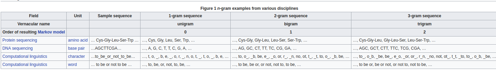
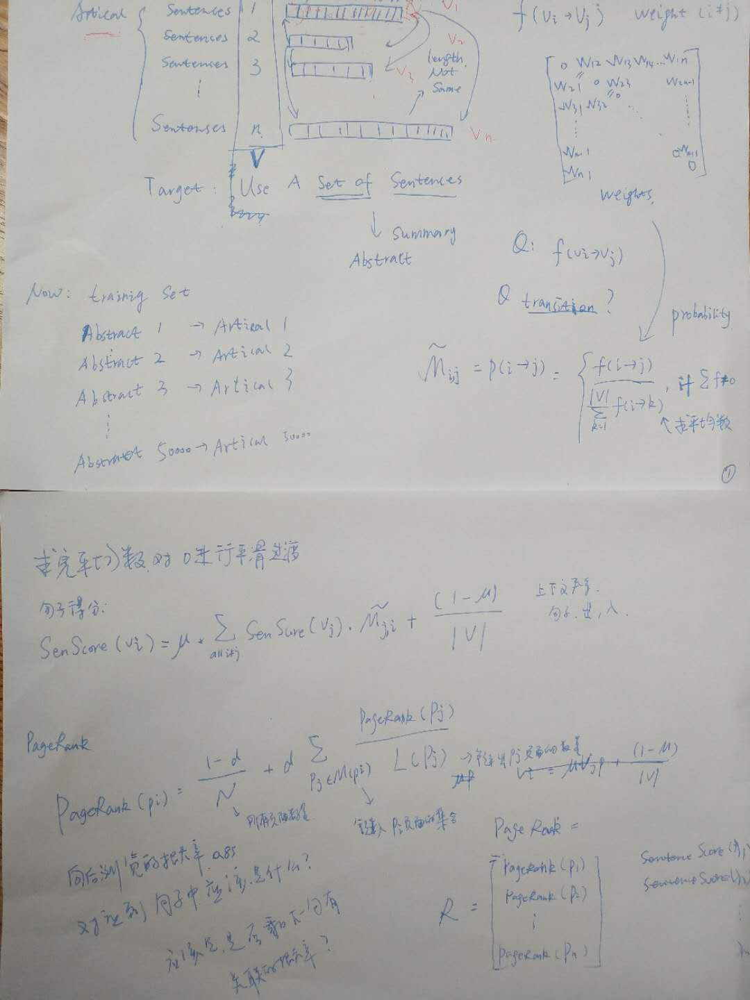

# 前言

这篇文章主要从实战角度讲述怎么从文本生成摘要。其实就是完全不会，调库的话也能实现，但是这样就只能完全依赖于第三方库的实现，无法自己进行调优。所谓"What I cannot create, I do not understand",还是有很有必要了解一下的。限于本人水平，文章比较浅显。

# Survey Of Text Summarization

主要有两种方式(本文主要讨论的是抽取式的)，一是生成式(abstractive)，一是抽取式(extractive),抽取式就是直接把原文中重要(重不重要就看你来判断了)的句子作为文本的摘要。生成式就比较厉害了，经过转述，替换，缩写等技术来生成出文本的摘要。抽取式的比较成熟，但也有一些问题存在，比如说抽取的句子时有的句子会远远长于平均长度的句子，有的具有上下文的无法被提取出相关信息。还些辩论式(观点对立)的信息无法很好抽取。[抽取式的文本摘要](https://pdfs.semanticscholar.org/7e30/d0c7aaaed7fa2d04fc8cc0fd3af8e24ca385.pdf)用到的方法有:

* TF-IDF
* Cluster Based Model
* Graph theoretic approach
* Machine Learning approach
* LSA Method
* An approach to concept-obtained text summarization
* Neural networks 
* Automatic text summarization based on fuzzy logic 
* Text summarization using regression for estimating
feature weights 
* Multi-document extractive summarization 
* Query based extractive text summarization
* Multilingual Extractive Text summarization 

此外还有pagerank，textrank都可以用于其中。

# NLP Basics

NLP先撂出来一堆名词吧，有文本分词，标注，训练，关键词提取，命名实体识别，文本分类。这些都是比较基础的，每一种也有不少方法去实现，例如分词就有许多，N-gram,CRF分析，还可以自定义词典分词。大部分的库已经帮你实现了，看看[HanLP](https://github.com/hankcs/HanLP/)的Readme就知道了。下面介绍下TF-IDF,和N-GRAM。


## [TF-IDF](https://en.wikipedia.org/wiki/Tf%E2%80%93idf)

词频-逆文档频率其实很好理解，啥叫逆文档频率呢，就是出现次数少的词权重大，次数大的权重少。首先计算词频，然后计算逆文档频率，然后得到`TF-IDF=TF*IDF` `IDF=log(语料中的文档总数/包含该词的文档数+1)`,在python的[sklearn库中](http://scikit-learn.org/stable/modules/generated/sklearn.feature_extraction.text.TfidfVectorizer.html)中实现就更简单了。

```python
# https://stackoverflow.com/questions/34449127/sklearn-tfidf-transformer-how-to-get-tf-idf-values-of-given-words-in-documen
from sklearn.feature_extraction.text import TfidfVectorizer
import numpy as np
from scipy.sparse.csr import csr_matrix

tf = TfidfVectorizer(input='filename', analyzer='word', ngram_range=(1,6),
                     min_df = 0, stop_words = 'english', sublinear_tf=True)
tfidf_matrix =  tf.fit_transform(corpus)
```

## [N-GRAM](https://en.wikipedia.org/wiki/N-gram)
一图胜千言，直接看下wiki上的示例图就明白了


# Word2vec, Doc2Vec, Sentence2Vec

## [Word Embedding](https://en.wikipedia.org/wiki/Word_embedding)

这个来看下知乎上的解释吧
> word embedding，就是找到一个映射或者函数，生成在一个新的空间上的表达，该表达就是word representation。通俗的翻译可以认为是单词嵌入，就是把X所属空间的单词映射为到Y空间的多维向量，那么该多维向量相当于嵌入到Y所属空间中，一个萝卜一个坑。
作为一个比较重要的知识点，不是一两句介绍的，看参考链接详细学习。

## to vec

* wordtovec 用的两种方法是：skipgram和cbow。 
两者的差别是

> The skipgram model learns to predict a target word thanks to a nearby word. On the other hand, the cbow model predicts the target word according to its context. 

* sentence2vec
```python
def sentence2vec(sentences):
    sentence = [cut_sentence(s) for s in sentences]
    vectorizer = CountVectorizer()
    transformer = TfidfTransformer()
    tfidf = transformer.fit_transform(vectorizer.fit_transform(sentence))
    weight = tfidf.toarray()
    return weight
```
* Also Doc2vec....

# PageRank And TextRank

PageRank很著名，从写爬虫的时候知道的，但是应用到文本摘要还是第一次知道。

## Cosine similarity Or NN

余弦相似性，word or sentences or doc 已经转换成向量了，自然可以用测量向量间的夹角余弦值计算其相似度了。不过在fasttext的使用过程中还发现了可以采用knn去计算其相似性。

## PageRank And TextRank 

因为这次是中文文本摘要，所以采用TextRank的算法库用的是[TextRank4ZH](https://github.com/letiantian/TextRank4ZH)。textrank只是随手测了一下，主要的还是用pagerank,具体的论文暂时没找到先不补充链接了。

```python
# coding: utf-8
# textrank
import json
import re
import os
import sys
import codecs
from textrank4zh import TextRank4Keyword, TextRank4Sentence

trainfilepath = "./train_with_summ.txt"
result = []

def fenju2file(trainfilepath,outputdir):
    """
        Please make sure you dest dir was exists
    """
    count = 1

    with open(trainfilepath,encoding="utf-8") as f:
        for text in f.readlines():
            summarization = json.loads(text)['summarization']
            article = json.loads(text)['article']
            ouputfilepath = outputdir+str(count) 

            with open(ouputfilepath,'w',encoding="utf-8") as o:
                for juhao in re.findall('[\u4e00-\u9fa5].*?[。|！|？]',article):
                    o.writelines(juhao+'\n')
            count = count + 1

    print("PreProcess Done !\n")

def sumary(filename):
    text = codecs.open(filename, 'r', 'utf-8').read()
    tr4w = TextRank4Keyword()

    tr4w.analyze(text=text, lower=True, window=2)

    tr4s = TextRank4Sentence()
    tr4s.analyze(text=text, lower=True, source = 'all_filters')
    for item in tr4s.get_key_sentences(num=1):
        print("TextRank Summarization Is: ",item.sentence)

count = 1
with open(trainfilepath,encoding="utf-8") as f:
    for text in f.readlines():
        summarization = json.loads(text)['summarization']
        article = json.loads(text)['article']
        tmpfilepath = './output/'+str(count) 
        with open(tmpfilepath,'w',encoding="utf-8") as o:
            for juhao in re.findall('[\u4e00-\u9fa5].*?[。|！|？]',article):
                o.writelines(juhao+'\n')
        count = count + 1
        
        print("Origin Summarization : ",summarization)
        sumary(os.path.join('./output/',str(count)))
```

# In Action: FastText

## FastText Basic Useage

安装很简单，只要`make`一下，所有的命令行基本都有python接口

* 训练模型(支持skipgram或者cbow方式,无监督学习,Word Representations)
> 
```bash
fasttext skipgram -input traningText -ouput trainedModel
fasttext cbow -input traningText -ouput trainedModel
```

```python
import fasttext
model = fasttext.skipgram('data.txt', 'model')
model = fasttext.cbow('data.txt', 'model')
```

* 输出向量(输出word vec 或者sentences vec)
> 
```bash
fasttext print-word-vectors trainedModel.bin < yourFile
fasttext print-sentence-vectors trainedModel.bin < yourFile
```

* 文本分类(监督学习)
> 
```bash
fasttext supervised -input train.txt -output model #(train.txt is a text file containing a training sentence per line along with the labels.)
fasttext supervised -input train.txt -output model -label '__label__' #(自定义标签)
fasttext test model.bin test.txt k #(Top k类)
fasttext predict model.bin test.txt k 
fasttext predict-prob model.bin test.txt k  # probability for each label
```


```
Envy➜  data : master ✘ :✭ ᐅ  head amazon_review_polarity.train 
__label__2 , black lawn mower cover , been searching for ever to get suitable cover and this is just perfect . did try making my own cover but was not successful . 
__label__2 , much better than expected , i have to admit i had very low expectations for this product . i couldn ' t really imagine a product ( short of a needle and thread ) that would fix a piece of fabric for under $10 . but , this kit did a pretty good job . it basically consists of some glue-type stuff that you spread in the hole and then you pour fabric shavings on top to blend it in . the kit comes with a bunch of different colors that you can mix to match the color of your fabric this being the trickiest part of the process . i happen to have dark charcoal colored seats , so the mix was pretty easy black and a little white . the finished product looks pretty good , not perfect , but really good for a $10 fix . 
__label__1 , don ' t blame lucasfilm . . , it bothers me how many star wars fans bash george lucas and lucasfilm for continually releasing the star wars movies in ' new ' editions . star wars is a franchise , and the films are a product . if you are stupid enough to buy these films over and over again , then do not complain if they try to sell you the same films every 2 years . you are creating demand for an old product . 
__label__1 , miata mx5 covercraft cover , the quality was fine however , it did not fit the seats as stated . it bulged in areas and unable to stretch enough to reach around the lower part of the seat . 
```

## FastText Pybinding

不要`pip install fasttext`(这个是想当然安装了，而且还需要预先安装`Cython`,需要`pip install Cython`), 而且pip install的无法load fasttext 训练出来的模型文件(modle.bin),需要从源码安装,在fasttext的文件夹下`pip install .`(才发现官网有指南)

```python

from  fastText import load_model
def sen2vec_by_fasttext(sentences,model=load_model('./oh_no.bin')):
    """
    Args:
        sentences: A list of sentence from a document
        model:  Pre-Traning with fastText
    """
    senvecs = []
    for _ in sentences:
         senvecs.append(model.get_sentence_vector(_))
    senvecs = np.array(senvecs)
    return senvecs

```

# Rouge And Automatic Evaluation of Summaries 

Rouge是一种用来评估自动摘要，评估方法不涉及，具体原理不讨论，附有了论文链接。用perl编写，除了安装不好安装，其他还好。
> `cpan install XML::DOM`
> `export ROUGE_EVAL_HOME=/usr/local/ROUGE-1.5.4/data`
安装之后，运行下test文件，然后安装python binding `pip install pyrouge`
将生成的摘要和原摘要写到对应的指定文件中，然后用写测试代码。

```python
# coding:utf-8
from pyrouge import Rouge155
r = Rouge155('/home/angela/ROUGE')
r.system_dir = '../docs/system'
r.model_dir = '../docs/gold'
r.system_filename_pattern = 'system.(\d+).txt'
r.model_filename_pattern = 'gold.[A-Z].#ID#.txt'
output = r.convert_and_evaluate()
output_dict = r.output_to_dict(output)
```

# Other: 

* Show your GPU memory info
> `nvidia-smi -l 1` 每1秒输出一次显示信息。

* gensim 很好用

* How to implement a project of paper


# References
* [Text Summarization Techniques: A Brief Survey](https://arxiv.org/pdf/1707.02268.pdf)
* [A Survey of Text Summarization Extractive Techniques ](https://pdfs.semanticscholar.org/7e30/d0c7aaaed7fa2d04fc8cc0fd3af8e24ca385.pdf)
* [文本摘要自动生成综述](https://juejin.im/post/5a2e1840f265da43062ab69f)
(https://pdfs.semanticscholar.org/7e30/d0c7aaaed7fa2d04fc8cc0fd3af8e24ca385.pdf)
* [fasttext](https://github.com/facebookresearch/fastText)
* [fasttext python library document](https://pypi.python.org/pypi/fasttext)
* [fasttext Word representations](https://fasttext.cc/docs/en/unsupervised-tutorial.html)
* [Bag of Tricks for Efficient Text Classification](https://arxiv.org/pdf/1607.01759v2.pdf)
* [Enriching Word Vectors with Subword Information](https://arxiv.org/pdf/1607.04606v1.pdf)
* [抽取式文档摘要方法（一）](https://blog.csdn.net/qq_32458499/article/details/78659372)
* [抽取式文档摘要方法（二）](https://blog.csdn.net/qq_32458499/article/details/78664199)
* [All Our N-gram are Belong to You](https://research.googleblog.com/2006/08/all-our-n-gram-are-belong-to-you.html)
* [Python自然语言处理](https://www.amazon.cn/dp/B00L7IV7C4)
* [有谁可以解释下word embedding? 知乎](https://www.zhihu.com/question/32275069)
* [Vector Representations of Words](https://www.tensorflow.org/tutorials/word2vec)
* [Get Sentences vec from word2vec](https://stackoverflow.com/questions/29760935/how-to-get-vector-for-a-sentence-from-the-word2vec-of-tokens-in-sentence)
* [ROUGE: A Package for Automatic Evaluation of Summaries](http://www.aclweb.org/anthology/W04-1013)
