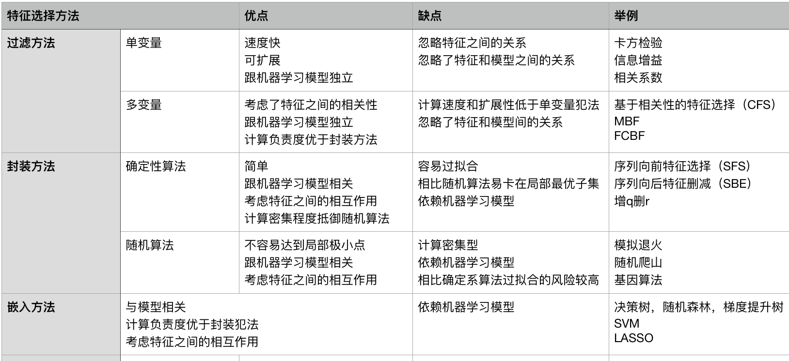

# 前言

这篇笔记来自书本《美团机器学习实践》第二章的阅读，拖延到现在整理出来。学习特征工程的时候，大多数直接看到的都是各种方法和对应的实现，上篇在这里[sklearn和特征工程](https://github.com/mylamour/blog/issues/23)。而对于各种方法在什么场景的适用，却没有明确描述。而这本书恰恰弥补了这一缺憾。当然，美团的技术博客上也有介绍: [机器学习中的数据清洗与特征处理综述](https://tech.meituan.com/machinelearning_data_feature_process.html)

# 数据分析与特征抽取

首先要知道手里拿到的这份数据是什么类型的，数据有很多类型，数值类型，离散类型，还有文本，图像视频等等。这些数据是要进行向量化的，进行向量化之后怎么利用专业性的知识，将其中隐藏的规律给找出来，表现出来尤为重要。这里面包含了两个步骤，一个是数据分析，一个是特征抽取。数据分析主要是确定哪些因素与预测目标有关，特征抽取则是主要从哪这些信息中抽取出相关因素，并用数值变量去表示。

文中提到的探索性数据分析，可以帮助我们在对数据信息没有足够的先验知识，也不知道该利用什么方式去分析的情况下，通过可视化去发现数据的模式和特点。

探索性数据分析主要包含两种技术，一种是可视化技术，另一类是定量技术。可视化技术主要是各种图，箱型图，直方图，多变量图，散点图，茎叶图，平行坐标，让步比，多维尺度分析，目标投影分析，主成成分分析，降维，非线性降维等。定量技术主要包括的是均值，方差，峰度，分位数，偏度等。

下面是列出针对不同的特征的分析方式有哪些。

# 数据特征与特征处理

## 数值特征

数值类型的数据可以直接作为输入，但是不意味着不需要进行特征工程。

通常情况下，对数值类型进行适当的数值变化能带来不错的效果提升。对于数值特征主要考虑的是大小和分布。 目标变量为输入特制的光滑函数的模型，如线性回归，逻辑回归等对输入特征的大小比较敏感。因此，此时有必要对输入进行**归一化**, 如果不敏感，则不需要进行归一化。 如果模型对输入特征和目标变量有一些隐式或者显式的假设，则数据分布对模型很重要。例如线性回归通常使用平方损失函数，其等价于预测误差服从高斯分布。

下面是针对数值特征常见的处理方式有以下8种: 截断，二值化，分桶(可以看做对数值变量的离散化)，缩放，缺失值处理， 特征交叉，非线性编码，行统计量

| 数值特征处理方式 | 说明                                                                                | 备注                                                                      |
|------------------|-------------------------------------------------------------------------------------|---------------------------------------------------------------------------|
| 截断             | 对于连续型的数据，有时候太多的精度可能只是噪声                                      |                                                                           |
| 二值化           | 计数特征要考虑是保留原始计数还是转换为二值标识是否存在                              | 比如说点击，播放次数，访问量，评论数等                                    |
| 分桶             | 一种对特征的抽样方法，可以看做对数值变量的离散化                                    | 比如说，将a,b,c三个特征看做一类，d,e,f看做另一类                          |
| 缩放             | 将数值变量缩放到一个确定范围                                                        | 标准化缩放，平方根缩放，对数缩放，基于某种范数的归一化等                  |
| 缺失值处理       | 大多数模型不能处理特征缺失的情况，缺失特征则会影响效果                              | 补值(均值，中位数)，忽略，用模型预测缺失值再去设置                        |
| 特征交叉         | 用来表示特征之间的相互作用，例如+-x➗，可以在线性 模型中引入非线性性质，提升表达能力 | FM/FFM可以自动进行特征交叉组合                                            |
| 非线性编码       | 采用非线性编码用于提升线性模型的效果                                                | 比如使用多项式核，高斯核等，或者采用随机森林的叶节点进行 编码喂给线性模型 |
| 行统计量         | 对向量进行一些简单的统计                                                            | 比如说空值个数，正负值个数，均值，方差等                                  |

## 类别特征

类别的数值是表示并没有数学意义，是定性数据，也无法进行数学运算。

| 类别特征                        | 说明                                           | 备注                                                                                                                   |
|---------------------------------|------------------------------------------------|------------------------------------------------------------------------------------------------------------------------|
| 自然数编码                      | 每类给一个编号                                 | 训练多个模型融合可以进一步提升模型的效果                                                                               |
| 独热编码                        | 每个特征值对应一维特征                         |                                                                                                                        |
| 分层编码                        | 不同位数进行分层，然后按层次进行自然数编码     | 这个我也不是很明白什么意思，举例是邮政编码和身份证号                                                                   |
| 散列编码                        | 选用不同的散列函数，利用融合的方式提升模型效果 | 对于取值特别多的类别，独热编码得到的特征矩阵非常稀疏 自然数编码和分层编码可以看做散列编码的特例                        |
| 计数编码                        | 类别特征对应的计数                             | 对异常值较为敏感，特征取值也有可能冲突                                                                                 |
| 计数排名编码                    | 计数的排名对类别特征进行编码                   | 对异常值不敏感，类别特征取值不会冲突                                                                                   |
| 目标编码                        | 基于目标变量对类别特征进行编码                 | 比如利用历史数据预测未来结果，采用基于时间信息划分训 练集和验证集，利用相同时间窗口大小的历史数据对类别特 征进行编码。 |
| 类别特征之间 交叉组合           | 类别之间交叉产生新的类别                       |                                                                                                                        |
| 类别特征和数值 特征之间交叉组合 | 类别之间交叉产生新的类别                       | 强依赖专家知识                                                                                                         |

以上两种是机器学习中可谓最常见的两类特征，但是除此之外还是有一些其他的特征，比如说时间特征，空间特征，文本特征等等。

| 数据特征 | 处理方式                                                          | 说明                                                                          | 备注 |
|----------|-------------------------------------------------------------------|-------------------------------------------------------------------------------|------|
| 时间特征 | 单个时间变量可以直接作为类别变量处理 时间序列采用滑动窗口统计特征 | 时间序列不仅包含一维变量，还包含其他变量，比如，天气 温度，降雨量，订单数等。 |      |
| 空间特征 | 经纬度可以转换为数值变量，也可以做散列，距离的计算就更多了        |                                                                               |      |

## 文本特征

这个就涉及到NLP领域的一些知识了，建议自行了解一下。文本特征旺旺产生特别稀疏的特征矩阵。在预处理的过程中可能用到一下方式：字符转换为小写，分词，去除无用字符，提取词根，拼写纠错，词干提取，标点符号编码，文档特征，试题插入和提取，Word2Vec，文本相似性，去除停用词，去除稀有词，TF-IFD，LDA，LSA等

* 语料构建
* 文本清洗
* 分词(词性标注，词性还原和词干提取，文本统计特征，N-Gram模型）
* Skip-Gram模型(词集模型，词袋模型，TF-IDF）
* 余弦相似度
* Jaccard相似度
* Levenshtein
* 隐性语义分析
* Word2Vec

详细的就不介绍了，一般实际中的NLP任务并不会用到整个数据集处理的全部流程。而且Word2Vec可以把单词的语义信息嵌入包含到向量中去。

# 特征选择

特征选择的目的有三种，一是**简化模型**，使模型更易于理解，二是**改善性能**，节省存储和计算开销，三是**改善通用性**，降低过拟合。 特征选择的前提是训练集中包含许多冗余或无关特征，移除特征不会导致丢失信息。冗余和无关是不同的概念，如果一个特征有用，同时和另一个特征强相关，那么这就是冗余。

特征选择一般包括产生过程，评价函数，停止准则，验证过程。为了特征选择，首先是要产生特征或者特征子集候选集合，其次需要衡量其重要性以及好坏程度，因此需要量化特征变量与目标变量之间的相互关系。

下面介绍一些选择方法(敲到表格里还真是费劲...)。

以上大概是整个特征选择的笔记了，至此，关于机器学习中最重要的一环，特征工程想必有了一个深刻的了解了。当然领域的专业知识，也是非常必要的。除此之外还要明白的是:

* 基于大量数据的简单模型胜于基于少量数据的复杂模型
* 如果特征工程足够复杂，即便是简单的模型，也能表现出非常好的效果
* 算法的理解要比特征工程容易一些，毕竟纸上得来终觉浅，绝知此事要躬行，而通常情况下选取的算法已是熟知的，达到较好的效果却是需要不停的尝试特征工程

# 资源

* [sklearn和特征工程](https://github.com/mylamour/blog/issues/23)
* [机器学习中的数据清洗与特征处理综述](https://tech.meituan.com/machinelearning_data_feature_process.html)