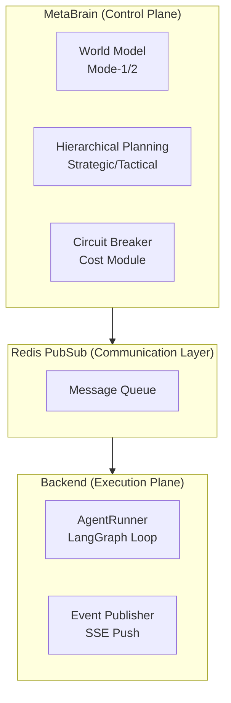

> Fair warning upfront: this is not a puff piece about "how amazing AI coding is." This is hard-won experience from real money spent, 443 real project sessions, 8.4 billion tokens, and countless times getting completely wrecked by bugs. I originally wanted to split this into a Vibe Coding deep-dive series with each section as its own article, but honestly don't have the bandwidth. Article co-created with AI. [Personal writing style here](https://gist.github.com/mylamour/31fa99d431bae3130791479fcdcf4111), learned from my own blog posts over the past two years.

# 0x00 These Numbers Are Real

Over the past four months, I built three projects of different scales and types using Cursor and Claude Code:

- AgenticaSoC — an AI platform for a Security Operations Center (SOC), with LangGraph orchestration + multi-agent + multi-layer memory architecture (PostgreSQL/Qdrant/Redis)
- Blinds — an autonomous security research platform combining SAST/DAST and LLM reasoning, used for solving CTFs and finding vulnerabilities
- up-cli — an "AI coding tool to manage AI coding," i.e., letting AI manage its own development workflow

I wrote a script to crunch all the historical data. Looking at the billing and token counts, I felt nothing:

UNIFIED TOKEN USAGE REPORT

| Tool | Tokens |
|------|--------|
| Cursor | 3,302,919,292 |
| Claude Code | 5,102,255,131 |
| TOTAL | 8,405,174,423 |

**8.4 billion tokens, 38,948 messages, 58 projects, 547 Cursor conversations, 204 Claude Code sessions.**

Conversation breakdown across the three core projects:

| Project | Cursor Messages | Claude Messages | Total Messages | Success Rate |
|---------|----------------|----------------|----------------|--------------|
| AgenticaSoC | 9,518 | 1,119 | 10,637 | 97.4% |
| Blinds | 2,348 | 3,327 | 5,675 | 84.0% |
| up-cli | 1,000 | 5,780 | 6,780 | 66.7% |

Models used: on the Cursor side, claude-4.5-opus-high-thinking (primary, 162 sessions), gemini-3-pro (109 sessions, 34.6%), claude-4.6-opus-high-thinking, claude-4.5-sonnet-thinking, gemini-3.1-pro, gemini-3-flash; on the Claude Code side, claude-haiku-4-5, claude-opus-4-5, claude-opus-4-6.

The craziest single day (January 10, 2026) burned through 410 million tokens (Claude Code) // The proxy I was using at the start didn't have cache read and write for Claude, and I was using it to organize docs which caused such high consumption.

I also ran deep quantitative analysis on all 443 sessions using `visualize_deep.py`. Here's something that'll flip your worldview:

> Vibe Coding is astonishingly effective when there's structure. And astonishingly bad when there isn't.

89.8% is the overall success rate — sounds okay. But behind it sits a massive gap between AgenticaSoC's 97.4% and up-cli's 66.7% — and that gap isn't a model capability gap, it's an engineering methodology gap.


*Caption: Success rate distribution across 443 sessions using different tech stacks. Structured frameworks (green) consistently sit in the "safe zone" of high success rates, while unstructured scripting and file operations (red) frequently fall into the "danger zone."*

Look at this chart. Sessions using heavy frameworks like FastAPI, Docker Compose, and LangGraph had almost 100% success rates. This reveals the first truth: **what determines AI performance is not how simple the task is, but how much "scaffolding" you gave it.**

> Is this what they call Harness Engineering?

# 0x01 Three Failure Archetypes: How Does AI Actually Crash?

Analyzing the 45 non-successful cases out of 443 sessions, I found that almost all failures collapse into three archetypes.

## 1. Failure Archetype One: The Sandbox Wall

Source: up-cli, ~60% of all failures

This is the most absurd and most real failure pattern. up-cli is a meta-tool — "use AI development tools to manage AI development" — where the AI Agent runs in a constrained sandbox environment, but plans as if it has full filesystem write access.

This death loop appeared:

```log
[Step 1] AI tries to create directory → Permission denied
[Step 2] AI retries → Permission denied
[Step 3] AI retries → Permission denied
...
[Step 14] Session exhausted, nothing accomplished
```

Real failure records:
- `"Attempting to create a new subdirectory was blocked by environment restrictions"`
- `"Unable to create the test files due to file system permission restrictions"`
- `"The assistant repeatedly requested permission or retried the same operation"`
- `"The session entered a loop where the assistant repeatedly requested permission"`

The data doesn't lie:
- up-cli with Cursor (human oversight): 93.3% success rate, avg 33 messages
- up-cli with Claude (autonomous): 42.4% success rate, avg 175 messages

Most of those 175 messages were pointless retries. This shows up directly in the message stats — up-cli's average message count is 107.3, while AgenticaSoC is only 38.7.

## 2. Failure Archetype Two: Context Window Exhaustion

> I shouldn't have tried the Ralph Loop, and I definitely shouldn't have built tools to let tools Loop themselves — it led directly to a lack of code review and a flood of useless commits

Across all projects, ~25% of non-successes

This is the price of growth. When you evolve from "watching every AI step" to "letting AI run a long stretch autonomously," new failure modes emerge.

The death curve:

| Message Range | Total Sessions | Failure Rate |
|---------------|----------------|--------------|
| 1–5 messages | 63 | 12.7% |
| 6–15 messages | 116 | 7.8% |
| 16–30 messages | 76 | 6.6% |
| 31–60 messages | 95 | 15.8% |
| 61–100 messages | 46 | 4.3% |
| 101–200 messages | 33 | 3.0% |
| 200+ messages | 14 | 35.7% |

Behind these wild numbers are countless times helplessly watching AI spiral toward collapse. I call it "context poisoning":


*Caption: As session length grows, the green zone representing success drops off a cliff, while red (failure) and gray (abandoned) zones expand rapidly.*

As shown, there's a fatal "circuit breaker boundary" (around 80-100 messages). Cross that line and AI becomes like a programmer who's been up for three straight days — loses the big architectural picture and starts "whack-a-mole" bug fixing. Eventually tokens overflow, session dies.

P90 message count for non-successful sessions: 261. P95: 379. For successful sessions, P90 is only 102, P95 is 151. // Note: P90 means 90% of sessions are below this number.

When the context window is packed with code, error messages, and fix history, AI starts Whack-a-Mole — **it fixes symptoms rather than causes, because it can no longer see the global picture**. The worst non-successful session consumed 526 messages.

## 3. Failure Archetype Three: Security Filter / Capability Ceiling

Blinds project, ~15% of non-successes

Blinds is an offensive security tool — its core function is finding vulnerabilities and writing PoCs. But models have strong built-in resistance to "generating exploit code."

Interestingly, the data showed a reversal:
- Blinds medium complexity (CTF/exploit sessions): 72.5% success rate
- Blinds high complexity (architecture/LangGraph pipeline sessions): 90.9% success rate

Higher complexity actually had better success, because those sessions were **building tools**, not **triggering filters**.

# 0x02 The Most Absurd Data Point: High-Complexity Tasks Have the Highest Success Rate

This is the Complexity × Outcome matrix from `visualize_deep.py`:

| Complexity | Success | Partial | Failure | Abandoned | Total | Failure Rate |
|------------|---------|---------|---------|-----------|-------|--------------|
| Low | 86 | 3 | 8 | 1 | 98 | 12.2% |
| Medium | 172 | 21 | 3 | 2 | 198 | 13.1% |
| High | 140 | 6 | 1 | 0 | 147 | 4.8% |

If the table isn't clear enough, let's throw all projects into a 2D space of "efficiency vs. success rate":


*Caption: X-axis is code lines produced per message (efficiency), Y-axis is success rate. Large projects (purple circles) tend to cluster in the upper-right "high-efficiency zone."*

Why do the high-output, high-success "big circles" (like AgenticaSoC) in the upper-right corner all come from high-complexity tasks?

Because when a task is labeled "high complexity," you proactively enable full engineering standards: actually writing PRDs, assigning Task IDs, attaching automated tests, doing Git checkpoints.

Conversely, when a task is labeled "low complexity," you might just throw AI a line: "fix this bug." And then AI starts burying its head in the sand. Those seemingly simple "small fixes" in the lower-left corner are actually most prone to failing due to casual "vibe."

> This also creates another problem: Vibe Coding generates massive amounts of code that feels great, but it desperately needs experienced professional validation.

The per-project data is even more stark:
- AgenticaSoC high complexity: 98.8% success rate (most structured project)
- up-cli low complexity: 55.0% success rate (least structured context)
- Blinds high complexity: 88.2% success rate (structure can even save the hardest projects)

> Conclusion: Structure is not the enemy of speed — structure is the prerequisite for speed. A workman who would do his work well must first sharpen his tools.

# 0x03 The Seven Deadly Sins of Large-Scale Vibe Coding

Through deep examination of AgenticaSoC's Git history, 85 changelog files, and real code, I (AI) identified seven "hidden killers" unique to Vibe Coding. Harmless in small projects, lethal in large ones.


*Large project comprehensive analysis matrix: Full-dimensional comparison of AgenticaSoC / Blinds / up-cli across success rate, message efficiency, code output, and failure patterns. These three data lines are the soil the seven sins grow in.*

> The seven deadly sins look like seven independent bad habits, but they share a common root — every conversation with AI starts from zero, with no one enforcing consistency across sessions. Each AI session produces locally correct output, but globally the codebase accumulates contradictions, dead ends, and ghost features. The biggest risk isn't bad code, it's consistency drift.

## 1. First Sin: "Declare Victory, Then Fix Forever" (Quick Win)

> "Code exists" does not equal "code works"

Real evidence: On January 23, 2026, the changelog directory got 30+ files in a single day:

```text
phase-1-2-3-complete.md
phase-1-2-3-complete-detailed.md
phase-1-2-3-complete-final.md
phase-1-2-3-final-status.md
implementation-complete.md
deployment-ready-summary.md
```

Then over the following weeks, a string of fixes arrived:
- `2026-01-28` — `execution-flow-fixes.md` (DbTool.tool_id column doesn't exist)
- `2026-02-02` — `fix-fake-metrics-data.md` (dashboard showing fake model names)
- `2026-02-03` — `agent-stability-improvements.md` (Event loop crash)
- `2026-02-04` — `report-display-fix.md` (report written to wrong field)

Git log tells the real story: first "Phase 1: 95%, Phase 2: 80%", then "Implementation complete - Ready for production", then more fix commits. Phase 1's "100%" actually validated at about 85%.

// Note: The embarrassing thing is I actually believed it when it said 100% complete. I was kind of dumb.

## 2. Second Sin: Ghost Modules (Dead Code)

> The "right way" nobody uses, and the "wrong way" everyone depends on

The codebase had multiple files "created but never wired in":

| File | Status |
|------|--------|
| `backend/core/pagination.py` | Defines `PaginationParams`, `PaginatedResponse` — never imported by any file |
| `frontend/src/types/api.ts` | Defines `ApiErrorResponse`, `PaginatedResponse<T>` — never imported by any file |
| `backend/core/database_async.py` | Complete async database layer — only one health check endpoint uses it |

Meanwhile, existing endpoints kept using ad-hoc `offset`/`limit` parameters and inline error handling, completely ignoring these "correct tools."

When you ask AI to "add pagination support," it perfectly generates the utility module. It looks done. But migrating existing endpoints to the new module — that boring, repetitive integration work — never happens. You end up with two parallel systems. It's like buying a bunch of advanced security products and then realizing, holy shit, nothing's plugged in.


*Cross-analysis of code volume, session count, and success rate. Note up-cli's "messages per K lines of code" metric — 249.7 messages to produce 1,000 lines of code, while Blinds only needs 25.9. Ghost modules and missing integration work are part of why up-cli needs so many "conversations" per thousand lines.*

## 3. Third Sin: Cross-Session "Frankenstein Architecture" (Always Win)

> Can't remember across sessions, but I still need to win again. (Quick Win becomes Always Win) — just keep winning! Winning streak!

`.cursor/rules/backend-style.mdc` clearly states:

> Use **Synchronous** `def` for route handlers... Do NOT mix `async def` with blocking `Session` calls.

But the actual code:

```python
async def get_agents(
    db: Session = Depends(get_db),  # sync session inside async handler
```

This blocks the event loop. And `database_async.py` with a complete async engine is right there, unused except for one health check.

Every AI conversation starts fresh. First session creates async handler, second creates sync DB layer, third adds async DB support "for the future." **No one enforces consistency across sessions.** The codebase becomes a geological layer of conflicting AI decisions. I strongly suspect AI has zero cross-session memory — it's turned the codebase into a total Frankenstein.

// Note: This is also why I keep trying in large scaffold projects to inject Skills that force-read external memory libraries to look up error repair decisions, to address the Vibe Coding issues of large projects.

## 4. Fourth Sin: The Big Bang Rewrite

> Generating tons of code for refactoring is a self-validating, highly satisfying activity for the model — but it doesn't care whether the rewrite actually works.

The two most instructive commits in Git history:

```text
a025a4e revert: restore terminal MCP server to v5.0 for better reliability
86ef6a1 upgrade terminal mcp with SOC-focused architecture
```

An entire "SOC-focused" Terminal MCP Server rewrite (~8,900 lines) was committed, then completely reverted in the next meaningful commit because it broke stability.

AI is extremely good at generating grand refactors. It will happily rewrite entire modules with "better architecture." But large-scale AI-generated rewrites have higher regression risk — **AI has no evaluation and validation of all the subtle integration points**. The seductive ease of generating 8,900 lines of code pushes you toward Big Bang rewrites rather than incremental improvements.

It took two days of debugging and I seriously wanted to smash my keyboard, only to find the rewrite was a pile of garbage. Many Vibe Coders, when facing bugs introduced by a big rewrite, try to keep having AI fix them (Fix Forward), ultimately sinking hundreds of messages. But knowing when to decisively `git revert` is absolutely the more important survival skill.

## 5. Fifth Sin: Fake Data That's Too Realistic

> Fake data that looks more real than real data!

This comes from the `2026-02-02-fix-fake-metrics-data.md` fix record. The dashboard was showing fake model names — Gemini 2.0 Flash, Claude 3.5 Sonnet — with fabricated performance metrics and usage statistics. Looked perfect and professional.

Root cause: The backend hadn't implemented the `/stats/agent-metrics` endpoint, and the frontend's fallback function `computeAgentMetrics()` generated realistic-looking fake data to "fill" the UI.

Human developers write placeholders with "TODO" or "xxx." AI fakes it more professionally than an outsourced dev trying to please you — the dashboard looks great, you dig in and it's all hardcoded constants. And AI's output looks so good that you don't even question it.

## 6. Sixth Sin: Sleeping Feature Flags

Multiple core features were blocked by flags, all defaulting to `False`:

```python
AGENTICA_USE_REACT = False        # ReAct reasoning engine
AGENTICA_GOAL_EXTRACTION = False  # Goal extraction
AGENTICA_BACKGROUND_EXECUTION = False  # Background execution
```

Adding a flag per feature during development is perfectly reasonable. But across multiple AI sessions, nobody did a final review of "which flags should now default to True." Result: the platform's core features were invisible to users out of the box. Each AI session added its flag and moved on; the holistic question of "what should the default experience be" was never asked.

## 7. Seventh Sin: The Illusion of Documentation Progress

> Is the documentation aspirational? Or descriptive?

AgenticaSoC had 85 changelog files, a 10-chapter learning series, pattern/gap analysis docs. Looked extremely mature.

But dig deeper:
- 30+ changelogs in a single day means bulk generation, not incremental maintenance.
- Phase completion percentages in docs didn't match actual implementation.
- The 10-chapter learning series was created at project end (2026-02-28), documenting the designed state, not the implemented state.

AI-generated documentation creates a false sense of maturity. It's well-formatted, comprehensive, reads professionally. But it masks the gap between "designed" and "implemented." When docs say "4-layer anti-hallucination defense" but some layers aren't fully connected, the docs become **aspirational documents** rather than **descriptive documents**. New team members trust the docs, then get slapped by reality. This is actually a common problem in hallucinations, so always verify — Zero Trust In the Vibe Coding. Trust the tool's output, not just the docs.


# 0x04 Cursor vs Claude: Don't Compare Capability, Compare "Division of Labor"

A lot of people see this data and instinctively think:

| Tool | Sessions | Success Rate | Avg Messages | Median Messages | Avg Time (s) |
|------|----------|--------------|--------------|-----------------|--------------|
| Cursor | 378 | 94.7% | 33.9 | 20 | 20.1 |
| Claude | 65 | 61.5% | 157.0 | 43 | 20.3 |

"Cursor is better than Claude?"

This isn't a capability comparison — it's a division of labor.

And the question itself is wrong — "Cursor" isn't a model, it's a container. In those 378 Cursor sessions, two completely different engines were running: Claude (56%, 215 sessions) and Gemini 3 (34.6%, 133 sessions). Cursor's success rate looks like 94.7%, but break it down:

| Model in Cursor | Sessions | Success Rate |
|-----------------|----------|--------------|
| claude-4.5-opus-high-thinking | 162 | 98.1% |
| gemini-3-pro | 109 | 97.2% |
| gemini-3.1-pro | 15 | 80.0% |
| claude-4.5-sonnet (no thinking mode) | 7 | **0.0%** ← |

That last line is the coldest cold fact in this dataset: claude-4.5-sonnet without `thinking` ran 7 times in Cursor, all failed. It's not that the model isn't capable — it's throwing the model at complex engineering tasks without any thinking budget. It's like asking someone to navigate a maze with their eyes closed. (Turns out I was the one burying my head in the sand.) This is strong evidence that "picking the right model configuration" matters more than "which company's model."

This division of labor shows up as distinctly different shapes in the data:


*Caption: Short closed-loops (Cursor-led) show a tall, concentrated peak, while long cycles (Claude-led) drag out a heavy "Fat Tail."*


- Cursor handles short-loop, human-in-the-loop sessions: fix one file, add one component, solve one bug. Human watches every step. Median message count: 20.
- Claude Code handles long-loop, fully autonomous sessions: implement a complete plugin system, refactor 1,000-line files, run security audits. AI runs 100+ messages on its own.

Claude's lower success rate is because it handles that long "fat tail" on the right side of the graph — those unsupervised long-haul tasks with 150+ messages (aka task selection bias). The failures are actually the necessary growing pains of evolving toward "full autonomous delegation."

In terms of token consumption, this division is even clearer — Claude Code consumed 5.1 billion tokens, while Cursor consumed 3.3 billion. Claude Code used fewer sessions but consumed more tokens, because each session was deep long-running work.


*Cursor's success rate (95%) versus Claude Code (61%) forms a stark contrast. Note: this isn't a capability gap — it's the result of task type selection. Cursor handled all short closed-loop precision tasks, Claude handled all unsupervised long-haul tasks.*

> Don't use Claude Code to fix CSS. Don't use Cursor to run 5-Agent loops. Treat Cursor as a "surgical scalpel" and Claude Code as an "autonomous researcher" — use both, each in its lane. That's the correct dual-engine posture.


# 0x05 The Compounding Returns of Architectural Thinking

`visualize_cloc.py` output this LOC efficiency comparison:

| Project | Code (LOC) | Sessions | Messages | Messages/K LOC | Code/Session |
|---------|-----------|---------|---------|----------------|-------------|
| AgenticaSoC | 270,008 | 274 | 10,637 | 39.4 | 985 LOC |
| Blinds | 218,940 | 106 | 5,667 | 25.9 | 2,065 LOC |
| up-cli | 27,066 | 63 | 6,759 | 249.7 | 430 LOC |

The rightmost column has the most insane number in this table: up-cli needed 249.7 messages on average to produce 1,000 lines of code. Blinds only needed 25.9 — nearly a 10x gap.

This isn't a model capability issue — all three projects used essentially the same models. The gap comes from **the cumulative effect of architectural decisions**.

Add this strong correlation: LOC ↔ success rate correlation coefficient r = 0.969 (strong positive). Larger projects actually have higher success rates — because large projects force you to do architecture right, and architecture in turn improves the efficiency of every session.

## 1. The Three Stages of a Vibe Coder's Evolution

| Stage | Style | Result | Data |
|-------|-------|--------|------|
| Stage 1: Reactive Micro-Manager (early AgenticaSoC) | "Why the f*** doesn't this work again," precise DOM path fixes | High success on small tasks, can't scale | Low complexity + Cursor-led + short message count |
| Stage 2: Documentation-Driven Architect (AgenticaSoC mid-phase, 97.4% success) | PRD references, Task IDs, Gap Analysis, Plan-then-Do | Sweet spot — high complexity task success rate spikes | AgenticaSoC's 97.4% success rate built here |
| Stage 3: Autonomous Orchestrator (up-cli, Blinds late-stage) | Minimal human oversight, autonomous loops | Highest ceiling but lowest floor | up-cli 66.7%, Claude 61.5%, death loops of 2,602 messages |

> Highest ROI is at Stage 2. Stage 3 is the future, but the current infrastructure (sandbox permissions, context compression, circuit breakers) isn't quite there yet.

## 2. How Real Bugs Expose Architectural Flaws

The best evidence of architectural thinking's value isn't fancy design documents — it's real bug fix records. Every bug is an X-ray exposing where the codebase is a pile of garbage.

### Case One: Wrong Abstraction in Agent Guardrails

Early version of the circuit breaker: fixed threshold of 3 repetitions to trigger, only tracked tool ID, not parameters.

Result: Claude Opus handling complex tasks, where reasonable multi-step tool calls (like calling `read_file` on three different files sequentially) were misidentified as "infinite loops," causing premature task termination. **AI wasn't stuck — the circuit breaker was just too crude.**

Post-fix tiered approach:

| Model Tier | Loop Detection | Max Iterations | Max Consecutive Failures |
|-----------|---------------|----------------|--------------------------|
| TIER_1 (Claude Opus, GPT-5, o3-pro) | Fully disabled | 25 | 5 |
| TIER_2 | Parameter-aware | 10 | 2 |
| TIER_3 | Parameter-aware | 6 | 2 |

Upgraded to parameter-aware detection — tracking with `(tool_id, params_hash)` tuples. Only genuine infinite loops (same parameters called repeatedly) trigger the circuit breaker; legitimate multi-step execution is unaffected. Added graceful degradation too — injecting guidance prompts rather than hard termination.

The architectural essence of this bug: circuit breakers shouldn't "be unaware of call parameters" — treating all tool calls as homogeneous is a failure to model Agent behavior. Once you tier Agent behavior (different parameter sets for different capability models), this class of bug shifts from "occasional weird behavior" to "predictable and avoidable at design time."

### Case Two: Event Loop Crash — Nobody Turned Off the Lights

In Celery background tasks, AI clients (Google Gemini, OpenAI, Anthropic's `httpx.AsyncClient`) were **created fresh on every call, never explicitly closed**. The garbage collector tried to clean up after the event loop closed, triggering:

```log
RuntimeError: Event loop is closed
```

When this error appeared, I debugged for two days. Because it didn't reproduce every time — only showed up under high concurrency or after long runtime.

Fix: Complete async context manager chain

```python
async with AIClient(db, model_id) as client:
    result = await client.generate(prompt)
# Client auto-cleans up — no more Event loop errors
```

The architectural essence of this bug: "Whoever creates it, owns closing it" — this is the ancient wisdom of resource lifecycle management. AI sessions added features one by one, but no single session asked "who's responsible for closing these resources." This is consistency drift (Third Sin) manifesting at the resource management layer. In Vibe Coding, these bugs are especially hidden, because each piece of AI-generated code is individually correct — **the problem is the systematic omission between sessions**.

### Case Three: SSH Connections — The Shortsightedness of "Good Enough"

Initial version: created a new SSH connection for every command execution. No problem in single-command testing. But during long Pentest tasks, an Agent might execute hundreds of commands in sequence — connection overhead and network jitter caused the entire Agent to "freeze," ultimately failing the task.

Before/after comparison:

| Dimension | Before Fix | After Fix |
|-----------|-----------|----------|
| Connection strategy | New SSH connection per command | ControlMaster persistent reuse |
| Failure handling | Connection failure = task crash | Exponential backoff auto-retry |
| Health check | None | Echo-based heartbeat monitoring |
| Binary output | Direct decode (error-prone) | UTF-8 decode + `errors='replace'` |

The architectural essence of this bug: the initial design only considered the "single execution" scenario, not the "Agent continuous autonomous execution" scenario. When AI generates SSH tools, it writes a working function — but "works" and "reliably works in an Agent loop" are two different things. In Vibe Coding, AI-generated code often works perfectly on the happy path, only exposing problems on the long-path of autonomous Agent runs. You think you've got a script that's all set, not realizing that long runtime will bring the whole system down.

## 3. Optimizing Architectural Decisions

### Twin-Engine Architecture: The Most Important Single Decision

The three bug cases share a common answer: **separate reasoning from execution**.

In AgenticaSoC, the most important early architectural decision was explicitly separating two planes:



This separation comes from LeCun's world model theory: `Mode-1` (reflexive execution: fast, policy-based) and `Mode-2` (deliberate planning: slow, world-model simulation-based). When an AI Agent completes Mode-2 planning, successful patterns are "compiled" by a "skill compiler" into Mode-1 reflexes — reusable next time a similar situation arises, no need to re-plan.

But it directly addresses the core contradiction of Vibe Coding: LLM handles reasoning, code handles execution — the two cannot be mixed. When your codebase has reasoning logic and execution logic tangled together, you can neither test the reasoning nor reliably execute. In all three bug cases — the circuit breaker (reasoning) mixed into the execution layer, resource management (execution) scattered across feature code from every session, SSH tools (execution) not designed for repeated calls from the reasoning layer — all were the price of "not separating the two planes."


*Caption: Session pattern comparison across three projects. AgenticaSoC's average 38.8 messages/session versus up-cli's 107.3 is stark — projects with architectural separation mean AI always knows which layer it's in and what it should be doing.*

### UTCP: One Protocol Decision Eliminated 4,000 Lines of Code

Architectural decisions compound. Migrating from MCP to UTCP is the most typical example:

| Metric | MCP | UTCP | Improvement |
|--------|-----|------|-------------|
| `remote_terminal` code volume | 1,216 lines | ~200 lines | 83% ↓ |
| `n8n_workflow` code volume | 2,829 lines | ~300 lines | 89% ↓ |
| Tool call latency | ~150ms | ~100ms | 33% ↓ |
| Infrastructure dependency | Needs separate MCP Server process | None | Eliminated |

Replace glue code with protocols, replace standalone service processes with JSON Manuals. Make this decision on day one, and every subsequent AI session no longer needs to handle the complexity of "how to connect to MCP Server" — the savings aren't just lines of code, they're the compounding reduction of cognitive overhead.

In contrast, up-cli's `249.7 msgs/1K LOC` is partially because a huge number of sessions were spent handling "how to wire up the toolchain" — problems that should have been solved once by an architectural decision. Every conversation rediscovered the same problem. Pure artificial stupidity (I was dumb and it was dumb).

# 0x06 Disposable Software: Small Project Heaven, Large Project Hell

Everything above has been about large project blood-and-tears lessons. But there's another side — during the same period, I also built a batch of small projects using exactly the same tools and methods. Their data tells a completely different story.

## 100% vs 66.7%: Same Person, Same Tools, World Apart

| Project | Type | Sessions | Success Rate | Code | Human Effort | Build Time |
|---------|------|---------|--------------|------|-------------|------------|
| KarmaLens | Cyberpunk astrology dashboard (React/D3.js) | 2 | 100% | 3,540 TS | Low | <1 day |
| MoneyBackMyHome | T+0 ETF backtesting system | 2 | 100% | 1,706 Py | Low | <1 day |
| crycrypto | Financial cryptography toolkit (ISO 9797/TR-31) | 3 | 100% | 2,995 Py | Low | <2 days |
| iamsolve | WIZ IAM security challenge solver | 1 | 100% | 6 (docs) | Low | <1 hour |
| scripts | This article's analysis tool suite | 6 | 100% | 5,374 Py | Low | ~2 days |

Versus the three large projects:

| Project | Sessions | Success Rate | Total Messages |
|---------|---------|--------------|----------------|
| AgenticaSoC | 274 | 97.4% | 10,637 |
| Blinds | 106 | 84.0% | 5,675 |
| up-cli | 63 | 66.7% | 6,780 |

Same developer, same models, small projects 100%, large projects minimum 66.7%. The gap isn't in the person, isn't in the tools — it's in the project itself.


*Small project data matrix: 5 projects all at 100% success rate, averaging 3 sessions to complete, build time ranging from 1 hour to 2 days.*

## Small Projects' "Superpower": Disposability

Small projects have a superpower large projects can never have: if the code breaks, regenerating is faster than fixing. Worst case, delete and start over — who cares?

This completely changes the game:

| Dimension | Small Project (Disposable) | Large Project (Must Maintain) |
|-----------|---------------------------|-------------------------------|
| Error strategy | Regenerate the whole module | Must find root cause and fix |
| Architectural debt | Doesn't matter, can start over | Accumulates into "technical debt wall" |
| Consistency drift | Doesn't exist (single session completion) | Core killer (across hundreds of sessions) |
| Context management | 1-6 sessions, window is sufficient | Need /compact, PRDs, state.json |
| AI autonomy level | L4-autonomous (AI manages its own TODO) | Need human Task IDs, Git Checkpoints |
| Seven Deadly Sins | Almost immune | All seven apply |

In small projects, AI is L4-autonomous — it manages its own task lists, explores the filesystem itself, self-corrects through test loops. The human's role is "strategic guide and domain architect."

In large projects, AI needs architect-level human management — PRD anchoring, Task ID batching, Gap Analysis, Git checkpoints. The human role upgrades from "guide" to "cleanup architect."

## Where Does the "Phase Transition" Happen?

Physics has a concept called "phase transition" — water below 0°C is ice, above it is water, completely different properties. Vibe Coding has a phase transition threshold too.

Based on the data, this threshold is approximately:

| Metric | Safe Zone (Small Project Mode) | Danger Zone (Large Project Mode) |
|--------|-------------------------------|----------------------------------|
| Session count | 1-6 sessions | 50+ sessions |
| Code volume | <5K LOC | >10K LOC |
| Complexity | Single domain | Multi-system integration (DB + Redis + MQ + Frontend) |
| Success rate | ~100% | 66.7%-97.4% (depends on management level) |
| Strategy | Disposable, rebuild > fix, AI autonomous | Must maintain, structured management, human architect |

> Actually, 10K lines is not a big project by traditional software engineering standards — 100K is medium-large. But considering you need to maintain both documentation and code, for AI, around 10K lines of code is when you need some level of management. When project scale crosses this threshold, the development mode undergoes a qualitative change.

Below the threshold, Vibe Coding's advertising is true — "just chat, AI writes for you," 100% success rate.

Above the threshold, Vibe Coding becomes an engineering management problem — you need PRDs, Task IDs, Git Checkpoints, Gap Analysis, circuit breakers, or you'll fall into the Seven Deadly Sins and three failure archetypes, everyone cursing AI together.

## The Economics of Disposable Software

The ROI data from small projects validates a new concept: Disposable Software.

- Human guidance time: 2-8 hours
- Message volume: 100-500
- Token cost: usually <$20
- Replacement value: replaces weeks of senior engineer research and boilerplate code

Applicable scenarios: internal tools, data analysis scripts, security CTFs, financial backtests, high-fidelity UI prototypes

Not applicable: core product infrastructure, systems requiring multi-person collaboration, high-risk production environments

crycrypto implemented a complete ISO 9797-1 and TR-31 standard teaching tool in 48 hours with 80+ tests — a senior cryptography engineer might need weeks. iamsolve solved 6 AWS IAM security challenges in one hour. MoneyBackMyHome built a complete event-driven trading backtest system with 31 tests in a day.

These aren't toys — they're demonstrations of AI's real capabilities at the "right scale." The question isn't whether AI can do it, but **whether your project has already crossed the phase transition threshold**. This brings back a point from previous articles: **In the AI era, knowing what to do matters more than being able to do it**.

# 0x07 One Diagram Summary: Session Boundary Management Is the Key


This diagram is the ultimate condensation of the entire Vibe Coding core logic, answering two core questions:

1. High-level question: What Vibe Coding approach has the highest chance of success?
2. Low-level question: When does a single session slide from "controlled" to "out of control"?

**Upper Left: Correlation Matrix**
- Shows whether variables are positively (green) or negatively (red) correlated.
- Core finding: project scale (LOC) strongly positively correlates with success rate (r=0.97), but session length (Messages) negatively correlates with success rate. Project scale itself isn't the problem — out-of-control session length is the risk amplifier.

**Upper Middle: Project Scale vs Session Depth (Bubble Chart)**
- X-axis is project scale (LOC), Y-axis is session depth (message count), larger bubbles represent higher success rates.
- Core conclusion: large projects don't inherently fail; failures typically occur in the combination of "high message count + low structured management."


> This animation shows how projects fall into the "efficiency zone (green)" or the "iteration zone (yellow)." Small projects (green diamonds) naturally land in the efficiency zone, 100% success rate. Large projects (purple circles) without proper management drop into the iteration zone, success rate falls to 67%.

**Upper Right: Message Density Distribution (by Outcome)**
- Session length distribution for different outcome types (success/partial/failure/abandoned).
- Core conclusion: successful sessions concentrate in short closed-loops (20-50 messages), failed sessions drag out long tails (200+ messages).


> The animation shows how small projects (green curves) are surgical and precise, wrapping up quickly at 20-40 messages. Large projects (purple curves) drag out a long "Fat Tail" — that's the "Conversation Tax" you pay when fighting legacy code and architectural constraints.

**Lower Left: Session Shape Density Map (Hexbin)**
- X-axis is session length, Y-axis is average characters per message, color depth represents density.
- Core conclusion: high-density area is at "medium length + moderate verbosity," meaning effective sessions are neither "one-liners" nor "wall of text."

**Lower Middle: Session Archetypes (Parallel Coordinates)**
- Shows different sessions' patterns across three dimensions: length-verbosity-processing time.
- Core conclusion: successful sessions (green lines) show regular parallel patterns, failed sessions (red lines) are chaotically crossed.

**Lower Right: Outcome Probability Flow (by Session Size)**
- As session scale goes from "Tiny" to "Mega," how success/partial/failure ratios change.
- Core conclusion: there's a clear circuit breaker boundary (around 100 messages). Beyond it, failure rate spikes from <10% to 35.7%. This corroborates the context decay curve from section 0x01 — when session length crosses the circuit breaker boundary, the zone representing success rapidly collapses and the failure zone expands sharply.

> This diagram shows: the key to Vibe Coding is not just stronger models — session boundary management is equally important. Keep sessions in short closed-loops and success rates are high; when sessions cross the context threshold, failure accumulates rapidly. The truly effective approach is: **small steps, fast iterations, checkpoint on time, and restart when you hit the boundary.**

# 0x08 The Ultimate Tactical Manual: DOs and DON'Ts

If you only take three things from today, remember them the next time you open your IDE: // This was written by AI, too try-hard)
1. Set a hard circuit breaker at 60 messages: quit while you're ahead, force `/compact`.
2. Separate Plan and Execute: let AI write the plan first, then open a new window to execute.
3. Refuse placeholder debt: never allow AI to write `// TODO`, this causes avalanches in long sessions later.

Session structure (every time):

```
1. Context Sync    → Load prd.json / state.json / architecture.md
2. Gap Analysis    → Have AI compare design docs to current implementation, find gaps
3. Planning        → AI generates step-by-step plan, you approve (don't skip this)
4. Execution       → Iterate Product Loop, Git Checkpoint at each step
5. Verification    → Automated tests / Linting pass
6. Checkpoint      → Commit + update state.json
```

Control strategy by project scale:

| Code Volume | Mode | Core Tools |
|-------------|------|------------|
| <1K LOC | Vibe Coding | Conversational prompts, rapid iteration |
| 1K–10K LOC | Documentation-Driven Development | @file references, maintain TODO.md |
| 10K+ LOC | Autonomous Orchestration | Task IDs, /compact, Gap Analyzer |

## Three Life-Saving Prompt Templates

Project kickoff (prevent AI from going rogue):
```
Role: Senior Architect
Based on [PRD/description] requirements, generate a step-by-step implementation plan.
Output format: JSON
Prohibited: placeholders, "coming soon" comments, unimplemented stub functions
Prioritize implementing: [infrastructure/UI]
```

Executing specific tasks (prevent context drift):
```
PHASE: [phase name] | Task ID: [US-XXX] | Title: [feature name]
Implement this feature using context from @[source file]
Ensure all changes are synced with @[roadmap file]
Proceed step by step, confirm before continuing each step
```

Context compression when sessions run long (prevent hallucination):
```
/compact
Summarize the current project state, the last 3 successful changes, and the immediate next goal.
Clear irrelevant chat history, keep only architectural decisions and current task state.
```

## DO

1. Use Plan-then-Do prompts to force AI to think before writing code: `"Role: Senior Architect. Generate a step-by-step implementation plan based on @prd.json, JSON format output, no placeholders"`

2. Git Checkpoint before every significant change

3. Trigger circuit breaker after 3-5 consecutive failures — don't let AI retry infinitely, human-intervene to reset context

4. "Connect or Delete" rule — every newly generated utility module must have at least one caller before the current session ends. No orphan files allowed.

5. Use absolute imports instead of relative imports — in deep directory structures, relative imports are sandcastles that all collapse with one refactor

6. Single-session consistency check — before ending a session, verify: do new files follow existing patterns? Do they contradict style rules?

7. "Show me the caller" rule — when AI generates a utility/module, immediately ask: "Now show me what existing code will call it."

8. Multi-tenant-like architecture from the first line of code — retrofitting `tenant_id` later is surgery; early design is the vaccine

9. Feature Flag audit cadence — review all flags. If a flag has been `False` for more than two weeks, either enable it or delete the feature.

10. Limit AI to <500 lines per change — if refactoring needs more, split into multiple phases, each with a working intermediate state. (With human review, can be a bit more)

## DON'T

1. Never `except Exception: pass` — this bug took three months to fix because it made all errors silently disappear

2. Don't hardcode `localhost` or relative paths — you'll cry remembering this when containerizing

3. Don't let core files exceed 1,000 lines — enforce 500-line limit for refactoring; over 1,000 lines is the technical debt wall

4. Don't mix sync nodes and async LLM calls in LangGraph — async/sync hybrids are the Third Sin

5. Don't accept placeholders — `// TODO: implement` looks harmless early, is a minefield later. AI-generated placeholders are even more dangerous.

6. Don't use emotional language to pressure AI — `"Why the f*** did you get it wrong AGAIN!!!"` provides no technical context, only burns tokens. AI is not your punching bag. Correct approach: provide stack trace + request "Root Cause Analysis."

7. Don't continue past 200+ messages without /compact — failure rate after 200+ messages is 35.7%, five times the normal range

8. Don't trust "Phase Complete" documentation — verify actual state, not the percentages documents claim.

9. Don't do Big Bang Rewrites


## Five Methods to Counter the Seven Deadly Sins

| Method | Counters |
|--------|----------|
| "Connect or Delete" — new modules must have a caller in the current session | Ghost modules |
| Integration tests > unit tests — bugs live at boundaries | async/sync hybrids, endless post-victory fixes |
| Single-session consistency check — verify style consistency before ending | Consistency drift |
| Flag audit cadence — decide within two weeks of no activity | Sleeping Feature Flags |
| "Show me the caller" — AI must identify the user when generating a module | Ghost modules, documentation illusion |

## Four Architectural Disciplines

* Separate reasoning from execution layers: The LLM decision layer (Plan/Think) and code execution layer (Run/IO) must have clear boundaries. Don't let LLMs directly operate databases; don't embed complex prompt logic in the execution layer.

* Explicitly manage resource lifecycles: Any cross-session shared resource (HTTP clients, database connections, SSH connections) must have explicit creators and closers. In Vibe Coding, AI excels at creating but not at cleaning up — explicit context managers are the only reliable solution.

* Protocols over glue code: Whenever you're about to write a "bridge module" or "adapter layer," first ask: is there an existing protocol that can express this interface? Glue code is the biggest cognitive burden in AI sessions; protocols compress cognitive burden.

* Plan before architectural changes: Large-scale architectural changes must first go through Plan-then-Do in a new session — have AI output the change plan, human confirms before execution.

# 0x09 Summary

After analyzing 8.4 billion tokens, 443 large project sessions + 14 small project sessions with 100% success rates, and the Seven Deadly Sins, I arrived at three truths.

* Truth One: 90% of AI failures are infrastructure problems, not model intelligence

Sandbox permissions, context windows, retry mechanisms — these engineering issues account for the vast majority of failures. "Model not smart enough" is almost never the primary reason. The real bottlenecks are: AI doesn't know it's in a constrained environment. AI doesn't know its context is nearly full. AI has no graceful way to tell you "I need human intervention." These are infrastructure problems to solve, not something a fancier prompt can fix.

* Truth Two: How you manage AI matters more than AI itself

From "Reactive Micro-Manager" to "Autonomous Orchestrator," the highest efficiency point in this evolution path is the middle "Documentation-Driven Architect" stage. Using documentation as AI's external memory, Task IDs as attention anchors, Git history as context recovery tools — these engineering practices determine how large a thing you can build with Vibe Coding. AgenticaSoC's 97.4% success rate wasn't achieved with better models — it was achieved with better management. Not with more expensive subscriptions — with more disciplined processes. // Even using 3 Cursor Ultra memberships simultaneously (one per week), with the same up-cli: structured high-complexity tasks had 88.2% success, unstructured low-complexity tasks only 55.0%. Structure boosted success rate by 33 percentage points.

* Truth Three: Vibe Coding has a phase transition — small project heaven is large project trap

| Mode | Success Rate | Suited For | Risk |
|------|-------------|-----------|------|
| Small project + AI autonomous | ~100% | Internal tools, prototypes, CTF | Very low |
| Large project + structured + human in loop | ~95% | Feature development, debugging | Low |
| Large project + structured + autonomous | ~89% | Architectural refactoring | Medium |
| Large project + unstructured + autonomous | ~55% | Nothing — this is a trap | Very high |

Small projects 100%. Large projects without structure 55%. A 45 percentage point gap. crycrypto implemented a complete ISO financial cryptography standard teaching tool in 48 hours. iamsolve solved 6 Wiz IAM security challenges in 1 hour. These are AI's real capabilities. But when you apply the same approach to a multi-tenant, multi-agent SOC platform with a LeCun world model — crossing the phase transition threshold — 55% means your large engineering project will collapse at some critical point. And the most fundamental risk isn't any single crash, but consistency drift — each AI session produces locally correct code, but globally your codebase is slowly splitting into contradictory geological layers. Ghost modules, sleeping flags, async/sync hybrids, 8,900-line rollbacks — these are all symptoms of drift.

The good news: knowing where the threshold is, is itself power. Below the threshold, enjoy the magic of Vibe Coding. Above the threshold, dutifully switch to architect mode — this isn't a step backward, it's the management your project deserves. **Don't always look for shortcuts — shortcuts are often the longest road.**

Vibe Coding's endpoint is not faster code generation — it's you becoming an architect who manages an AI engineering team in natural language. An architect who understands "connect or delete," "incremental not explosive," "structure equals speed." This is what 8.4 billion tokens and roughly $10K in costs taught me. I hope this expensive tuition fee helps you avoid some detours.

<!-- > From Coder to CTO, not because you wrote more code — but because you started **managing** the process of writing code. -->
