> In January 2026, I was still experimenting with agents writing code in a handful of single-repository prototypes. By April, the team was collaborating, multiple agents were working on code, documentation, and contracts in parallel, and the workspace had quickly expanded to 14 repositories. Based on traceable engineering artifacts in the workspace, roughly 1.04 million lines of content accumulated over three months, with documentation, code, and contracts accounting for about 6:3:1. That number describes engineering scale, not productivity. What made me stop and look back was what happened once multiple agents entered real engineering at the same time: who defines the task, who owns write access, what makes a Review trustworthy, and whether the system can actually stop when the evidence chain breaks.
> I eventually abstracted these practices into an Agentic SDLC control plane: agents act with context and boundaries, have an owner, carry verification evidence, and can connect to Issues, Git, CI, deployment, and runtime validation. The commercial value of Agentic Coding is not simply generating more code. It is making higher automation speed safe enough for a team to use.

> *Co-created with AI.*

# 0x00 Three Review Rounds, 24 Findings, Only 2 Confirmed by Evidence

I decided to rewrite this article because of an AI Review that was not particularly flattering.

One PR in X-Pulsar—the X2 control plane and product entry point—went through three consecutive rounds of Spiral Review and accumulated 24 findings. Later, a human reviewer returned to the complete source, Git history, tests, and comment threads to verify them one by one. Only 2 entered the set of “confirmed real issues.”

That number could easily become a sensational headline, with the cause reduced to “model hallucination.” The actual data flow is more revealing.

At the time, a large diff exceeding 50,000 characters was split by file; if a single file was still too large, it was split again by line. Each chunk went to the model independently. The final merge pass saw conclusions already written for each chunk, not the original code evidence. More importantly, although the review runner could call tools, its working directory did not contain a checkout of the repository under review. It could not see the complete file, call sites, subsequent fix commits, or related tests. When a new push triggered another Review, the context also excluded explanations the author had already provided in the previous round.

The old pipeline and the boundary after the fix can be shown in one diagram:

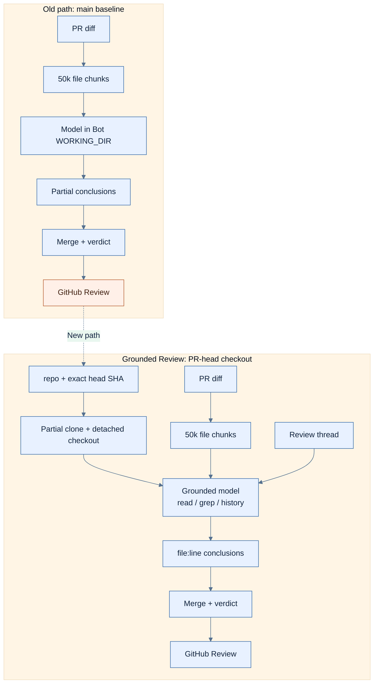

*Figure 1: The old Chunk Review path and the corrected Grounded Review boundary. Event facts are bound to the corresponding PR and test snapshot.*

The original implementation did one thing correctly: Chunk Review did not silently truncate the second half. The problem was that a resource boundary had been treated as a fact boundary. A helper might live in another chunk, a caller might sit outside the diff, or a problem might already have been fixed by a later commit; the local model would still fill in what it could not see using familiar defect patterns. A merge pass can normalize wording, but it cannot correct a shared false assumption using repository facts it never received.

That incident made me rename the output of a Review: the first pass can only produce a **candidate finding**. It may say, “this looks like a cache-isolation issue,” but it cannot be promoted to a blocking finding until it has read the real file, definitions, call sites, history, and tests.

The subsequent fix brought PR-head checkout, `file:line` grounding, historical Review threads, input validation, and a per-repository Git lock into the main path. In the corresponding verification snapshot, the relevant checks reported 307 passed and 7 warnings, and CI passed on Python 3.11 and 3.12. The first large grounded Review still lost a chunk at 319 seconds, so the budget for large chunks was raised separately to 600 seconds. Caller timeouts and cancellation were also made to terminate the underlying task, preventing a process that nobody was waiting for from continuing to consume resources.

Even then, it would be wrong to write that “the false-positive problem has been solved.” No public acceptance artifact was produced from a before/after replay of the original PR; the current implementation still falls back to diff-only when checkout fails; and candidate generation has not yet been separated from per-finding verification as a structured two-stage pipeline. A merged change, green tests, and proven Review precision are three different states.

Nor would I claim that the other 22 findings were individually proven false. There is only one accurate statement: of the 24 findings, repository-grounded human verification confirmed 2 real issues; the remaining findings did not enter the confirmed-issue set.

This became the starting point for the entire system. Models produce fluent judgments quickly, but before a judgment can become a team fact, the system must know which object and version it is looking at, whether it can return to the original evidence, and whether it really stops when that evidence breaks.

# 0x01 An Agent's Entry Point Should Be the Task Fact, Not the Code

I used to start with a sentence like, “help me fix this problem.” The agent would find the files, change the code, run a few tests, and produce a polished summary ten minutes later. That works smoothly in a solo prototype. In a team, it leaves too much undefined: who set the goal, which repositories may change, which files are off-limits, what counts as acceptance, who accepts the risk, and who takes over after failure.

Today, work with side effects enters an Issue before it enters the code:

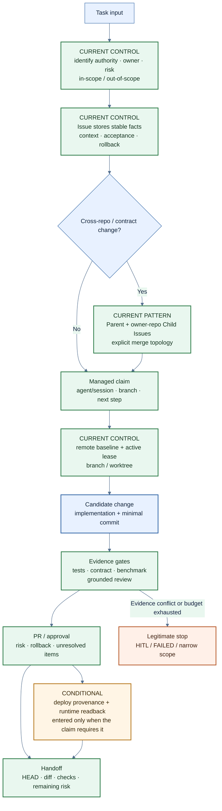

*Figure 2: The control chain from Task Fact to Delivery. Runtime Proof is a conditional stage entered according to the strength of the claim.*

The Issue is not project-management decoration, nor does it mean opening a ticket for every one-line comment change. It stores the relatively stable facts of this task: context, in-scope, out-of-scope, acceptance criteria, verification commands, dependencies, risk, and rollback. An agent's live heartbeat, branch, worktree, and next step should not repeatedly rewrite the Issue body. They belong in an updatable managed claim comment.

I care about three fields in particular.

* The first is scope. An instruction to “fix the login issue” may lead a model to rewrite an authentication helper, modify a shared protocol, add a cache layer, and then update three callers along the way. The code may not be wrong, but Review can no longer tell whether this is still the original task. Writing down both what may change and what explicitly must not change constrains the agent's attention and the blast radius at the same time.

* The second is acceptance. “Tests pass” is not enough. A shared-field change must at least name its fixture, producer, consumer, and integration replay; a runtime fix must identify the source, deployed subject, and readback; a Review fix needs a replay of the original incident. The acceptance criteria determine how far the final claim may go.

* The third is risk. Who may approve a migration, deployment, deletion, external call, or policy enforcement? An agent may propose a plan and prepare a change in an isolated environment. It cannot expand its own authority simply because implementation went smoothly.

This practice comes from a habit I developed over years of security architecture work. When faced with an automated principal, I **first ask about principal, object, action, scope, and the negative case: whose identity does it act under, which object can it affect, where should it fail first, and did state change after the failure?** The same questions apply to a Coding Agent. Only the execution speed and concurrency surface are larger.

**Cross-repository work also needs a parent/child split. The Parent Issue stores the overall goal, contract changes, dependencies, and intermediate compatibility states. Each owner repository uses its own Child Issue to manage its branch, tests, and PR. Git has no cross-repository database transaction, so merge order must be explicit: shared contracts and compatibility rules first, then backward-compatible producers and consumers, and only then integration replay, deployment, and runtime evidence.**

An Issue cannot guarantee that an agent does the right thing. It performs a more fundamental operation: **it turns a task from an ephemeral conversation into an object the team can review, take over, or reject**. Without that object, the worktree, Review, and proof that follow have nothing to anchor to.

# 0x02 From 6 Repositories to 14: Why Context Became Infrastructure

X2 did not begin with 14 repositories or a complete design called “Context Engineering.”

In January 2026, I started writing `CLAUDE.md` files in a few early prototypes simply to avoid re-explaining startup commands, directory boundaries, and verification methods in every new session. By April, the repository count was expanding rapidly from single digits, a third person had joined, and Cursor, Claude Code, and Codex were all working across repositories at the same time. In the historical review baseline, there were about 6 active repositories in early May, 11 by mid-May, and the current 14-repository engineering map by the end of the month.

The first thing to **fail at this stage was not code generation, but default consensus**. When a new agent enters a repository, should it trust the README, STATUS, the roadmap, or yesterday's session? Who defines a shared field? If product documentation says the path is connected but the deployed environment disagrees, who has authority?

This article mentions several internal X2 repositories. Readers only need four entry points: `X-Pulsar` is the control plane and product entry point; `X2-Docs` is the cross-repository authority and contract control plane; `X2-Bot` is the engineering automation execution plane; and `X2-Orbit` is the evaluation, evidence, and controlled-evolution plane.

X2-Docs appeared on May 4, right in the middle of rising multi-repository pressure. Its first commit added 67 files and 5,372 lines at once. This was not a retrospective summary; it covered **authority, ADRs, integration contracts, AI coding context, Git, SDLC, testing, and Issue standards**. Over the following week, it added fixtures for the shared protocol and contract layer, tag governance, a deployment overview, tool-access governance, local orchestration, multi-tenant standards, and benchmark scripts.

What mattered was what existed on day one: “who decides, what is shared, and how is it verified” came before further repository expansion. At the fixed 2026-07-11 baseline, X2-Docs contained 230 tracked files, 199 Markdown files, 15 unique ADRs, and 15 JSON contract fixtures. Of course, file count does not prove governance works. It only shows that governance has acquired an engineering surface that must itself be maintained and audited.

```mermaid
%%{init: {'theme':'base','themeVariables':{'fontFamily':'Arial, PingFang SC, Microsoft YaHei','primaryColor':'#E8F1FF','primaryTextColor':'#10233F','primaryBorderColor':'#3568A8','lineColor':'#55708F','secondaryColor':'#E9F7EF','tertiaryColor':'#FFF5E5'}}}%%
flowchart LR
  JAN["2026-01 · CURRENT HISTORY<br/>CLAUDE.md appears in three early prototypes<br/>solving personal session cold starts"]:::current
  MAY4["2026-05-04 · CURRENT HISTORY<br/>X2-Docs established<br/>authority · contracts · Git · SDLC"]:::current
  MAY13["2026-05-13 · CURRENT HISTORY<br/>AGENTS.md synchronized across eight repos<br/>tool-neutral rules become fleet-wide"]:::current
  MAY19["2026-05-19 · CURRENT HISTORY<br/>STATUS / VIBE rolled out broadly<br/>implementation reality separated from working memory"]:::current
  MAY29["2026-05-20~29 · CURRENT HISTORY<br/>new repos born with a context set<br/>Orbit adds debt / proof protocols"]:::current
  JUL["2026-07 · CURRENT HISTORY<br/>Review · derived value · native proof retrospectives<br/>Evidence Engineering / PCD extracted"]:::current

  JAN -->|"More repositories and agents"| MAY4
  MAY4 -->|"Set standards first, then scale out"| MAY13
  MAY13 -->|"Rules alone cannot express reality"| MAY19
  MAY19 -->|"From remembered documentation to default protocol"| MAY29
  MAY29 -->|"From context to evidence"| JUL

  classDef current fill:#E9F7EF,stroke:#2F7D4A,color:#13351F,stroke-width:2px;
```

*Figure 3: The evolution of the X2 workspace from a personal context habit to an evidence system. Dates come from a fixed historical-review baseline.*

The context entry points then went through two concentrated rollouts. On May 13, eight core repositories added the tool-neutral `AGENTS.md` on the same day. Around May 19, most platform repositories filled in STATUS/VIBE files. Later cyber ranges, SIEM runtimes, and evaluation repositories were closer to being “born with an entry point.” Early repositories accumulated these files piecemeal over months; later repositories could load the same protocol at creation time. **The default changed from “remember to add the documentation” to “without an entry point, the repository is not ready.”**

We eventually separated information by how quickly it changes:

| Artifact | What it answers | Typical rate of change |
|---|---|---|
| `AGENTS.md` / `CLAUDE.md` | Behavioral rules, prohibitions, verification entry points | Slow |
| `STATUS.md` | Where the implementation actually stands | Medium |
| `VIBE_CODING_CONTEXT.md` | Recent changes, removals, focus, and next steps | Fast |
| X2-Docs authority / contract | Cross-product terms, boundaries, and shared objects | Slow |
| Issue + managed claim | Scope, owner, branch, and acceptance for this task | Current task |

**The fixed reading order for a Coding Agent is rules → implementation reality → working memory → cross-repository authority → current task → Git remote state.** The last step cannot be skipped. A document may say “start from main” while the local main is already behind. An Issue may say to change a directory while the current checkout contains somebody else's WIP. Context and Git must converge before work begins.

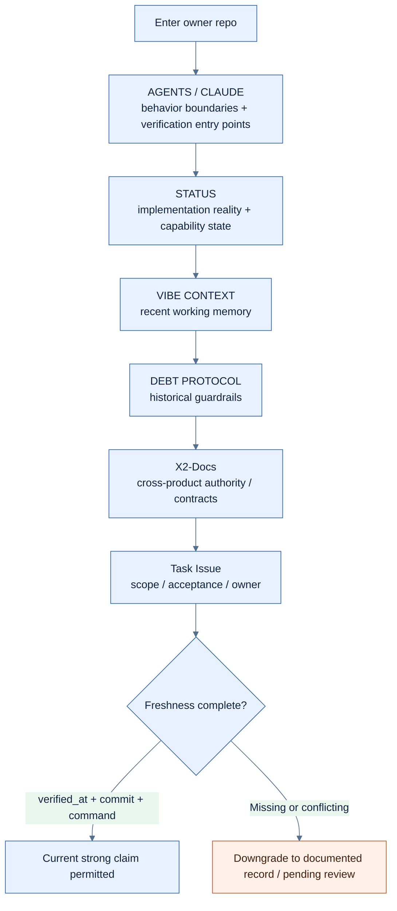

*Figure 4: The context-loading protocol and freshness branch. It defines the order of reading and downgrade behavior.*

Calling a file `STATUS.md` does not make it true. Test counts, module status, and deployment records all go stale. I later began requiring critical status claims to include `verified_at`, `source_commit`, a reproduction command, and `stale_after`, along with `does_not_prove`. Without those fields, the language is downgraded to “documented record” or “pending review,” so the most polished old document cannot overrule newer code.

**Platform authority also has boundaries. X2-Docs may decide a cross-product contract, but it cannot declare on behalf of a product repository that the runtime has been deployed. A product repository may describe its local implementation, but it cannot privately promote a new field into a shared protocol. What the context protocol truly solves is not “putting more tokens into the model.” It makes source, time, authority, and conflict visible.**

# 0x03 Git Must Record More Than History; It Must Say Who Is Writing

When two agents change the same line, Git reports a conflict. The more dangerous case often comes without a red warning: Agent A changes a producer according to the old contract, while Agent B changes a consumer according to the new documentation. They touch different files, their tests pass independently, and Git can merge both changes automatically—yet the semantics have already diverged.

This is now my opening sequence for a Coding Agent:

```bash
git fetch origin --prune
git status --short --branch
git branch -vv
git worktree add .worktrees/<task> -b feat/<topic> origin/main
```

Each command solves a different problem. `fetch` refreshes remote references without touching current WIP. `status` exposes dirty state, branch, and upstream. `branch -vv` makes ahead/behind state visible. The new worktree gets its own index, HEAD, and uncommitted state, created from `origin/main`.

The principle is not “always pull first.” A dirty primary checkout may belong to somebody else. An automatic `pull` can introduce a merge, `stash` changes the scene, and `reset` makes a decision on behalf of the owner. **The first responsibility of preflight is to decide whether this directory may serve as the write space for this task—not to force every directory into a clean state.**

Worktrees are useful and frequently overestimated. They isolate the Git checkout, index, branch, and WIP. They do not isolate process permissions, network access, environment variables, secrets, or other directories. A runner in an independent worktree may still have excessive filesystem and deployment permissions. Git isolation and OS/container/VM, identity, and credential isolation are two separate control layers.

Once multiple agents are involved, the word “owner” is no longer precise enough. I split it into four questions:

| Question | Engineering mechanism |
|---|---|
| Who decides the goal, shared facts, and priority? | authority, ADR, Issue owner |
| Who approves this class of change? | CODEOWNERS, branch protection, reviewer policy |
| Who may continue writing this branch/path right now? | active claim, lease, branch, worktree |
| Who actually executed the action? | automation identity, GitHub actor, Agent/session, event provenance |

**CODEOWNERS only handles approval routing.** At the 2026-07-11 remote-main baseline, 12 of the 14 repositories tracked it; the other two gaps were deliberately retained in the record. Even if all 14 had CODEOWNERS, it still would not know who is writing locally, nor would it stop two agents from modifying the same scope.

The history of X2-Docs shows that this ownership model was not designed in one pass. From May 11 to 13, actionable Issues were first routed back to their owner repositories, dirty default checkouts were forbidden from forced synchronization, and **“one task, one branch, one worktree, one owner, one scope” was written into the Agent contract**. In late May, **CODEOWNERS evolved from coarse file-level rules into product/agent/data/infra ownership, with cross-review routing for workflows and builds. The lifecycle from discovered issue → local implementation → PR → issue closure was then made explicit.**

Only in June did those written policies continue turning into active controls. Workspace audit, safe cleanup, product entry points, and `agent-start` preflight were connected. New worktrees had to start from `origin/<default>`, not a possibly stale local main. The shared integration harness could explicitly select an X-Pulsar worktree as its runtime subject. Codex, Claude Code, Bot, or Orbit sessions operating behind the same GitHub actor were also recorded in the managed claim comment. A second, overlapping claim standard was deliberately closed instead of letting two competing rule sets enter the main path.

That historical chain addresses task routing, checkout safety, scope, approval, lifecycle, remote baseline, runtime subject, and active writer. Compressing it into “we use CODEOWNERS and worktrees” hides the actual concurrency control required by multiple agents.

The active writer is completed by an Ownership Lease. A claim carries at least the task, agent/session, repository, branch, worktree, owned paths, heartbeat, expiry, state, and next step. Orbit's reference implementation uses atomic current state for recovery and append-only events for claim, heartbeat, release, and conflict history. **If claims in the same repository share a branch or overlap in paths, the system warns before a merge conflict appears.**

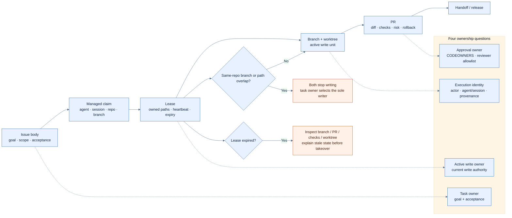

*Figure 5: The Ownership Lease and four kinds of owner. The diagram shows which facts Git concurrency control needs.*

An expired lease is not a license to overwrite somebody else's work. It means a takeover audit is required: inspect the branch, PR, checks, and any accessible worktree, then explain why the old claim became stale. If both sides already have local changes, preserve both worktrees and let the task owner select the sole writer. A file-based lease is not a strongly consistent cross-host lock; network partitions and clock problems still require stronger coordination or human convergence.

At handoff, I expect at least `git status`, the exact HEAD, diff/stat and commit list relative to `origin/main`, the worktree list, checks not run, and the next step. The goal of handoff is not to make the directory look tidy. It is to let the next person or agent reconstruct the scene without guessing.

This is why Git ownership belongs in this article. The risk of multi-agent AI Coding is not limited to code quality. It also comes from compressing authority, approval, active write, and execution provenance into one vague owner field. As writing becomes faster, that ambiguity turns into an incident faster too.

#### Audit Real Capability Before Trusting Role Documentation

Ownership design also needs a reverse check: **what the documentation says a component is responsible for is not the same as what the code allows it to do. At the fixed baseline, X2-Orbit's remote Codex worker could modify product repositories, commit, push, open PRs, and reach merge/deploy paths. X2-Bot could also implement, test, and commit through Claude/Codex runners in product-scoped worktrees. An Orbit-to-Bot feed bridge already existed, although it was disabled by default.**

This meant that the platform once had two write-capable automation owners, while documented authority had fallen behind real side effects. The finding did not prove that both systems had modified the same branch at the same time, nor did it reveal an overwrite incident caused by doing so. But it was enough to disprove the idea that role documentation naturally creates write isolation. CODEOWNERS governs approval, worktrees govern Git state, and leases govern the current scope. If two automation systems both possess commit, push, merge, or deploy capabilities, the platform must still specify which is the execution owner and under what conditions the other may only submit a candidate.

The target model narrows Orbit to evaluation, evidence, and recommendations, while Bot or an approved successor carries sole responsibility for automated writes. **The path is recommendation → managed claim → scoped PR → checks → human review → deploy → Orbit revalidation. Ownership audit must begin with actual capability, not system names, organization charts, or original product positioning.**

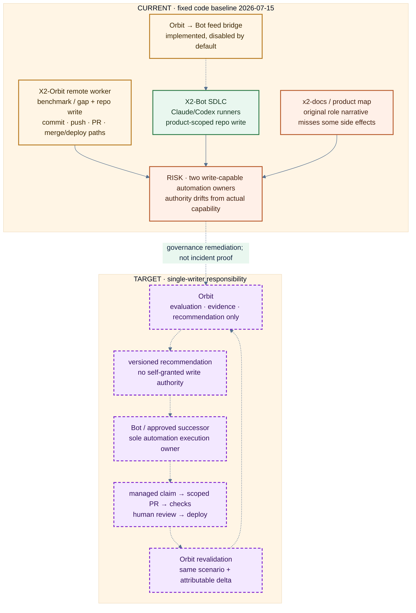

*Figure 6: Orbit/Bot ownership self-audit. Red shows Current capability and authority drift; the dashed purple path is the Target single-writer model.*

# 0x04 Why an Agent Needs a Legitimate Failure State

The easiest way for an agent to perform “autonomy” is to keep working forever. If a test fails, change the code again. If a benchmark regresses, switch prompts. If a deployment cannot read the result back, write an explanation. As long as output continues scrolling across the screen, it looks as if the system has not stopped.

The X2-Bot SDLC Engine breaks a task into explicit states:

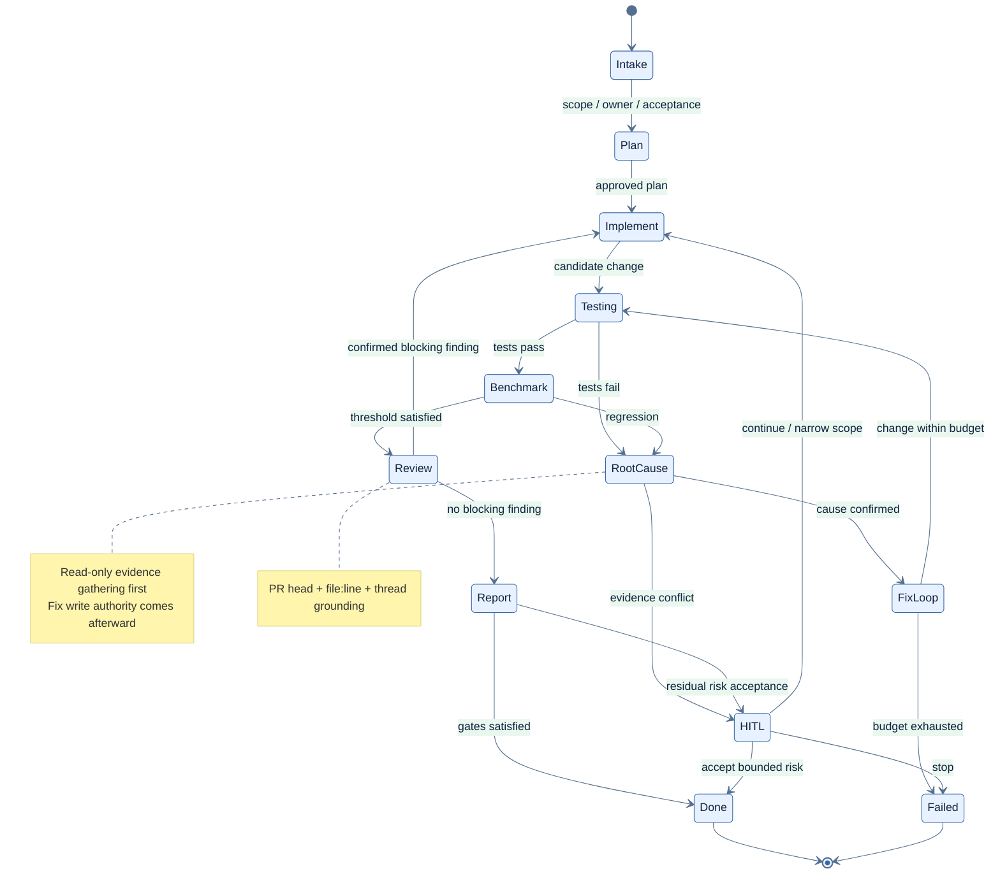

*Figure 7: The constrained X2-Bot SDLC state machine. It expresses both control flow and legitimate stopping states.*

The value of a state machine is not how tidy the diagram looks, but how it constrains the next action. `TESTING` answers only the specified checks. After failure, the task first enters read-only evidence gathering in `ROOT_CAUSE`, distinguishing code, environment, baseline, or the test itself, before `FIX_LOOP` receives limited write authority. `BENCHMARK` cannot be overridden by ordinary green tests. `REVIEW` proposes and verifies issues without casually taking over the implementation owner. `HITL_PAUSED` preserves the state from which it was entered so recovery can return to the correct boundary. `FAILED` is a legitimate endpoint; it does not need to be repackaged as “partially complete.”

X2-Bot's commit history also shows that drawing the state enum is only the beginning. On the day the state machine landed, it was immediately followed by fixes for injection, Git timeout, resume, blocking I/O, memory bounds, scope, and lifecycle failure. Later fixes addressed cases where the lifecycle continued after the task had failed, and where an incorrect test command kept a loop from exiting. An exception may be written to a log without changing control flow, in which case the outside world still sees success.

A controllable loop must define at least the following:

```yaml
state: root_cause
budget:
  attempts: 2
  elapsed_minutes: 15
  risk: read_only
evidence_input:
  - failing command
  - stack trace
  - current diff
  - relevant history
allowed_action:
  - inspect source and history
  - run targeted diagnostics
exit_condition:
  success: cause linked to reproducible evidence
  failure: evidence conflict or budget exhausted
failure_destination: HITL
```

A budget is not just tokens. It includes attempts, elapsed time, cost, and risk budget. **A third repetition of the same failed method should not automatically trigger a fourth attempt simply because tokens remain.** Fast ordinary tests also cannot automatically elevate authority for deployment, migration, or external actions. The central problem of Loop Engineering is keeping the loop inside its boundaries.

The Review incident that lost a chunk at 319 seconds added another lesson: timeout cannot be a single global number. Diff-only review, a small grounded pass, and a large chunk have different workloads and need different budgets. Raising the large-chunk timeout to 600 seconds was only half the fix. The other half was cancellation propagation. Once the caller has timed out or left, the underlying task must end too. Extending the time genuinely required and reclaiming a task that has lost its owner are two sides of the same loop decision.

A state machine is still not a sandbox. If the runner has excessive filesystem, network, or credential permissions, logically entering HITL cannot revoke capabilities already granted to the process. Process state, OS identity, and external side effects must be designed separately. Direct test coverage of the core lifecycle also remains limited, so I describe this state machine as an existing implementation that is still converging—not as a mature general-purpose framework.

# 0x05 Do Not Ask the Model Again About a Deterministic Problem

Another failure appeared in the generative Playbook learning path.

The system learned a new workflow from an execution trace. A domain name in the source task resolved to an IP address at runtime, but the Learner wrote that derived value into later nodes as if it were a stable parameter. When the workflow ran against a different target, the domain had changed while later actions still pointed at the old IP.

This was not a syntax error. The generated structure was complete and every field was valid. On the original target, the old IP might even continue to work. **Asking the same model to “check it again” can easily reproduce the mistake of treating valid format and local success as semantic correctness.**

The final fix did not use a longer prompt. It moved the deterministic part back into ordinary code:

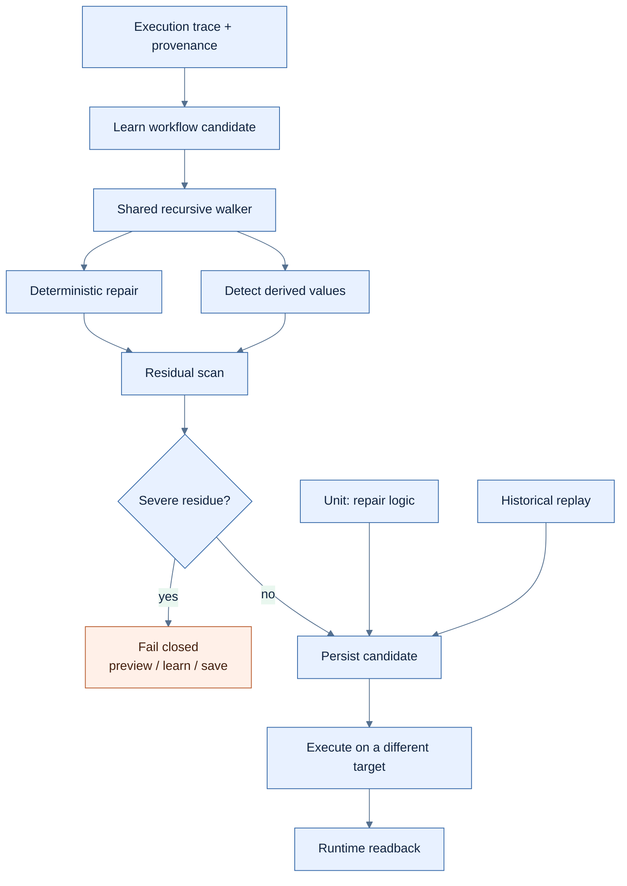

*Figure 8: Deterministic repair and residual scanning for Derived Values. The 8→0 result and changed-target replay are bound to this event snapshot.*

Detection and repair share the same recursive walker and provenance. Otherwise, the detector may see a nested field while the repairer changes only the top level; the preview path blocks it, while learn or save lets it through. Severe residue must stop all three persistence paths, rather than being saved and left for runtime to report.

The verification result for this incident reduced hard-coded nodes from 8 to 0. The related tests reported 577 passed and 4 skipped, and the changed-target replay found no old-IP residue. That result is bound only to the fix snapshot. It does not mean every generative workflow is now safe, nor does it mean a future schema cannot introduce a location the walker does not yet cover.

**Changed-target replay is essential.** Success against the same target may only mean that the old value still happens to work. Changing the authorized target reveals whether a derived value has been frozen into the workflow. This practice later influenced my approach to Review and runtime proof as well: do not merely ask a producer to repeat itself under familiar conditions. Change the observation point and actively search for counterexamples and residue.

There is a broader division-of-labor principle here. **Let the model handle work that requires semantic judgment, such as understanding user intent, proposing candidate steps, and explaining failure. Let parsers, schemas, walkers, provenance, and residual scans enforce deterministic invariants. A model may generate a candidate; it cannot use confidence to override a deterministic gate.**

# 0x06 If You Can Read It Back, Why Is the Product Loop Still Not Proven?

We once had a proof that looked complete: the verifier wrote test data into the fact layer, then read it back through the serving interface using a stable ID.

The evidence was valid. It proved that ingest/read plumbing worked, that an ID could locate an object, and that the serving view could return a matching result. It did not prove that the product had ever produced that data itself.

If the verifier seeds the data and reads it back, the verifier is what forms the closed loop. When a report ends with “the product producer is connected,” it presents the verification script's capability as product capability. This mistake is dangerous because **every preceding step is true; only the claim exceeds the evidence.**

I later separated delivery into four layers:

| Layer | What it can prove | What it cannot prove |
|---|---|---|
| Source | Code entered the specified commit | That commit was deployed |
| CI / Build | The specified tests and build passed | The running instance uses that artifact |
| Deploy provenance | The process or image corresponds to a version | The real product path was triggered |
| Runtime readback | One execution produced an object that can be read back | Every environment, production scale, or long-term stability |

A merged PR, an active service, HTTP 200, and native readback all have value, but each proves only its own segment. Deployment checks must also answer which process/image is running, its start time, cwd, commit/digest, configuration, and data path. A deployment script may have been updated while the old process is still running, and the service can still appear active.

To see why cross-repository proof is so easy to assemble incorrectly, first look at the roles these repositories play:

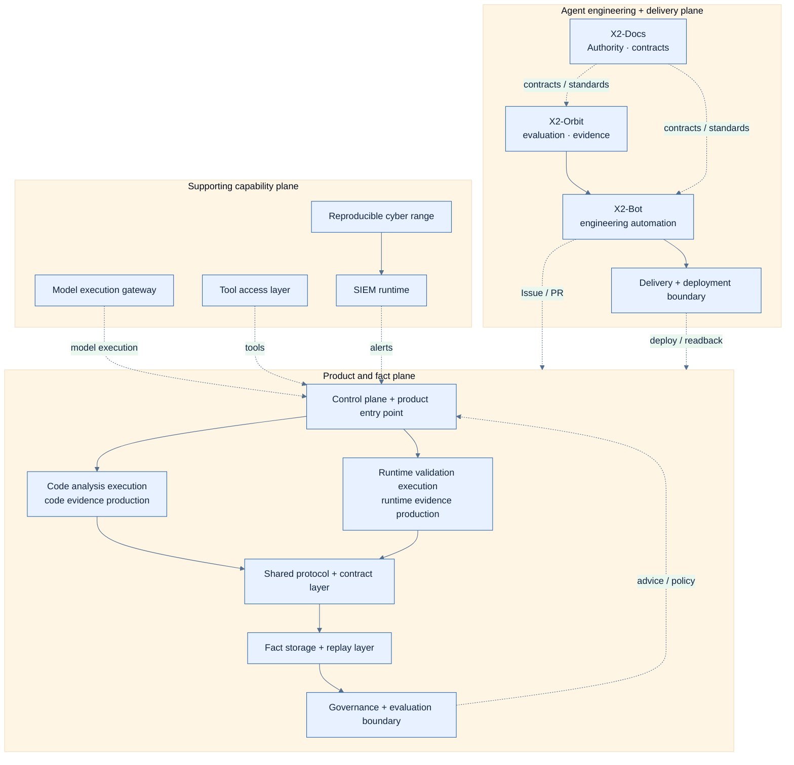

*Figure 9: The three responsibility planes relevant to this article.*

A stronger native producer proof needs continuous provenance and must be distinguished from a verifier writing and reading its own data:

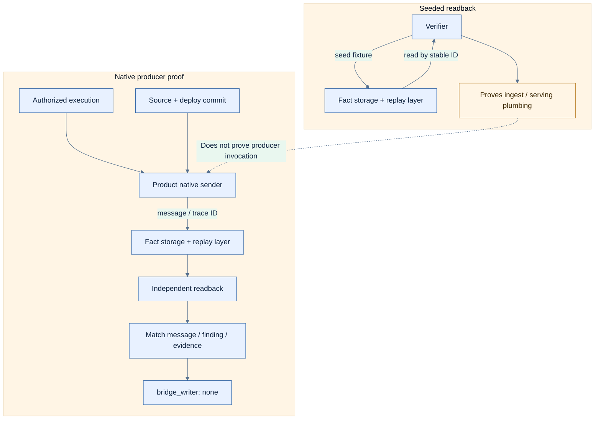

*Figure 10: The evidence difference between Seeded Readback and Native Producer Proof.*

`bridge_writer: none` rules out an intermediary script writing into the fact layer on the product's behalf. An accepted ID connects producer and ingest. Deploy provenance identifies the artifact actually running. A stable ID lets another verifier read the object back, and matched evidence prevents it from accepting a different but similar object. “Authorized execution” is part of the proof as well; runtime validation without scope is not an acceptable delivery, even when it succeeds technically.

Cross-repository systems are especially vulnerable to compositional hallucination: one repository's tests prove the sender, another proves ingest, a third example proves read, and a fourth demo proves a decision. Every segment is green, but the identity, trace, commit, and environment are not the same set. We therefore use first-breakpoint: if a path fails at its first trustworthy invariant, stop there and mark later stages `not reached`. Do not temporarily bypass authentication and then splice in another trace to manufacture a closed loop.

A proof chain in X2-Docs from June 29 to July 1 gave me a more complete example than 24→2. It did not begin with “the loop is complete.” It began with a real startup failure: the orchestrator used an obsolete bucket environment-variable name, the smoke test still called an endpoint that did not exist, and it sent an old envelope rejected by shared protocol and contract layer v0.2 with `extra=forbid`. After those problems were fixed, the report still retained a second embedding boot blocker. It did not describe “getting past the first error” as success.

Attributable evidence was added one slice at a time:

| Stage | New proof slice | What it still could not prove |
|---|---|---|
| Ingest path | HTTP ingest → Kafka → Landing → ClickHouse → replay polling | Core/Pulsar native producers were connected |
| Native adapter | Real Core adapter and Pulsar `sea_router` independently produced source-specific replay | The fact had influenced the next decision |
| Consumer path | Pulsar → Core Redis response; asynchronous landing race fixed | The effect came from one specific Sea fact |
| Same-ID provenance | A seeded OutcomeRecord produced UP while an unseeded control produced HOLD; the OutcomeRecord ID crossed the frozen consumer mirror | Production deployment or a generalized closed loop |
| Harness hardening | Fixed a flag silently ignored by settings and local embedding/proxy drift; covered token auth | The proof harness would never drift again; production secret custody was still incomplete |
| Shadow rollout | Channel B ran shadow/observe-first in local-dev and produced an enablement matrix | Enforcement was authorized or enabled by default in code |

This chain contains several very ordinary details:

* Asynchronous landing requires polling, not a single GET.
* A seeded lane needs an unseeded control before the ratchet difference can be attributed to that fact.
* The same OutcomeRecord ID must cross provenance and the frozen consumer mirror; “success” on both sides is not enough.
* Enabling a feature flag still requires a flag-off lane.
* The behavioral path begins in shadow mode and records only would-have-blocked. Technical connectivity does not grant blocking authority automatically.

These are bounded proofs in an authorized local environment. They do not imply production scale, every tenant, long-term stability, or a complete security loop. Their value is precisely that every PR knows which additional segment it proved and why the next segment still cannot be declared.

A proof artifact retained over time must state its boundaries explicitly:

```yaml
claim: product-native-evidence-readback
state: LIVE
snapshot: <event-date>
source_commit: <commit>
deployment_digest: <digest>
stable_trace_id: <redacted-reference>
readback_match:
  producer: true
  message: true
  evidence: true
bridge_writer: none
does_not_prove:
  - production scale
  - every deployment environment
  - long-term reliability
  - absence of unrelated regressions
```

`does_not_prove` is not a disclaimer. It prevents language from extrapolating one success in an authorized environment into a current capability of the whole platform. Not every PR needs to reach runtime; an ordinary change can reasonably stop at branch, tests, CI, and Review. But runtime provenance and same-trace readback cannot be omitted when automation will take further action, data will enter a long-lived fact layer, producer and verifier belong to different repositories, or the result will be used to increase an agent's autonomy.

# 0x07 An All-Green Gate May Still Be Validating the Wrong Subject

Engineers are accustomed to trusting gates. A gate is more reliable than a meeting conclusion because it executes, fails, and blocks a merge. Yet the platform's fixed-snapshot audit in July gave me a direct counterexample.

The legacy fixture gate in X2-Docs reported 15/15 passing fixtures. When the same set of objects was passed to the current shared protocol and contract layer 0.2.3 validator, the result was 0/15.

The green gate was not lying. It faithfully validated an obsolete compatibility subject. The problem was that verifier version, subject version, and fixture origin were not bound, so the pipeline continued to treat green results under the old rules as proof of compatibility with the current protocol.

Nor does this result imply that “the current validator must be correct” or “every integration is broken.” It proves something narrower and exact: the original blocking gate was not validating the current authoritative subject. A more complete gate must retain at least the following:

```yaml
gate:
  verifier_version: <tool-or-package-version>
  subject_version: <schema-producer-consumer-baseline>
  fixture_origin: <authoritative-source>
  command: <reproducible-command>
  failure_effect: block-state-transition
  exception:
    owner: <risk-owner>
    expires_at: <timestamp>
```

`failure_effect` is easy to omit. A script can exit nonzero, **but if a Makefile, CI wrapper, or parent Agent swallows the failure, the gate is still only a log line.** An exception also needs an owner and an expiry; otherwise, a temporary compatibility allowance slowly becomes the new default protocol.

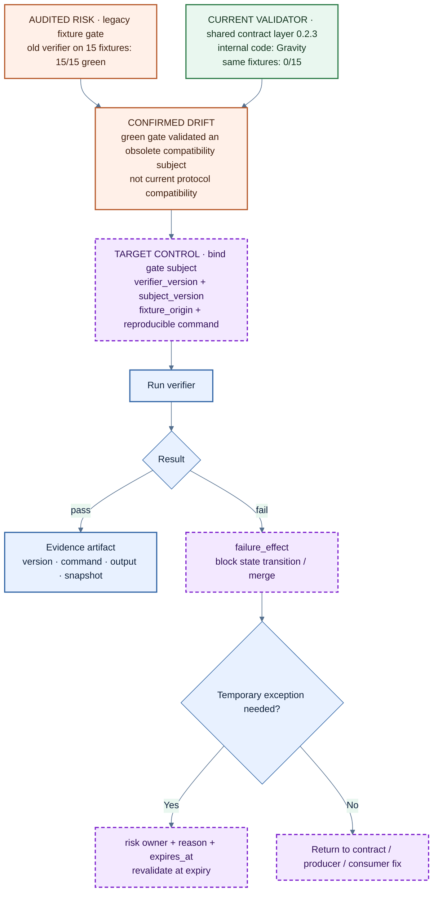

*Figure 11: From a green legacy gate to a version-bound gate. The 15/15→0/15 result proves only that the old blocking gate did not validate the current authoritative subject.*

I used to apply Assurance mainly to code and agent output: testing implementation, Review conclusions, deployment, and runtime. This example shows that the verifier itself can drift. Tests, schema validators, benchmarks, architecture checks, report checksums, and even a state called “final” should all answer which object and version they verified—and who actually stops after failure.

Authority must also accept counterevidence. On June 19, X2-Docs documented a Sea replay path and tenant/org scope for Orbit A2. Five days later, Orbit E2E proof found that the contract disagreed with the Sea and Pulsar implementations. The fix did not force the products to conform to stale documentation. It changed the authoritative path back to the real `get_replay`, changed scope to tenant+user, and documented the Sea→Pulsar merge/deployment order. Platform text could become LIVE first while the product composition remained PARTIAL and AWS proof remained MISSING until deployment completed and the artifact was rebuilt. Authority decides where contract conflicts converge; it is not exempt from correction by runtime evidence.

#### A Finding Is Not a Conclusion; Counterevidence Defines the Impact Boundary

In July 2026, we conducted a platform audit against fixed commits from eight repositories and produced 96 independent current findings. The original input contained 43 P0/P1 findings, which were then given to an independent reviewer tasked with actively finding counterevidence. The result was 29 supported, 8 missing-counterevidence, and 6 overstated findings, with 11 severity corrections in total.

The most important number is neither 43 nor 11. It is the reviewer's task definition. **The reviewer was not there to normalize tone, nor to ask another model to reread the same summary. The job was to challenge the impact boundary: does the dangerous sink actually exist in source, is the fixed deployment path truly reachable, what identity and preconditions apply, which existing controls reduce impact, and which stages in the report never actually executed?**

A finding can carry two different confidence levels at the same time:

```text
Fact confidence   = whether the code or configuration fact is true
Impact confidence = whether that fact can produce the stated impact inside the current delivery and runtime boundary
```

Some findings retained the source-code fact but required a lower impact rating because of deployment counterexamples, unreachable paths, or missing preconditions. Others retained high priority because no counterexample strong enough to alter reachability was found. Counterevidence is not a defense brief for the system. It prevents security language from inflating “a dangerous statement exists” directly into “the complete impact has occurred.”

**Independence does not simply mean switching models.** If two agents share the same chunk, the same stale STATUS, and the same failure destination, they are only copying an assumption. Verifier independence can come from different evidence sources, permissions, and responsibilities: a PR author cannot self-approve; a Review candidate returns to source, history, and tests; producer output is checked through stable-ID readback; and a separate role actively searches for deployment counterexamples to a high-severity finding.

The audit also uses first-breakpoint. When a cross-product path fails at its first trustworthy invariant, later stages are marked `not reached`. The system does not bypass the failure just to draw a complete loop. The report may contain fewer attractive “end-to-end” claims, but every conclusion knows where it stopped.

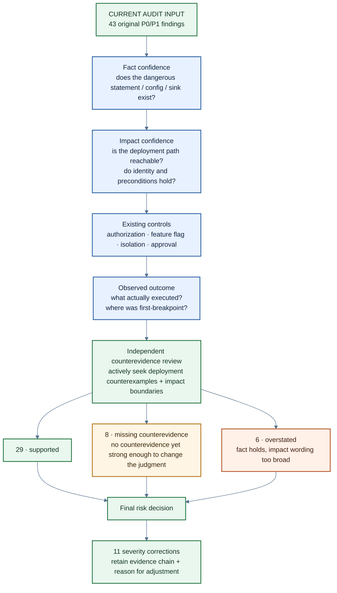

*Figure 12: How Counterevidence Review separates fact confidence from impact confidence. The numbers are bound to the fixed eight-repository audit.*

The preceding three sections show why an evidence gate must bind its subject, version, and failure effect. If verifiers and gates can drift, then other control-plane artifacts—architecture diagrams, automated writers, and risk findings—cannot acquire Current status merely because they look complete.

# 0x08 All 33 Diagrams Rendered, but Not One Could Represent Current Unconditionally

In an earlier version of this article, I wrote a section called “Architecture as Code” in a tone that suggested a formal gate was already ready. After another audit, that claim no longer held.

The earlier diagram audit exposed gaps in the old Architecture-as-Code narrative. ADRs, a DSL parser, scope validation, Mermaid, and some scanners already existed, but there was no complete code-to-model reconciler at the time, and the checks were not part of required product CI. The ability to generate a diagram and pass syntax validation does not mean code relationships have been reconciled with the model.

The latest X2-Docs has advanced this work to **foundation/advisory**. A Structurizr desired graph, relationship identity, governed UML sequence/state projections, schemas, a renderer, asset closure, mutation tests, and `uml-test` / `uml-check` are now in place. Architecture as Code has moved from “a worthwhile prototype” to “a control plane ready for experimentation.”

We switched to a clumsier but more reliable method: freeze remote commits across 14 repositories, then compare each of the 33 existing C4 diagrams, PlantUML views, ecosystem maps, and target diagrams against entry-point code, deployment configuration, current status, and ADRs. The result was:

| Classification | Count | Meaning in this audit |
|---|---:|---|
| Accurate | 0 | No original diagram could serve as a complete current fact without qualification |
| Partial | 7 | The primary boundary still held, but local relationships, conditions, or maturity needed correction |
| Stale | 16 | Continuing to present it as Current would mislead implementation or runtime judgment |
| Target-only | 10 | It expressed a target, not the current implementation |

`0 Accurate` does not mean all 33 diagrams were worthless. Partial diagrams retained many correct boundaries, and Target-only diagrams could still communicate direction clearly. The real problem was missing state: a Python package was drawn as an independently deployed container; an asynchronous path was drawn as a synchronous call; a proposed API and L5 target entered the Current overview; a disabled-by-default bridge was shown as nonexistent; and an owner that had changed was still described using the old role.

**Valid XML, a nonempty SVG, and a sharp PNG prove only that an artifact can be parsed. They do not validate nodes, edges, authority, deployment, or maturity. An architecture diagram is itself a claim-bearing artifact.**

The review produced 22 Mermaid views with explicit state semantics and six code-audited closed-loop detail diagrams. We did not paint them all as “correct.” Instead, Current, Conditional/Partial, Risk/Broken, Target/Proposed, and Candidate/ADR Required were written into nodes, edges, and legends. Every published diagram also needs a subject snapshot, evidence source, and `does_not_prove`.

This implementation still has explicit boundaries. The `architecture-uml` CI job is present/advisory, runs on PR-controlled source, and is not trusted enforcement. Production sequence/state scenarios still need to be added, along with required status, a protected/trusted evaluator, runtime reconciliation, and product-level adoption. The toolchain must continue to accept counterevidence from real code, deployment, and product behavior.

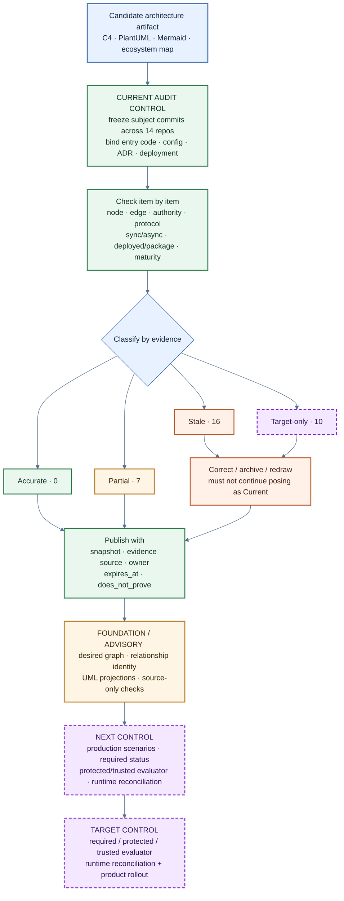

*Figure 13: **Architecture Artifact Assurance, not “if it renders, it is correct” Architecture as Code.***

This changed what I expect from Architecture as Code. A DSL and reconciler are still worth building, but the word “code” does not grant them authority. Models, scanners, and gates all need to bind to a real subject; when the code changes, the diagram becomes stale again. **Architecture artifacts must be rebuilt continuously, not generated once and treated as permanently correct.**

# 0x09 At This Point, I Gave the Practice a Name

These mechanisms did not begin with a framework diagram.

`CLAUDE.md` came from session cold starts. X2-Docs came from multi-repository authority pressure. Ownership Lease came from concurrent writes. Grounded Review came from 24/2. Deterministic repair came from the old IP. Native proof came from seeded readback. Gate audit came from 15/15→0/15. Architecture artifact state came from the 33-diagram review.

Looking back, they fall into five classes of problem:

| Engineering discipline | What it primarily answers |
|---|---|
| Prompt Engineering | How is the task expressed? |
| Context Engineering | What does the agent see, and what does it rely on? |
| Harness Engineering | What can the agent call, and how does it run? |
| Loop Engineering | How does the agent continue, stop, and fail? |
| Assurance Engineering | Why may an action, judgment, or delivery become fact? |

I call the fifth class extracted from the X2 practice **Agentic Assurance Engineering**. It designs engineering controls around an agent's authority, ownership, constraints, evidence, and risk acceptance. It does not replace the other four. Fixing 24/2 required the right Review prompt, PR-head and thread context, a usable Git/grep/test harness, chunk timing and cancellation mechanics, and file:line grounding, replay, and verdict boundaries.

**Evidence Engineering** is the evidence subdomain of Assurance. It covers provenance, independent verification, runtime readback, counterevidence, and `does_not_prove`. It asks how a candidate is verified, at which layer it holds, and what fact would overturn it.

**Proof-Carrying Delivery** is a delivery mechanism. In plain language, delivery must carry evidence: a change does not become complete because a summary says so. It moves into the next state carrying task scope, remote baseline, tests, Review, deploy provenance, runtime readback, checks not run, and remaining risk. I did not force this name into another `Engineering` because it sits at a different level. Prompt, Context, Harness, Loop, and Assurance are five classes of engineering problem; PCD is a way to put part of them into the delivery chain.

**X2 Agentic SDLC** is the concrete implementation. X2-Docs handles platform authority. GitHub Issues and claims handle tasks and active owners. Branches and worktrees preserve isolated writes. X2-Bot turns a task into a state machine with failure exits. X2-Orbit handles evaluation and proof contracts. Product repositories execute real behavior and produce evidence.

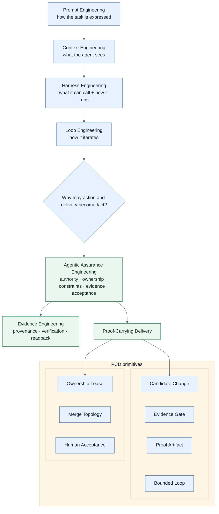

*Figure 14: The extracted method hierarchy—the latest practice built on top of Harness and Loop Engineering.*

This hierarchy matters for AI Coding. It avoids inventing another name for every new incident, and it avoids reducing every problem to “evidence.” Whether an agent has authority to act is related to whether it can provide evidence for the result, but they are not the same question. A gate can produce output without being bound to the correct subject.

If these mechanisms remain confined to my workspace, they are only personal working habits. They gain product value only when they become stable interfaces, connect to existing engineering systems—effectively forming a new development process and a new SDLC—and run repeatedly across different teams.

I define **Agentic Assurance Engineering** not as another Coding Model, nor as an agent wrapped in a chat window, but as a control plane between Issues, Git, CI, Review, deployment, and runtime. Models can be replaced. The **core of the engineering practice is task facts, authority boundaries, state transitions, evidence objects, and risk acceptance**.

| Capability | What it receives | What it delivers | What it solves |
|---|---|---|---|
| Context Authority | Rules, status, contracts, task facts | Context with source and freshness | Prevents agents from acting on stale or conflicting text |
| Scoped Execution | Issue, repo, branch, worktree, lease | A transferable unit of write ownership | Reduces scope violations, overwrites, and lost work under multi-agent concurrency |
| Grounded Review | PR head, source, history, thread | A file:line candidate and verifiable verdict | Pulls Review back from pattern completion to the real repository |
| Bounded Loop | State, budget, evidence, failure conditions | Legitimate exits such as HITL, FAILED, and DONE | Makes the agent stop when evidence is insufficient instead of retrying forever |
| Proof-Carrying Delivery | Source, CI, deploy, runtime trace | Provenance, readback, `does_not_prove` | Turns “done” into an auditable, rollbackable delivery state |

The first adoption layer connects this engineering practice to Issues, Git, and Review, providing advisory findings and handoff. The second connects contracts, tests, and policy gates to state transitions, allowing a merge to be blocked or an agent to be paused. The third adds deploy provenance, native producers, and runtime readback. Each layer creates value on its own, addresses a real problem, and retains a clear evidence boundary.

This practice is not primarily for teams that only want individual developers to generate a few more snippets of code. It is for organizations with multiple repositories, multiple agents, regulated delivery, or high-risk runtimes. What those organizations lack is not another model. They need an engineering product that can answer: who authorized the action, what can the action affect, which evidence is acceptable, and who takes over after failure?

For that reason, **the moat around Agentic Coding should not be built on a particular model or prompt. Models will change, tools will be replaced, and every customer will have different repositories and CI.** What transfers is the authority model, ownership protocol, evidence contract, policy gate, and runtime proof. Those are the stable core that can be extracted from internal engineering practice into a commercial product.

At the end of the process, I ask myself seven questions when working on AI engineering:

* Who defines the goal and shared facts?
* Under whose identity does the agent act, and what can it affect?
* Who is writing right now?
* Where should the system fail first?
* Does the evidence support source, CI, deploy, or runtime—and no further?
* Which counterexample would overturn the impact assessment?
* Who accepts the remaining risk, and who may increase autonomy?

These questions are not new. They come from principal, least privilege, separation of duties, negative testing, provenance, and auditability. **AI changes execution speed, concurrency scale, and the way errors propagate. It does not repeal the basic constraints of security and software engineering.**

For me, the most important change after AI Coding enters a team is not giving an agent more freedom. It is making sure every action is caught by a task fact, isolated by Git, claimed by an owner, verified by a gate, challenged by counterevidence, and stopped when the evidence chain breaks. Technical leadership is not the ability to tell a story without gaps. It is the ability to make the system state clearly what it can prove now, what it still cannot prove, and who owns the next step.
