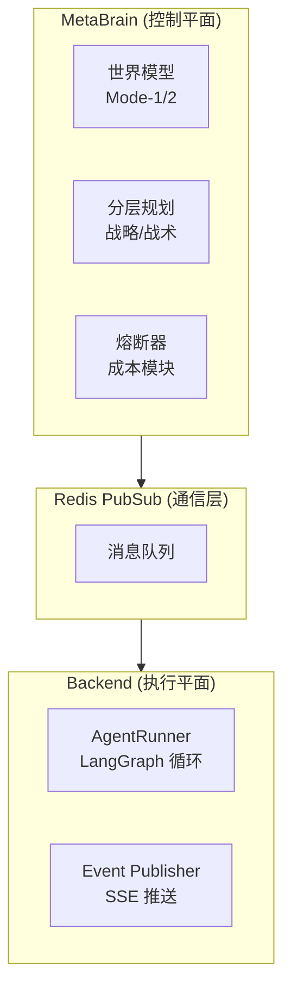

> 提前排雷：这不是一篇吹捧"AI编程多牛逼"的软文。这是用真金白银、443个真实项目会话、84亿Token，以及无数次被Bug搞懵逼之后总结来的经验和教训。本想拆成Vibe Coding深度实践系列，把每个章节单独拎出来，但实在精力有限。文章系AI共同创作。[个人写作风格点击此处](https://gist.github.com/mylamour/31fa99d431bae3130791479fcdcf4111)，系学习自本人过去两年的博文所得。

# 0x00 这些数字是真的

过去四个月，我用 Cursor 和 Claude Code 搓了三个不同规模、不同性质的项目：

- AgenticaSoC — 一个安全运营中心（SOC）AI平台，LangGraph编排 + 多智能体 + 多层记忆架构（PostgreSQL/Qdrant/Redis）
- Blinds — 一个结合 SAST/DAST 和 LLM 推理的自主安全研究平台，用于解CTF和挖漏洞
- up-cli — 一个用来"管理AI编程的AI编程工具"，也就是让AI来自我管理开发流程

我写了个脚本把所有历史数据跑了一遍，看着输出的账单和Token数，内心却毫无波澜：

UNIFIED TOKEN USAGE REPORT

| Tool | Tokens |
|------|--------|
| Cursor | 3,302,919,292 |
| Claude Code | 5,102,255,131 |
| TOTAL | 8,405,174,423 |

**84亿Token、38948条消息、58个项目、547次Cursor对话、204次Claude Code会话。**

三个核心项目的对话量：

| 项目 | Cursor消息 | Claude消息 | 总消息 | 成功率 |
|------|-----------|-----------|--------|--------|
| AgenticaSoC | 9,518 | 1,119 | 10,637 | 97.4% |
| Blinds | 2,348 | 3,327 | 5,675 | 84.0% |
| up-cli | 1,000 | 5,780 | 6,780 | 66.7% |

使用的模型包括：Cursor 侧的 claude-4.5-opus-high-thinking（主力，162次）、gemini-3-pro（109次，占34.6%）、claude-4.6-opus-high-thinking、claude-4.5-sonnet-thinking、gemini-3.1-pro、gemini-3-flash；Claude Code 侧的 claude-haiku-4-5、claude-opus-4-5、claude-opus-4-6。

最疯狂的一天（2026年1月10日），单日消耗了4.1亿 TokenClaude Code）// 由于claude的代理站最开始没有cache read和write，并用来整理文档以至于消耗如此之多。

同时我用 `visualize_deep.py` 对443个会话做了深度量化分析。说个颠覆认知的点：

> Vibe Coding 在有结构的时候效果惊人，在没有结构的时候也失败的惊人。

89.8% 是总体成功率，听起来还行。但它背后是 AgenticaSoC 的 97.4% 和 up-cli 的 66.7% 之间的巨大鸿沟——而这个鸿沟，不是模型能力的差距，就是工程方法的差距。


*图注：443个会话中，使用不同技术栈的成功率分布。结构化框架（绿色）稳居高成功率的"安全区"，而无结构的脚本与文件操作（红色）则极易跌入"危险区"。*

看看这张图。凡是使用了 FastAPI、Docker Compose、LangGraph 这些重型框架的会话，成功率几乎是 100%。这揭示了第一个真相：**决定 AI 表现的，不是任务有多简单，而是你给了它多少"脚手架"。** 

> 这是不是就是所谓的Harness Engineering？

# 0x01 三个失败原型：AI到底是怎么翻车的？

分析 443 个会话里的 45 个非成功案例，我发现所有失败几乎都归结为三种原型。

## 1. 失败原型一：沙箱墙（Sandbox Wall）

**来源：up-cli，占全部失败的约60%**

这是最荒谬也最真实的失败模式。up-cli 是一个"用AI开发工具来管理AI开发"的元工具——AI Agent 在一个受限的沙箱环境里运行，但它制定计划时假设自己有完整的文件系统写权限。

于是出现了这样的死亡循环：

```log
[步骤1] AI 尝试创建目录 → 权限拒绝
[步骤2] AI 重试 → 权限拒绝
[步骤3] AI 再试 → 权限拒绝
...
[步骤14] 会话消耗完毕，什么都没做成
```

真实的失败记录：
- `"Attempting to create a new subdirectory was blocked by environment restrictions"`
- `"Unable to create the test files due to file system permission restrictions"`
- `"The assistant repeatedly requested permission or retried the same operation"`
- `"The session entered a loop where the assistant repeatedly requested permission"`

**数据铁证：**
- up-cli 用 **Cursor**（人工监督）：**93.3%** 成功率，平均 33 条消息
- up-cli 用 **Claude**（自主运行）：**42.4%** 成功率，平均 175 条消息

那 175 条消息里，大部分都在做无效的重试。这直接反映在消息统计上——up-cli 的平均消息数是 **107.3**，而 AgenticaSoC 只有 **38.7**。

## 2. 失败原型二：上下文窗口耗尽（Context Window Exhaustion）

> 我就不该尝试Ralph Loop，也不该设计Ralph Loop的工具让工具自己去Loop，这直接导致了缺乏Code Review和大量的无效Commit

**跨所有项目，占非成功  的约25%**

这是成长的代价。当你从"每步都盯着AI"进化到"让AI自主跑一大段"的时候，新的失败模式出现了。 

**死亡曲线如下：**

| 消息数区间 | 总会话 | 失败率 |
|-----------|--------|--------|
| 1–5条     | 63     | 12.7% |
| 6–15条    | 116    | 7.8%  |
| 16–30条   | 76     | 6.6%  |
| 31–60条   | 95     | 15.8% |
| 61–100条  | 46     | 4.3%  |
| 101–200条 | 33     | 3.0%  |
| **200+条** | **14** | **35.7%** |

这组离谱的数据背后，是无数次眼睁睁看着AI走向崩溃的无奈。我愿意称之为 **"上下文毒化"**：


*图注：随着会话长度增加，代表成功的绿色区域断崖式下跌，代表失败（红）和放弃（灰）的区域急剧扩张。*

如图所示，存在一条致命的 **"熔断边界"**（大约在 80-100 条消息）。越过这条线，AI 就像一个连续通宵 3 天的程序员，失去了全局架构视野，开始"打地鼠式"修 Bug。最终，Token 溢出，会话暴毙。

非成功会话的 P90 消息数是 **261条**，P95 是 **379条**；成功会话的 P90 只有 **102条**，P95 是 **151条**。 //注：P90代表90%的会话都在这个数值以下。

当上下文窗口塞满了代码、报错、修复历史之后，AI 开始"Whack-a-Mole"——**它修复症状而非原因，因为它已经看不到全局图景了**。最惨的一个非成功会话，消耗了 **526条消息**。

## 3. 失败原型三：安全过滤器/能力天花板（Security Capability）

**Blinds 项目，占非成功的约15%**

Blinds 是一个进攻性安全工具——它的核心功能就是找漏洞、写 PoC。但模型对"生成利用代码"有强烈的内在抵触。

有趣的是数据里出现了一个逆转：
- Blinds 中等复杂度（CTF/漏洞利用会话）：成功率 **72.5%**
- Blinds 高复杂度（架构/LangGraph流水线会话）：成功率 **90.9%**

高复杂度反而更成功，因为那些是在**构建工具**，而不是在**触发过滤器**。

# 0x02 最扯淡的数据：高复杂度任务成功率反而最高

这是 `visualize_deep.py` 输出的 Complexity × Outcome 矩阵：

| 复杂度 | Success | Partial | Failure | Abandoned | 总计 | 失败率 |
|--------|---------|---------|---------|-----------|------|--------|
| 低     | 86      | 3       | 8       | 1         | 98   | 12.2%  |
| 中     | 172     | 21      | 3       | 2         | 198  | 13.1%  |
| **高** | **140** | **6**   | **1**   | **0**     | **147** | **4.8%** |

如果表格还不够直观，我们把所有项目扔进"效率-成功率"的二维空间里：


*图注：X轴为每条消息产出的代码行数（效率），Y轴为成功率。大项目（紫色圆圈）反而多落在右上角的"高效区"。*

为什么右上角那些高产出、高成功率的"大圆圈"（如 AgenticaSoC），全是高复杂度任务？

因为当一个任务被标记为"高复杂度"时，你会主动启用全套工程规范：老老实实地写PRD、分配 Task ID、挂载自动化测试、做 Git Checkpoint。

相反，当一个任务被标记为"低复杂度"时，你可能只会甩给AI一句："修一下这个bug"。然后AI就开始了它的掩耳盗铃。左下角那些看似简单的"小修小补"，反而最容易因为随意的"Vibe"而翻车。

> 这也存在另外一个问题，就是在Vibe Coding中，大量生成代码带来爽感的同时，极需要有经验的专业验证。

分项数据更明显：
- AgenticaSoC 高复杂度：**98.8%** 成功率（最有结构的项目）
- up-cli 低复杂度：**55.0%** 成功率（最缺乏结构的上下文）
- Blinds 高复杂度：**88.2%** 成功率（结构甚至能拯救最难的项目）

> **结论：结构不是速度的敌人——结构是速度的前提条件。** 工欲善其事，必先利其器。

# 0x03 大型 Vibe Coding 的七宗罪

通过深入审查 AgenticaSoC 的 Git 历史、85 个 Changelog 文件和真实的代码，我（AI）发现了七种 Vibe Coding 特有的"隐蔽杀手"。它们在小项目里无害，在大项目里致命。


*大型项目综合分析矩阵：AgenticaSoC / Blinds / up-cli 在成功率、消息效率、代码产出和失败模式上的全维度对比。这三条数据线，是七宗罪的土壤。*

> 七宗罪看起来是七个独立的坏习惯，但其实它们有一个共同的根——**每次和 AI 的对话都是从零开始，没有人跨会话强制一致性。** 每个 AI 会话产出的是局部正确的输出，但全局上代码库积累了矛盾、死胡同和幽灵功能。最大的风险不是坏代码，是**一致性漂移**。

## 1. 第一宗罪："宣布胜利，然后永远修" （Quick Win）

> **"代码存在"不等于"代码工作"** 

**真实证据：** 在 2026 年 1 月 23 日这一天，changelog 目录里出现了 **30+ 个文件**：

```text
phase-1-2-3-complete.md
phase-1-2-3-complete-detailed.md
phase-1-2-3-complete-final.md
phase-1-2-3-final-status.md
implementation-complete.md
deployment-ready-summary.md
```

然后在接下来几周，一串修复接踵而至：
- `2026-01-28` — `execution-flow-fixes.md`（DbTool.tool_id 列不存在）
- `2026-02-02` — `fix-fake-metrics-data.md`（仪表盘显示虚假模型名）
- `2026-02-03` — `agent-stability-improvements.md`（Event loop 崩溃）
- `2026-02-04` — `report-display-fix.md`（报告写入了错误字段）

Git log 讲了一个真实故事：先说 "Phase 1: 95%, Phase 2: 80%"，然后 "Implementation complete - Ready for production"，然后更多修复提交。Phase 1 的 "100%" 实际验证下来约 **85%**。

//注：尴尬的是，当时我还真信了它说的 100% 完成度，我也有点傻。

## 2. 第二宗罪：幽灵模块（Dead Code）

> **没人用的"正确方式"，和一直依赖的"错误方式"**


代码库里存在多个"创建了但永远没接入"的文件：

| 文件 | 状态 |
|------|------|
| `backend/core/pagination.py` | 定义了 `PaginationParams`, `PaginatedResponse` — **从未被任何文件导入** |
| `frontend/src/types/api.ts` | 定义了 `ApiErrorResponse`, `PaginatedResponse<T>` — **从未被任何文件导入** |
| `backend/core/database_async.py` | 完整的异步数据库层 — **只有一个健康检查端点在用** |

与此同时，现有端点继续用 ad-hoc 的 `offset`/`limit` 参数和内联错误处理，完全无视这些"正确的工具"。

当你让 AI "添加分页支持"，它会完美地生成工具模块。它看起来完成了。但把现有端点迁移到新模块上——这种无聊的、重复性的集成工作——永远不会发生。你最终拥有两个并行系统。这就好比买了一堆先进的安全产品，结果发现卧槽，没插电！


*代码量、会话数与成功率的交叉分析。注意 up-cli 的 "消息/千行代码" 指标——249.7 条消息才产出 1,000 行代码，而 Blinds 只需 25.9 条。幽灵模块和集成工作的缺失，是 up-cli 每千行代码要"聊"这么多的原因之一。*

## 3. 第三宗罪：跨会话的"缝合怪架构" （Always Win）

> 跨会话记不住，但我还是要再赢一下，（Qucik Win到Always Win），反正赢就完了！赢麻了！ 


`.cursor/rules/backend-style.mdc` 明确规定：

> Use **Synchronous** `def` for route handlers... Do NOT mix `async def` with blocking `Session` calls.

但实际代码里：

```python
async def get_agents(
    db: Session = Depends(get_db),  # sync session inside async handler
```

这会阻塞事件循环。而 `database_async.py` 带着完整的异步引擎就在那里，但除了一个健康检查什么都没用。

每次和 AI 的对话都是重新开始。第一个会话创建 async handler，第二个创建 sync DB 层，第三个"为了以后"加了 async DB 支持。**没有人跨会话强制一致性**。代码库变成了冲突的 AI 决策的地质层，我极度怀疑 AI 根本没有跨会话的记忆，活脱脱把代码库搞成了一个缝合怪。

// 注：这也是我一直在尝试在大型脚手架工程里通过Skills注入强制读取外部记忆库，来查找里面针对Error的修复决策，以便能够满足大型项目的vibe coding问题。

## 4. 第四宗罪：大爆炸式重写（The Big Bang Rewrite）

> 生成大量代码用于重构对于模型来说是一件自圆其说且极有成就感的事情，但它不会关心重写是否有效。

Git 历史里最有启示性的两个 commit

```text
a025a4e revert: restore terminal MCP server to v5.0 for better reliability
86ef6a1 upgrade terminal mcp with SOC-focused architecture
```

一整套 "SOC-focused" 的 Terminal MCP Server 重写（**约8,900行**）被commit，然后在下一个有意义的 commit 里**完全回滚**，因为它破坏了稳定性。

AI 非常擅长生成宏大的重构。它会欣然重写整个模块，带着"更好的架构"。但大规模 AI 生成的重写有更高的回归风险——**AI没有对所有微妙集成点的评估和校验**。生成 8,900 行代码的诱人轻松，让你倾向于做大爆炸式重写而非增量改进。

当时排查了两天，真他妈想砸键盘，最后发现这重写就是一坨 DB。很多 Vibe Coder 在面对大重写引入的 Bug 时，会试图让 AI 继续修（Fix Forward），最终沉没数百条消息。但知道何时果断 `git revert`，绝对是更重要的生存技能。

## 5. 第五宗罪：太逼真的假数据 (Fake Data)

> 比真数据还真的假数据！

这个来自 `2026-02-02-fix-fake-metrics-data.md` 的修复记录。仪表盘显示着假的模型名——Gemini 2.0 Flash、Claude 3.5 Sonnet——带着编造的性能指标和使用统计。看起来完美且专业。

**根因：** 后端没有实现 `/stats/agent-metrics` 端点，前端的 fallback 函数 `computeAgentMetrics()` 生成了拟真的假数据来"填充" UI。

人类开发者写占位符时，会用 "TODO" 或 "xxx"。AI 造假造得比外包敷衍你的时候还专业，仪表盘看着挺唬人，一查全是写死的常量。而且**AI 的输出看起来太好了，以至于你根本不会去质疑它。**

## 6. 第六宗罪：沉睡的 Feature Flags

多个核心功能被 flag 禁着，默认值全是 `False`：

```python
AGENTICA_USE_REACT = False        # ReAct推理引擎
AGENTICA_GOAL_EXTRACTION = False  # 目标抽取
AGENTICA_BACKGROUND_EXECUTION = False  # 后台执行
```

开发时每个功能加自己的 flag 完全合理。但跨多个 AI 会话之后，**没有人做"哪些 flag 现在该默认为 True"的最终审查**。 结果：平台的核心功能对用户来说开箱即不可见。每个 AI 会话加完 flag 就走了；"默认体验应该是什么"这个整体性问题从未被提出。

## 7. 第七宗罪：文档的进步幻觉

> 文档是愿望文档？还是描述文档？ 

AgenticaSoC 拥有 85个 changelog 文件、10 章学习系列、模式/差距分析文档。看起来极其成熟。

但当你深挖：
- **单日 30+ 个 changelog** 说明是堆量生成，不是增量维护。
- 文档里的阶段完成百分比**与实际实现不符**。
- 10 章学习系列创建于项目末期（2026-02-28），记录的是**设计态**而非**实现态**。

AI 生成的文档创造了虚假的成熟感。它格式工整、覆盖全面、读起来很专业。但它掩盖了"设计"和"实现"之间的差距。当文档说"4 层反幻觉防御"但有些层没完全接上时，文档变成了**愿望文档**而非**描述文档**。新加入的人信任文档，然后被现实震惊。这其实也是幻觉里的常见问题，所以要永远验证，Zero Trust In the Vibe Coding。信任工具的输出，而非只是文档。


# 0x04 Cursor vs Claude：不要比较能力，要比较"分工"

很多人看到这组数据会本能地觉得：

| 工具 | 会话数 | 成功率 | 平均消息 | 中位消息 | 平均耗时(s) |
|------|--------|--------|---------|---------|-----------|
| Cursor | 378 | 94.7% | 33.9 | 20 | 20.1 |
| Claude | 65 | 61.5% | 157.0 | 43 | 20.3 |

"Cursor 比 Claude 强？"

这其实不是能力比较，这是任务分工的不同。

而且这个问题本身就问错了——"Cursor" 不是一个模型，它是一个容器。在那 378 个 Cursor 会话里，运行着两个完全不同的引擎：Claude（56%，215 次）和 Gemini 3（34.6%，133 次）。单看 Cursor 成功率是 94.7%，但拆开来看：

| Cursor 内的模型 | 会话数 | 成功率 |
|----------------|--------|--------|
| claude-4.5-opus-high-thinking | 162 | 98.1% |
| gemini-3-pro | 109 | 97.2% |
| gemini-3.1-pro | 15 | 80.0% |
| claude-4.5-sonnet（无思考模式） | 7 | **0.0%** ← |

最后一行是这组数据里最冷的冷知识：不带 `thinking` 的 claude-4.5-sonnet 在 Cursor 里跑了 7 次，**全部失败**。不是模型不行，是在没有思考预算的情况下直接扔进复杂工程任务——就像让人闭着眼睛走迷宫。（掩耳盗铃竟是我自己）。这是"选对模型配置"比"选哪家模型"更重要的有力证明。

这种分工在数据分布上呈现出截然不同的形态：


*图注：短闭环（Cursor主导）呈现高耸的集中峰值，长循环（Claude主导）拖出了一条沉重的 "Fat Tail"。*


- Cursor 处理的是短循环、人工在环的会话：修一个文件、加一个组件、解一个 bug。人每步都在看。中位消息数20条。
- Claude Code 处理的是长循环、完全自主的会话：实现一个完整插件系统、重构1000行文件、跑安全审计。AI 自己跑100+条消息。

Claude 较低的成功率，是因为它承担了图右侧那条长长的"胖尾"——那些 150+ 条消息的无监督长线任务（也就是所谓的**任务选择偏差**）。失败，其实是因为开发者向"全自动委派"进化过程中必不可少的阵痛。

从 Token 消耗来看，这种分工更加清晰——Claude Code 消耗了 51 亿 Token，而 Cursor 消耗了 33 亿 Token。Claude Code 用更少的会话数消耗了更多的 Token，因为每个会话都是长时间深度工作。


*Cursor 的成功率（95%）与 Claude Code（61%）形成鲜明对比。注意：这不是能力差距，是任务类型筛选的结果——Cursor 承接了所有短闭环精准任务，Claude 承接了所有无监督长线任务*

> 不要用 Claude Code 去修 CSS，不要用 Cursor 去跑 5 个 Agent 的循环。把 Cursor 当作"外科手术刀"，把 Claude Code 当作"自主研究员"——两者都用，各司其职，才是正确的双引擎姿势。


# 0x05 架构思维的复利效应

`visualize_cloc.py` 输出了这组 LOC 效率对比：

| 项目 | 代码量(LOC) | 会话数 | 消息数 | 消息/千行代码 | 代码/会话 |
|------|------------|--------|--------|-------------|---------|
| AgenticaSoC | 270,008 | 274 | 10,637 | 39.4 | 985 LOC |
| Blinds | 218,940 | 106 | 5,667 | 25.9 | 2,065 LOC |
| up-cli | 27,066 | 63 | 6,759 | 249.7 | 430 LOC |

最右边那列是此表最离谱的数字：up-cli 平均每产出1,000行代码，需要消耗 249.7 条消息。而 Blinds 只需要 25.9 条——差距将近10倍。

这不是模型能力的问题，三个项目用的模型几乎相同。差距来自**架构决策的累积效应**。

再加上这条强相关：LOC ↔ 成功率的相关系数 **r = 0.969**（强正相关）。代码量越大的项目，成功率反而越高——这是因为大项目强迫你做好架构，而架构反过来提升了每个会话的效率。

## 1. 开发者的Vibe Coding三阶段

| 阶段 | 风格 | 结果 | 数据 |
|------|------|------|------|
| 第一阶段：反应式微观管理者<br/>（早期 AgenticaSoC） | "为什么他妈的又不工作了"、DOM路径精准修复 | 小任务成功率高，无法规模化 | 低复杂度 + Cursor 主导 + 消息数短 |
| 第二阶段：文档驱动架构师<br/>（AgenticaSoC 中期，97.4%成功率） | PRD引用、Task ID、Gap Analysis、Plan-then-Do | 甜蜜区——高复杂度任务成功率飙升 | AgenticaSoC 97.4% 的成功率在这里建立 |
| 第三阶段：自主编排者<br/>（up-cli、Blinds 后期） | 最小人工监督、自主循环 | 上限最高但下限最低 | up-cli 66.7%，Claude 61.5%，2,602条消息的死亡循环 |

> 最高ROI在第二阶段。第三阶段是未来，但眼下的基础设施（沙箱权限、上下文压缩、熔断器）还差点意思。

## 2. 真实Bug如何暴露架构缺陷

最能说明架构思维价值的，从来不是那些花里胡哨的设计文档，而是真实的 bug 修复记录。每一个 bug 都是一次 X 光片——照出代码库里哪里是一坨DB。

### 案例一：Agent守卫（Guardrails）的错误抽象

早期版本的熔断器：固定阈值 3 次重复就触发，且只跟踪 tool ID，不跟踪参数。

结果：Claude Opus 在处理复杂任务时，合理的多步工具调用（比如依次调用 `read_file` 读三个不同文件）被误判为"死循环"，任务被提前终止。**AI 不是在卡死，是熔断器设计得太粗糙。**

修复后的分层方案：

| 模型层级 | 循环检测 | 最大迭代 | 最大连续失败 |
|---------|---------|---------|------------|
| TIER_1 (Claude Opus, GPT-5, o3-pro) | **完全禁用** | 25 | 5 |
| TIER_2 | 参数感知 | 10 | 2 |
| TIER_3 | 参数感知 | 6 | 2 |

升级为参数感知检测——用 `(tool_id, params_hash)` 元组追踪。真正的死循环（同样参数反复调用）才触发熔断，合理的多步执行不受影响。还加入了优雅降级——注入引导提示而非硬性终止。

这个 bug 的架构本质： 熔断器不应该"感知不到调用参数"——把所有 tool 调用视为同质的，是对 Agent 行为缺乏建模。一旦你把 Agent 行为分层（不同能力模型用不同参数），这类 bug 就从"偶发奇怪行为"变成"设计时可以预测和避免的情形"。

### 案例二：Event Loop 崩溃——没人负责关灯

Celery 后台任务里，AI 客户端（Google Gemini、OpenAI、Anthropic 的 `httpx.AsyncClient`）**每次调用都新建，从不显式关闭**。垃圾回收器在事件循环关闭后尝试清理，触发：

```log
RuntimeError: Event loop is closed
```

这个错误出现时，排查了两天。因为它不是每次都复现——只在高并发或长时间运行后暴露。

修复：完整的异步上下文管理器链

```python
async with AIClient(db, model_id) as client:
    result = await client.generate(prompt)
# 客户端自动清理——不再有 Event loop 错误
```

这个 bug 的架构本质： "谁创建，谁负责关闭"——这是老生常谈的资源生命周期管理原则。AI 会话一个一个地加功能，但没有任何一个会话去问"谁负责关闭这些资源"。这是一致性漂移（第三宗罪）在资源管理层面的体现。在 Vibe Coding 里，这类 bug 特别隐蔽，因为 AI 生成的代码每个单独看都是对的——**问题出在会话之间的系统性遗漏**。

### 案例三：SSH 连接——短视的"够用"

初始版本：每次执行命令都新建 SSH 连接。在单个命令的测试里没问题。但长时间 Pentest 任务中，Agent 可能连续执行上百个命令——连接开销和网络抖动让整个 Agent "卡住"，最终任务失败。

修复前后对比：

| 维度 | 修复前 | 修复后 |
|------|--------|-------|
| 连接策略 | 每条命令新建 SSH 连接 | ControlMaster 持久化复用 |
| 失败处理 | 连接失败 = 任务崩溃 | 指数退避自动重试 |
| 健康检查 | 无 | echo-based 心跳监控 |
| 二进制输出 | 直接解码（报错） | UTF-8 解码 + `errors='replace'` |

这个 bug 的架构本质： 初始设计只考虑了"单次执行"的场景，没有考虑"Agent 连续自主执行"的场景。当 AI 生成 SSH 工具时，它写的是一个可工作的函数——但"可工作"和"在 Agent 循环中可靠工作"是两件事。在 Vibe Coding 里，AI 生成的代码往往在 happy path 上完美，在 Agent 自主运行的 long-path 上才暴露问题。你以为有了个脚本就一劳永逸，殊不知长时间运行直接把系统拖垮。

## 3. 架构决策的优化

### Twin-Engine 架构：最重要的一个决策

三个 bug 案例有一个共同的答案：**把推理和执行分开**。

在 AgenticaSoC 中，最重要的早期架构决策是明确分离两个平面：



这个分离来自 LeCun 的世界模型理论：`Mode-1`（反射式执行：快速、基于策略）和 `Mode-2`（深思熟虑的规划：慢速、基于世界模型模拟）。当 AI Agent 完成 Mode-2 规划后，成功模式被"技能编译器"编译成 Mode-1 的反射——下次遇到类似情况直接复用，无需重新规划。

但它直接对应 Vibe Coding 的核心矛盾：LLM 负责推理，代码负责执行，两者不能混在一起。 当你的代码库里推理逻辑和执行逻辑纠缠在一起时，你既无法测试推理，也无法可靠执行。三个 bug 案例里，熔断器（推理）混在执行层、资源管理（执行）散落在每个会话的功能代码里、SSH 工具（执行）没有考虑被推理层重复调用——全都是"没有分开两个平面"的代价。


*图注：三个项目的会话模式对比。AgenticaSoC 的平均38.8条消息/会话与 up-cli 的107.3条形成鲜明对比——有架构分离的项目，AI每次都知道自己在哪一层，做什么。*

### UTCP：一个协议决策省掉了 4,000 行代码

架构决策有复利。把 MCP 迁移到 UTCP 是最典型的案例：

| 指标 | MCP | UTCP | 改善 |
|------|-----|------|------|
| `remote_terminal` 代码量 | 1,216行 | ~200行 | 83% ↓ |
| `n8n_workflow` 代码量 | 2,829行 | ~300行 | 89% ↓ |
| 工具调用延迟 | ~150ms | ~100ms | 33% ↓ |
| 基础设施依赖 | 需要独立 MCP Server 进程 | 无 | 消除 |

用协议替代胶水代码，用 JSON Manual 替代独立服务进程。你在第一天做出这个决策，之后每一个 AI 会话都不再需要处理"怎么连接 MCP Server"的复杂度——这省掉的不只是代码行数，而是认知负担的复利。

反观 up-cli 的 `249.7 msgs/1K LOC`，部分原因正是大量会话在处理"怎么调通工具链"这类本该被架构决策一次性解决的问题。每次对话都在重新发现同一个问题，纯纯的人工智障（我智障他也智障）。

# 0x06 即用型软件实践：小项目的天堂与大项目的地狱

在之前的内容，我们分析的全是大型项目的血泪教训。但事情有另一面——在同一时期，我还用完全相同的工具和方法构建了一批小型项目。它们的数据讲了一个完全不同的故事。

## 100% vs 66.7%：同一个人，同一套工具，天壤之别

| 项目 | 类型 | 会话数 | 成功率 | 代码量 | 人工投入 | 构建时间 |
|------|------|--------|--------|--------|---------|---------|
| KarmaLens | 赛博朋克命理仪表盘 (React/D3.js) | 2 | 100% | 3,540 TS | 低 | <1天 |
| MoneyBackMyHome | T+0 ETF回测系统 | 2 | 100% | 1,706 Py | 低 | <1天 |
| crycrypto | 金融密码学工具包 (ISO 9797/TR-31) | 3 | 100% | 2,995 Py | 低 | <2天 |
| iamsolve | WIZ IAM 安全挑战破解 | 1 | 100% | 6 (文档) | 低 | <1小时 |
| scripts | 本文的分析工具套件 | 6 | 100% | 5,374 Py | 低 | ~2天 |

对比三个大型项目：

| 项目 | 会话数 | 成功率 | 消息总数 |
|------|--------|--------|---------|
| AgenticaSoC | 274 | 97.4% | 10,637 |
| Blinds | 106 | 84.0% | 5,675 |
| up-cli | 63 | 66.7% | 6,780 |

**同一个开发者，同一套模型，小项目 100%，大项目最低 66.7%。** 差距不在人，不在工具，在项目本身。


*小型项目数据矩阵：5个项目全部 100% 成功率，平均 3 个会话完成，构建时间从1小时到2天不等。*

## 小项目的"超能力"：可丢弃性（Disposability）

小项目有一个大项目永远不可能拥有的超能力：如果代码坏了，重新生成比修复更快。大不了删了重来，管我屁事？

这完全改变了游戏规则：

| 维度 | 小项目（可丢弃） | 大项目（必须维护） |
|------|-----------------|------------------|
| 出错策略 | 重新生成整个模块 | 必须找到根因并修复 |
| 架构债务 | 无所谓，反正可以重来 | 累积到"技术债墙" |
| 一致性漂移 | 不存在（单次会话完成） | 核心杀手（跨数百个会话） |
| 上下文管理 | 1-6个会话，窗口够用 | 需要 /compact、PRD、state.json |
| AI自主等级 | L4-自主（AI自己管理TODO） | 需要人工Task ID、Git Checkpoint |
| 七宗罪 | 几乎免疫 | 全部中招 |

小项目里的 AI 是 L4-自主——它自己管理任务列表、自己做文件系统探索、通过测试循环自我纠错。人的角色是"战略引导者和领域架构师"。

大项目里的 AI 需要 人工架构师级别的管理——PRD锚定、Task ID批处理、Gap Analysis、Git checkpoint。人的角色从"引导者"升级为"擦屁股的架构师"。

## "相变"发生在哪里？

物理学里有个概念叫"相变"——水在 0°C 以下是冰，以上是水，性质完全不同。Vibe Coding 也有一个相变临界点。

根据数据，这个临界点大约在：

| 指标 | 安全区（小项目模式） | 危险区（大项目模式） |
|------|---------------------|---------------------|
| 会话数 | 1-6 个会话 | 50+ 个会话 |
| 代码量 | <5K LOC | >10K LOC |
| 复杂度 | 单一领域 | 多系统集成（DB + Redis + MQ + Frontend） |
| 成功率 | ~100% | 66.7%-97.4%（取决于管理水平） |
| 策略 | 可丢弃，重建 > 修复，AI自主 | 必须维护，结构化管理，人工架构师 |

> 其实1w行以上，在传统软件工程中算不上大的项目，10w左右也只是中大型项目。但是考虑到不仅需要维护文档还要维护代码，对于AI来说，在代码的级别到10k左右，就需要进行一定的管理了。项目规模跨越这个临界点时，开发模式会发生质变

在临界点以下，Vibe Coding 的宣传片是真的——"随便聊，AI帮你写"，成功率 100%。

在临界点以上，Vibe Coding 变成了一个工程管理问题——你需要 PRD、Task ID、Git Checkpoint、Gap Analysis、熔断器，否则你会掉进七宗罪和三大失败原型的陷阱里，一起骂AI人工智障。

## 可丢弃软件的经济学

小项目的ROI数据验证了一个新概念：可丢弃软件（Disposable Software）。

- 人工引导时间：2-8小时
- 消息量：100-500条
- Token成本：通常 <$20
- 替代价值：替代了数周的高级工程师研究和样板代码

适用场景：内部工具、数据分析脚本、安全CTF、金融回测器、高保真UI原型

不适用场景：核心产品基础设施、需要多人协作的系统、高风险生产环境

crycrypto 在48小时内用80+测试实现了完整的 ISO 9797-1 和 TR-31 标准——一个高级密码工程师可能需要数周。iamsolve 在一个小时内破解了6个AWS IAM安全挑战。MoneyBackMyHome 在一天内建成了带31个测试的完整事件驱动的交易回测系统。

这些不是玩具——它们是 AI 在"正确尺度"下的真实能力展示。问题不在于 AI 能不能做，而在于**你的项目是否已经越过了相变临界点**。 这也就回到了之前文章提到过的一个观点，**AI时代知道做什么，比能做什么更重要**。

# 0x07 一图读懂：会话边界管理才是关键


这张图是对整个 Vibe Coding 核心逻辑的终极浓缩，它回答了两个核心问题：

1. 高层问题：什么样的 Vibe Coding 方式最容易成功？
2. 底层问题：单个会话什么时候会从"可控"滑向"失控"？

左上：相关性矩阵（Correlation Matrix）
- 看变量之间是正相关（绿色）还是负相关（红色）。
- 核心发现：项目规模（LOC）与成功率强正相关（r=0.97），但会话长度（Messages）与成功率负相关。说明项目规模本身不是问题，会话失控长度才是风险放大器。

中上：项目规模 vs 会话深度（气泡图）
- X 轴是项目规模（LOC），Y 轴是会话深度（消息数），气泡越大代表成功率越高。
- 核心结论：大项目并不天然失败；失败通常发生在"高消息数 + 低结构化管理"的组合。

> 💡 动态演示：范式转移（Paradigm Shift）


> 这个动画展示了项目是如何落入"高效区（绿色）"或"迭代区（黄色）"的。小项目（绿色菱形）天然落在高效区，成功率 100%。大项目（紫色圆形）如果管理不当，就会掉进迭代区，成功率跌至 67%。

右上：消息量密度分布（按结果）
- 不同结果类型（成功/部分/失败/放弃）的会话长度分布。
- 核心结论：成功会话集中在短闭环（20-50条消息），失败会话拖出长尾（200+条消息）。

> 💡 动态演示：会话形状对比（Session Shape）


> 动画展示了小项目（绿色曲线）如何像外科手术一样精准，在 20-40 条消息处迅速收尾。而大项目（紫色曲线）则拖出了一条长长的"胖尾（Fat Tail）"——这就是你在与遗留代码和架构约束作斗争时付出的"对话税（Conversation Tax）"。

左下：会话形状密度图（Hexbin）
- X 轴是会话长度，Y 轴是每条消息的平均字符数，颜色深度代表密度。
- 核心结论：高密度区域在"中等长度 + 适中冗余度"，说明有效会话既不是"一句话搞定"也不是"长篇大论"。

中下：会话原型（平行坐标）
- 展示不同会话在"长度-冗余度-处理时间"三个维度上的模式。
- 核心结论：成功会话（绿线）呈现规律的平行模式，失败会话（红线）则混乱交叉。

右下：结果概率流（按会话大小）
- 随着会话规模从"Tiny"到"Mega"，成功/部分/失败的占比变化。
- 核心结论：存在明显的熔断边界（100条消息附近）。超过后失败率从 <10% 飙升至 35.7%。这与0x01章节的上下文衰减曲线相互印证——当会话长度越过熔断边界，代表成功的区域迅速坍塌，失败区域急剧扩张。

> 这张图说明：Vibe Coding 的关键不仅是模型更强，还有更重要的会话边界管理。 会话保持短闭环，成功率很高；当会话跨过上下文临界点，失败会迅速累积。所以真正有效的方法是：**小步快跑、及时 checkpoint、到边界就重开会话。**

# 0x08 终极战术手册：DOs and DON'Ts

经过 443 个会话的血泪洗礼，我把所有的 DOs 和 DON'Ts 浓缩成了下面两部分：战略篇（决定在什么规模下用什么模式）和战术篇**（具体的会话结构与反陷阱军规）。

如果你今天只带走三件事，请在下一次打开 IDE 时记住： // 这是AI写的，太装逼了）
1. 设立 60 条消息的硬熔断：见好就收，强制 `/compact`。
2. Plan 与 Execute 分离：让 AI 先写计划，再开新窗口执行。
3. 拒绝占位符债务：绝不允许 AI 写 `// TODO`，这会在长会话后期引发雪崩。

会话结构（每次都这样）：

```
1. Context Sync    → 加载 prd.json / state.json / architecture.md
2. Gap Analysis    → 让AI对比设计文档和当前实现，找出差距
3. Planning        → AI生成分步计划，你批准（不要跳过这步）
4. Execution       → 迭代 Product Loop，每步 Git Checkpoint
5. Verification    → 自动化测试 / Linting 通过
6. Checkpoint      → Commit + 更新 state.json
```

项目规模对应的控制策略：

| 代码量 | 模式 | 核心工具 |
|--------|------|---------|
| <1K LOC | Vibe Coding | 对话式提示，快速迭代 |
| 1K–10K LOC | 文档驱动开发 | @file 引用，维护 TODO.md |
| 10K+ LOC | 自主编排 | Task ID, /compact, Gap Analyzer |

## 三个救命提示词模板

启动项目（防止 AI 乱跑）：
```
Role: Senior Architect
基于 [PRD/描述] 的需求，生成分步实现计划。
输出格式：JSON
禁止：占位符、"coming soon" 注释、未实现的存根函数
优先实现：[基础设施/UI]
```

执行具体任务（防止上下文漂移）：
```
PHASE: [阶段名] | Task ID: [US-XXX] | Title: [功能名称]
使用 @[源文件] 中的上下文实现此功能
确保所有变更与 @[路线图文件] 同步
逐步推进，每步确认后继续
```

会话过长时的上下文压缩（防止幻觉）：
```
/compact
总结项目当前状态、最近3个成功变更、下一个立即目标。
清除无关的聊天历史，只保留架构决策和当前任务状态。
```

## DO（有数据和血泪支撑的）

1. 用 Plan-then-Do 提示强制 AI 先思考再写代码  `"Role: Senior Architect. 基于 @prd.json 生成分步实现计划，JSON格式输出，禁止使用占位符"` 

2. 每次重要改动前 Git Checkpoint

3. 3–5 次连续失败后触发熔断器 不要让 AI 无限重试，人工介入重置上下文

4. "接上或删掉"规则   每个新生成的工具模块必须在当前会话结束前至少有一个调用者。不允许孤儿文件。

5. 用绝对导入替代相对导入 深层目录结构里，相对导入是沙堡，一次重构全部崩塌

6. 单会话一致性检查  会话结束前验证：新文件是否遵循现有模式？是否和 style rules 矛盾？

7. "给我看调用者"规则  当 AI 生成一个 utility/module，立即问："现在给我看现有代码中谁会调用它。"

8. 多租户类架构从第一行代码开始设计 后期改造 `tenant_id` 是手术，早期设计是疫苗

9. Feature Flag 审计节奏 审查所有 flag。如果一个 flag 已经 `False` 超过两周，要么启用它，要么删除这个功能。

10. 限制 AI 单次变更 < 500 行  如果重构需要更多，拆成多个阶段，每个阶段有可工作的中间状态。（人工Review的情况下，可以更多一些）

## DON'T（每一条都踩过）

1. 永远不要 `except Exception: pass` 这条 bug 修了三个月，因为它让所有错误无声消失

2. 不要 hardcode `localhost` 或相对路径 容器化的那天你会哭着想起这条

3. 核心文件不要超过 1000 行 强制执行 500 行限制重构，超过 1000 行就是技术债墙

4. 不要在 LangGraph 里混用 sync 节点和 async LLM 调用 async/sync 嵌合体——第三宗罪

5. 不要接受 Placeholder  `// TODO: implement` 在早期看起来无害，在后期是地雷阵。AI 生成的占位符更危险。

6. 不要用情绪化语言给 AI 施压  `"你TM的为什么又搞错了！！！"` 不提供技术上下文，只消耗 Token。AI又不是你的出气筒，正确姿势：提供 stack trace + 请求"Root Cause Analysis"。

7. 不要在长会话里没有 /compact 就继续走 200+条消息后的失败率是 35.7%，是正常区间的5倍

8. 不要信任"Phase Complete"文档  验证实际状态，而不是文档声称的百分比。

9. 不要做大爆炸式重写


## 对抗七宗罪的五条军规

| 军规 | 对抗 |
|------|------|
| "接上或删掉" — 新模块必须在当前会话有调用者 | 幽灵模块 |
| 集成测试 > 单元测试 — Bug 住在边界上 | async/sync 嵌合体、胜利后修不完 |
| 单会话一致性检查 — 结束前验证风格一致性 | 一致性漂移 |
| Flag 审计节奏 — 两周未启用就决断 | 沉睡的 Feature Flags |
| "给我看调用者" — AI 生成模块时必须指出使用者 | 幽灵模块、文档幻觉 |

## 架构纪律的四条铁律

铁律一：推理与执行分层
LLM 决策层（Plan/Think）和代码执行层（Run/IO）必须有明确的边界。不要让 LLM 直接操作数据库，不要在执行层嵌入复杂的 prompt 逻辑。

铁律二：资源生命周期显式管理
任何跨会话共享的资源（HTTP 客户端、数据库连接、SSH 连接）必须有明确的创建者和关闭者。在 Vibe Coding 里，AI 擅长创建，不擅长清理——显式的上下文管理器是唯一可靠的方案。

铁律三：协议优于胶水代码
每当你准备写一个"桥接模块"或"适配层"，先问：有没有已有协议可以表达这个接口？胶水代码是 AI 会话最大的认知负担，协议是认知负担的压缩。

铁律四：架构变更先Plan
大规模架构变更必须先在新会话里做 Plan-then-Do——让 AI 输出变更计划，人工确认后再执行。

# 0x09 结论

分析完84亿 Token、443个大型项目会话 + 14个100%成功率的小项目会话，以及七宗罪后，我得出三个真相。

* 真相一：AI 的失败 90% 是基础设施问题，不是模型不够聪明

沙箱权限、上下文窗口、重试机制——这些"无聊"的工程问题贡献了绝大多数失败。模型不够聪明从来不是主要原因。

真正的瓶颈是：AI 不知道它在一个受限环境里。AI 不知道它的上下文快满了。AI 没有一个优雅的方式告诉你"我需要人类介入"。

这是基础设施要解决的问题，不是你换个牛逼的提示词就能解决的。

* 真相二：你对 AI 的管理方式，比 AI 本身更重要

从"Reactive Micro-Manager"到"Autonomous Orchestrator"，这个进化路径里，最高效的是中间的 "Documentation-Driven Architect" 阶段。

把文档当作 AI 的外部记忆，把 Task ID 当作注意力锚点，把 Git 历史当作上下文恢复工具——这些工程实践，决定了你能用 Vibe Coding 构建多大的东西。

AgenticaSoC 的 97.4% 成功率不是靠更好的模型，是靠更好的管理。不是靠更贵的订阅，是靠更有纪律的流程。// 即便同时用了3个Cursor Ultra会员（一周一个）

同样是 up-cli，结构化的高复杂度任务成功率 88.2%，无结构的低复杂度任务只有 55.0%。 结构把成功率提升了 33 个百分点。

* 真相三：Vibe Coding 存在相变——小项目的天堂是大项目的陷阱

| 模式 | 成功率 | 适合 | 风险 |
|------|--------|------|------|
| 小项目 + AI自主 | ~100% | 内部工具、原型、CTF | 极低 |
| 大项目 + 有结构 + 人工在环 | ~95% | 功能开发、Debug | 低 |
| 大项目 + 有结构 + 自主运行 | ~89% | 架构重构 | 中 |
| 大项目 + 无结构 + 自主运行 | ~55% | 什么都不适合——这是陷阱 | 极高 |

小项目 100%。大项目无结构 55%。差距 45个百分点。

crycrypto 在48小时内实现了完整的 ISO 金融密码学标准的教学工具。iamsolve 在1小时内破解了6个 wiz的 IAM 安全挑战。这些都是AI的真实能力。

但当你把同样的方法用到一个多租户、多智能体、带 LeCun 世界模型的 SOC 平台时——跨越了相变临界点——55% 意味着你的大型工程会在某个关键节点崩溃。而最根本的风险不是某一次 crash，而是一致性漂移——每个 AI 会话产出局部正确的代码，但全局上你的代码库在缓慢分裂成互相矛盾的地质层。幽灵模块、沉睡的 flag、async/sync 嵌合体、8900行的回滚——这些都是漂移的症状。

好消息是：知道临界点在哪里，本身就是力量。 在临界点以下，尽情享受 Vibe Coding 的魔法。在临界点以上，老老实实切换到架构师模式——这不是退步，这是你的项目配得上的管理方式。**别总想着走捷径，捷径往往是最远的路。**

Vibe Coding 的终点，不是更快的代码生成，而是你成为一个用自然语言管理 AI 工程团队的架构师——一个明白"接上或删掉"、"增量不爆炸"、"结构即速度"的架构师。这是84亿 Token 和 价值约1W$的费用告诉我的，希望这笔昂贵的学费，能帮你少走弯路。

<!-- > 从 Coder 到 CTO，不是因为你写了更多代码——而是因为你开始**管理**写代码的过程。


