> 2026 年 1 月，我还在几个单仓原型里尝试让 Agent 写代码。到了 4 月，团队开始协作，多个 Agent 并行处理代码、文档和契约，workspace 很快扩展到 14 个仓库。 按 workspace 中可追踪的工程制品统计，三个月内累计形成约 104 万行内容，其中文档、代码和契约约占 6:3:1。这个数字只说明工程
> 规模，不代表生产率。真正让我停下来复盘的，是当多个 Agent 同时进入真实工程以后，谁定义任务，谁拥有写入权，Review 凭什么可信，以及证据断掉时系统能不能停下来。
> 我后来把这套实践抽象成 Agentic SDLC 控制面：让 Agent 的行动有上下文、有边界、有 owner、有验证证据，并能够接入 Issue、Git、CI、部署和运行时验证。Agentic Coding 的商业价值，不只是生成更多代码，而是让更高的自动化速度能够被团队安全地使用。

> *本文系AI共同创作*

# 0x00 三轮 Review，24 条意见，只有 2 条经取证确认

我决定重写这篇文章，是因为一次不太体面的 AI Review。

X-Pulsar（X2 的控制面与产品入口） 的一个 PR 连续经历三轮 Spiral Review，一共留下 24 条意见。后来人工回到完整源码、Git history、测试和评论线程逐条取证，进入“已确认真实问题”集合的只有 2 条。

这个数字很容易被写成一个耸动标题，然后把原因归结为“模型幻觉”。实际的数据流更值得看。

当时，大 diff 超过 50,000 字符后会按文件切块；单个文件仍然过大，再按行切。每个 chunk 独立交给模型，最后一轮 merge pass 看到的是各块已经写好的结论，不是原始代码证据。更关键的是，review runner 虽然能调用工具，工作目录里却没有被审仓库的 checkout。它看不见完整文件、调用点、后续修复 commit 和相关测试。新一轮 push 触发 Review 时，上一轮作者已经给出的解释也没有进入上下文。

旧链路与修复后的边界，可以放在一张图里看：

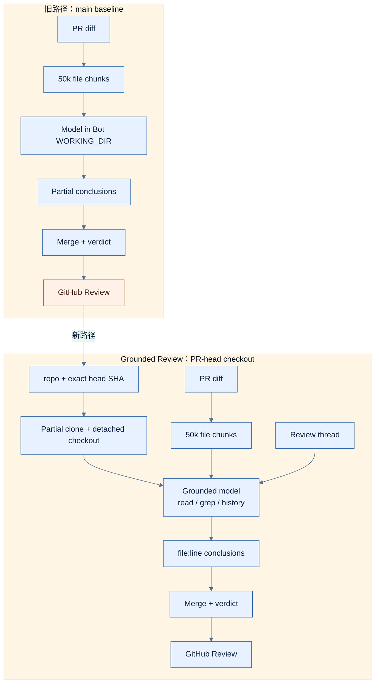

*图 1：Chunk Review 旧路径与 Grounded Review 修复边界。事件事实绑定相应 PR 与测试快照；*

Chunk 没有把后半段静默截掉，这一点原实现做对了。问题在于资源边界被当成了事实边界：某个 helper 在另一块，某个调用者在 diff 之外，某个问题已经被后续 commit 修复，局部模型仍会按常见缺陷模式补齐缺失部分。Merge pass 可以统一措辞，却没法从没有拿到的仓库事实里纠正共同的错误假设。

这次事故让我把 Review 输出重新命名：第一遍只能叫 **candidate finding**。它可以说“这里看起来像缓存隔离问题”，但在读取真实文件、定义、调用点、history 和测试以前，不能升级成 blocking finding。

后来的修复把 PR head checkout、`file:line` grounding、历史 Review thread、输入校验和每仓 Git lock 接进了主链。对应验证快照中的相关检查是 307 passed、7 warnings，Python 3.11 和 3.12 CI 都通过。第一次大型 grounded Review 又在 319 秒时丢失了一个 chunk，于是把大型 chunk 的预算单独提高到 600 秒，并让 caller 超时或取消时终止底层任务，避免一个已经没人等待的进程继续消耗资源。

但是仍然不能写“误报问题已经解决”。原 PR 的 before/after replay 没有形成公开验收制品；checkout 失败时当前实现还会降级到 diff-only；候选生成与逐条 verifier 也没有拆成结构化的两段管线。合并、测试绿色和 Review precision 被证明，是三种不同状态。

同样，我不会反过来说另外 22 条已经被逐条证明为错误。准确说法只有一句：24 条意见中，人工仓库取证确认了 2 条真实问题，其余意见没有进入已确认问题集。

这件事后来成了整套工程的起点。模型输出很快，判断也很流畅，但一个判断要进入团队事实，必须先知道它在看哪个对象、哪个版本，能不能回到原始证据，以及证据断掉时是否真的停下来。

# 0x01 Agent 的入口不应该是代码，而应该是任务事实

过去我也会从一句“帮我修一下这个问题”开始。Agent 找文件、改代码、跑几个测试，十分钟后给出一份很完整的总结。单人原型里，这种方式很顺；进入团队以后，它缺的东西太多：目标由谁定义，允许改哪些仓库，哪些文件不能动，验收是什么，谁接受风险，失败后交给谁。

现在，一项有副作用的工作先进入 Issue，再进入代码：

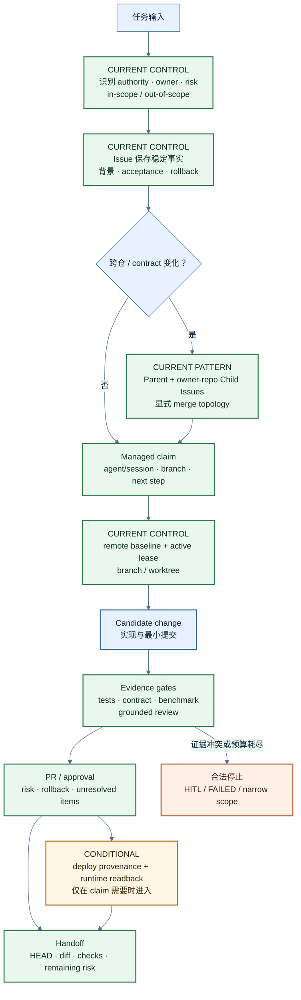

*图 2：从 Task Fact 到 Delivery 的控制链。Runtime Proof 是按主张强度进入的条件阶段；*

Issue 在这里不是项目管理装饰，也不是要求每次改一行注释都开工单。它保存的是这次任务相对稳定的事实：背景、in-scope、out-of-scope、验收标准、验证命令、依赖、风险和 rollback。Agent 的实时 heartbeat、branch、worktree 和 next step 不应该反复改写 Issue body，而应进入可更新的 managed claim comment。

我尤其在意三个字段。

* 第一个是 scope。一个“修复登录问题”的指令，可能让模型顺手重写鉴权 helper、修改共享协议、补一套缓存，再更新三个调用者。代码未必错，但 Review 已经无法判断这还是不是原任务。把允许修改和明确不改的范围写出来，是对 Agent 注意力和故障半径的双重约束。

* 第二个是 acceptance。它不能只有“测试通过”。一个共享字段变化至少要说明 fixture、producer、consumer 和 integration replay；一个运行时修复要说明 source、部署对象和 readback；一个 Review 修复则需要原事故 replay。验收标准决定最后能说到哪一层。

* 第三个是 risk。谁可以批准 migration、deploy、删除、外部调用或策略强制？Agent 可以提出方案，也可以在隔离环境准备变更，不能因为实现顺利就自行扩大授权。

这套做法其实来自我长期做安全架构时的习惯。面对一个自动化主体，我会**先问 principal、object、action、scope 和 negative case：它以谁的身份行动，影响哪个对象，最先应该在哪里失败，失败以后状态有没有变化**。换成 Coding Agent，这些问题仍然成立，只是执行速度更快、并发面更大。

**跨仓任务还需要 parent/child 拆分。Parent Issue 保存总目标、合同变化、依赖和中间兼容态；每个 owner repo 用自己的 child Issue 管 branch、测试和 PR。Git 没有跨仓数据库事务，所以合并顺序必须显式：先共享 contract 和兼容规则，再是向后兼容的 producer/consumer，随后才是集成回放、部署和运行证据。**

Issue 不能保证 Agent 做对事。它只完成一个更基础的动作：**把任务从易失的聊天变成团队可以复查、接管和拒绝的对象**。没有这个对象，后面的 worktree、Review 和 proof 都缺少锚点。

# 0x02 从 6 个仓库到 14 个：上下文为什么会变成基础设施

X2 最初没有 14 个仓库，也没有一套叫“Context Engineering”的完整设计。

2026 年 1 月，我先在几个早期原型里写 `CLAUDE.md`，只是为了不在每次新会话里重复解释启动命令、目录边界和验证方式。到了 4 月，仓库从个位数快速展开，第三个人加入，Cursor、Claude Code、Codex 开始同时跨仓工作。历史复盘口径里，5 月初活跃仓库约 6 个，5 月中旬达到 11 个，月底进入现在的 14 仓工程图。

这个阶段最先**失效的不是代码生成，而是默认共识**。一个新 Agent 进入仓库，应该信 README、STATUS、roadmap，还是昨天的会话？共享字段由谁定义？产品文档说链路接通，部署现场不认，谁说了算？

本文会提到几个 X2 内部仓库名，读者只需要先记住四个入口：`X-Pulsar` 是控制面和产品入口，`X2-Docs` 是跨仓 authority 与 contract 控制面，`X2-Bot` 是研发自动化执行面，`X2-Orbit` 是评测、证据和受控演进面。

X2-Docs 在 5 月 4 日出现，时点正好落在多仓压力上升的中间。首个提交一次加入 67 个文件、5,372 行，内容不是事后总结，而是 **authority、ADR、integration contracts、AI coding context、Git、SDLC、testing 和 Issue 规范**。接下来一周又落了共享协议与契约层的 fixture、tag governance、部署全景、工具接入治理、本地编排、多租户标准和 benchmark 脚本。

它有意义的地方，是第一天出现的对象：先处理“谁说了算、共享什么、怎样验证”，再继续铺仓。到 2026-07-11 的固定口径，X2-Docs 有 230 个 tracked files、199 个 Markdown、15 个唯一 ADR 和 15 个 JSON contract fixtures。当然需要注意的是：文件多也不证明治理有效；它只说明治理已经有了必须维护和审计的工程表面积。

```mermaid
%%{init: {'theme':'base','themeVariables':{'fontFamily':'Arial, PingFang SC, Microsoft YaHei','primaryColor':'#E8F1FF','primaryTextColor':'#10233F','primaryBorderColor':'#3568A8','lineColor':'#55708F','secondaryColor':'#E9F7EF','tertiaryColor':'#FFF5E5'}}}%%
flowchart LR
  JAN["2026-01 · CURRENT HISTORY<br/>三个早期原型出现 CLAUDE.md<br/>解决个人会话冷启动"]:::current
  MAY4["2026-05-04 · CURRENT HISTORY<br/>X2-Docs 建立<br/>authority · contracts · Git · SDLC"]:::current
  MAY13["2026-05-13 · CURRENT HISTORY<br/>八仓同步 AGENTS.md<br/>工具无关规则舰队化"]:::current
  MAY19["2026-05-19 · CURRENT HISTORY<br/>STATUS / VIBE 集中铺开<br/>实现现实与工作记忆分层"]:::current
  MAY29["2026-05-20~29 · CURRENT HISTORY<br/>新仓出生即带 context 集合<br/>Orbit 加入 debt / proof 协议"]:::current
  JUL["2026-07 · CURRENT HISTORY<br/>Review · derived value · native proof 复盘<br/>抽取 Evidence Engineering / PCD"]:::current

  JAN -->|"仓库与 Agent 增加"| MAY4
  MAY4 -->|"先定标准，再铺开"| MAY13
  MAY13 -->|"规则不足以表达现实"| MAY19
  MAY19 -->|"从补文件变成默认协议"| MAY29
  MAY29 -->|"从上下文扩展到证据"| JUL

  classDef current fill:#E9F7EF,stroke:#2F7D4A,color:#13351F,stroke-width:2px;
```

*图 3：X2 workspace 从个人上下文习惯到证据系统的演进时间线。日期来自固定历史复盘口径；*

上下文入口随后经历了两次集中铺开。5 月 13 日，八个核心仓同日加入工具无关的 `AGENTS.md`；5 月 19 日前后，多数平台仓集中补齐 STATUS/VIBE。后来的靶场、SIEM 运行时和评测仓更接近“出生即带入口”。早期仓花几个月零散积累，晚期仓在创建时就能加载同一协议，**默认值由“记得补文档”变成“没有入口就不算准备好”**。

我们最后把不同变化速度的信息拆开：

| 载体 | 它回答什么 | 典型变化速度 |
|---|---|---|
| `AGENTS.md` / `CLAUDE.md` | 行为规则、禁止项、验证方式 | 慢 |
| `STATUS.md` | 当前实现实际到哪里 | 中 |
| `VIBE_CODING_CONTEXT.md` | 最近变化、删除、焦点与下一步 | 快 |
| X2-Docs authority / contract | 跨产品术语、边界和共享对象 | 慢 |
| Issue + managed claim | 本次 scope、owner、branch、acceptance | 当前任务 |

**Coding Agent固定阅读顺序是规则→实现现实→工作记忆→跨仓 authority→当前任务→Git remote 状态。** 最后一步不能省。文本说“从 main 开始”，本地 main 可能已经落后；Issue 说改某个目录，当前 checkout 里可能正有别人的 WIP。Context 和 Git 必须在动手前汇合。

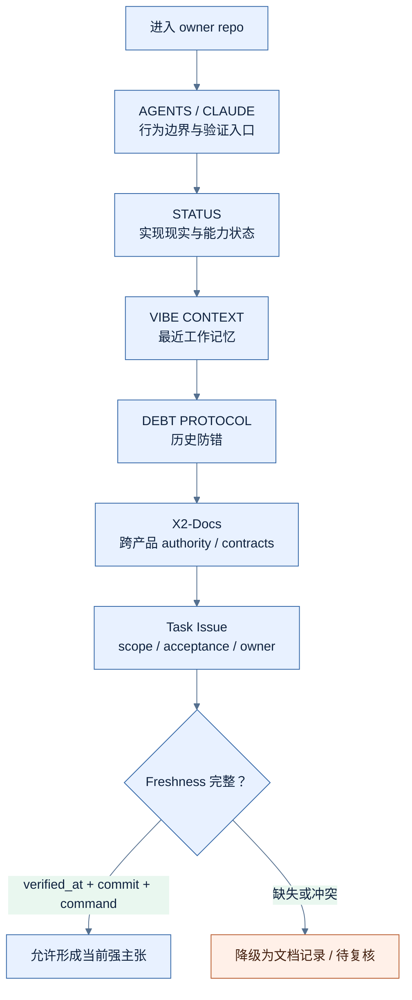

*图 4：上下文加载协议与 freshness 分支。它规定读取与降级顺序；*

把文件叫 `STATUS.md` 也不会让它自动变真。测试计数、模块状态和部署记录都会过期。后来我开始要求关键状态带上 `verified_at`、`source_commit`、复核命令和 `stale_after`，并写出 `does_not_prove`。如果没有这些字段，就把措辞降成“文档记录”或“待复核”，不让格式最完整的旧文档赢过新代码。

**平台 authority 也有边界。X2-Docs 可以决定跨产品 contract，不能替产品仓宣布 runtime 已部署；产品仓可以描述本地实现，不能私自把新字段升级为共享协议。上下文协议真正解决的不是“给模型塞更多 token”，而是让来源、时态、权威和冲突都可见。**

# 0x03 Git 不只保存历史，它还要回答谁正在写

两个 Agent 同时修改同一行，Git 会给出冲突。更危险的情况通常没有红色提示：Agent A 按旧 contract 修改 producer，Agent B 按新文档修改 consumer。两边改不同文件，各自测试通过，Git 也能自动合并，语义却已经分叉。

我现在给 Coding Agent 的起手式：

```bash
git fetch origin --prune
git status --short --branch
git branch -vv
git worktree add .worktrees/<task> -b feat/<topic> origin/main
```

四条命令各自解决一件事。`fetch` 只刷新远端引用，不碰当前 WIP；`status` 暴露 dirty、branch 和 upstream；`branch -vv` 让 ahead/behind 可见；新 worktree 从 `origin/main` 建立独立 index、HEAD 和未提交状态。

这里的原则不是“每次先 pull”。一个 dirty primary checkout 可能属于另一个人，自动 `pull` 会引入 merge，`stash` 会改变现场，`reset` 则直接替 owner 做了决定。**Preflight 的第一职责，是判断这个目录能不能成为本次任务的写入空间，而不是强行把所有目录整理成干净。**

Worktree 很有用，也经常被高估。它隔离 Git checkout、index、branch 和 WIP，不隔离进程权限、网络、环境变量、secret 或其他目录。一个 runner 在独立 worktree 里，仍可能拥有过大的文件和部署权限。Git 隔离与 OS/container/VM、身份和凭据隔离是两层控制。

多 Agent 以后，“owner”这个词也不够用了。我把它拆成四个问题：

| 问题 | 工程载体 |
|---|---|
| 谁决定目标、共享事实和优先级？ | authority、ADR、Issue owner |
| 谁批准这类变更？ | CODEOWNERS、branch protection、reviewer policy |
| 谁此刻可以继续写 branch/path？ | active claim、lease、branch、worktree |
| 谁实际执行了动作？ | automation identity、GitHub actor、Agent/session、event provenance |

**CODEOWNERS 只负责 approval routing**。2026-07-11 的远端主分支口径里，14 个仓库有 12 个追踪它；另外两个缺口同样被保留。即使 14/14 都有，它仍不知道本地是谁在写，也不会阻止两个 Agent 同时修改相同 scope。

X2-Docs 的历史说明，这套 ownership 也不是一次设计出来的。5 月 11 日至 13 日，先把 actionable Issue 路由回 owner repo，规定 dirty default checkout 不得被强行同步，再把 **“一任务、一 branch、一 worktree、一 owner、一 scope”写成 Agent contract**。5 月下旬，**CODEOWNERS 从粗粒度文件逐步变成按 product/agent/data/infra 分工，并补上 workflow/build cross-review 的审批路由；随后又把 discovered issue→local implementation→PR→issue closure 串成显式生命周期。**

到 6 月，这些 written policy 才继续变成 active control：workspace audit、safe cleanup、product entrypoint 和 `agent-start` preflight 被接入，规定新 worktree 从 `origin/<default>` 而不是可能落后的本地 main 创建；shared integration harness 可以明确选择一个 X-Pulsar worktree 作为运行 subject；同一 GitHub actor 背后的 Codex、Claude Code、Bot 或 Orbit session 也被放进 managed claim comment。内容重叠的另一套 claim 标准被主动关闭，没有让两套规则同时进入主链。

这条历史链分别解决 task routing、checkout safety、scope、approval、lifecycle、remote baseline、runtime subject 和 active writer。把它压缩成“我们用了 CODEOWNERS 和 worktree”，反而看不见真正的多 Agent 并发控制。

Active writer 由 Ownership Lease 补上。一个 claim 至少带 task、agent/session、repo、branch、worktree、owned paths、heartbeat、expiry、state 和 next step。Orbit 的参考实现用 atomic current state 支持恢复，用 append-only events 保存 claim、heartbeat、release 和冲突。**同仓 claim 如果 branch 相同或路径重叠，在 merge conflict 出现前就会报警。**

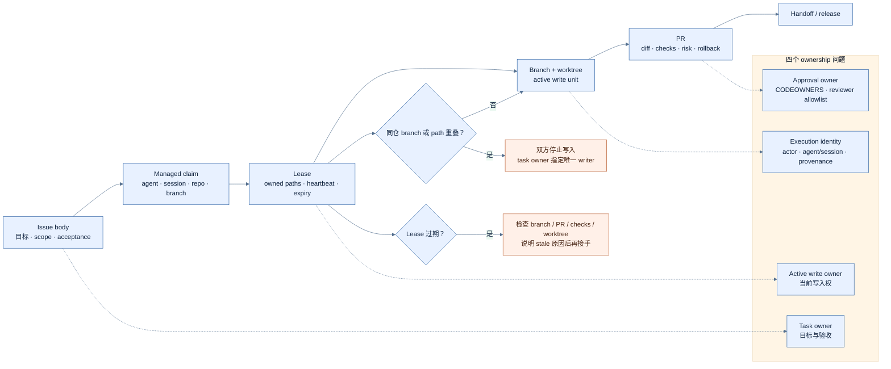

*图 5：Ownership Lease 与四类 owner。该图说明 Git 并发控制需要哪些事实；*

Lease 过期不是“可以覆盖”的许可证。它只表示需要接管审计：先看 branch、PR、checks 和仍可访问的 worktree，再说明旧 claim 为什么 stale。双方已经有本地改动时，保留两个 worktree，由任务 owner 指定唯一 writer。文件式 lease 也不是跨主机强一致锁，网络分区和时钟问题仍要靠更强协调或人工收口。

交接时，我希望至少留下 `git status`、准确 HEAD、相对 `origin/main` 的 diff/stat 和 commit 列表、worktree 列表、未运行检查与下一步。Handoff 的目标不是让目录看起来整洁，而是让下一位人或 Agent 不用猜就能重建现场。

这也是为什么 Git owner 设计必须进入文章。多 Agent AI Coding 的风险并不只在代码质量，而在 authority、approval、active write 与 execution provenance 被压进一个模糊的 owner 字段。写入速度变快以后，这种模糊会更快地变成事故。

## 先审计真实 capability，再相信角色文档

Ownership 设计还需要一个反向检查：**文档说一个组件负责什么，不等于代码允许它做什么。固定基线上，X2-Orbit 的 remote Codex worker 可以修改产品仓、commit、push、创建 PR，并具备 merge/deploy 路径；X2-Bot 也能通过 Claude/Codex runner 在产品 scope 的 worktree 中实现、测试和提交。Orbit 到 Bot 的 feed bridge 已存在，只是默认关闭。**

这意味着平台一度存在两个 write-capable automation owner，文档 authority 已经落后于真实 side effect。这个发现没有证明两个系统同时修改了同一 branch，也没有发现由此造成的覆盖事故；但它足以否定“角色文档自然形成写入隔离”。CODEOWNERS 管批准，worktree 管 Git 状态，lease 管当前 scope；如果两个自动化都拥有 commit、push、merge 或 deploy 能力，平台还必须明确谁是执行 owner，以及另一方只能在什么条件下提出 candidate。

目标模型是让 Orbit 收敛到评测、证据和建议，由 Bot 或经批准的后继者承担唯一自动化写入责任。**路径是 recommendation→managed claim→scoped PR→checks→human review→deploy→Orbit revalidation  。Ownership audit 必须从真实 capability 出发，而不是从系统名字、组织图或最初的产品定位出发。**

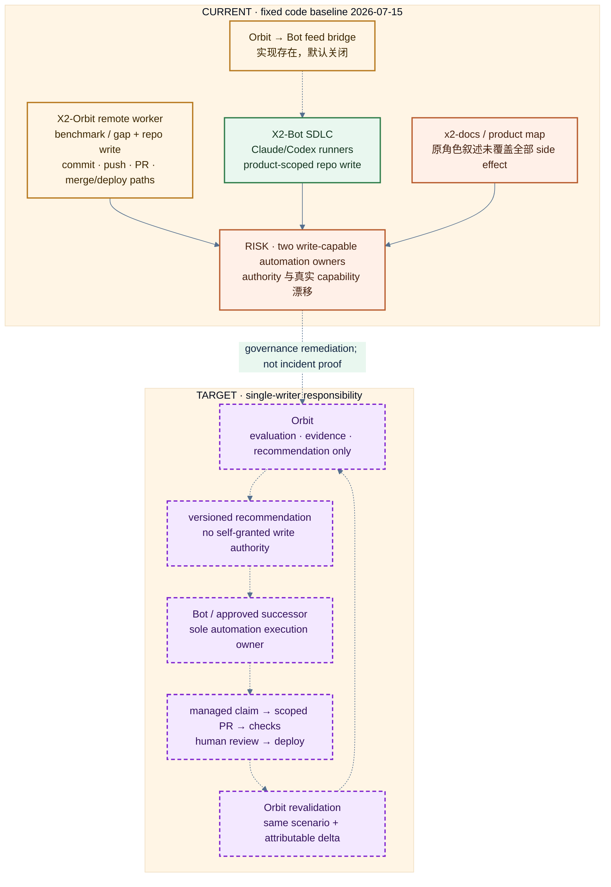

*图 6：Orbit/Bot ownership self-audit。红色是 Current capability 与 authority drift，紫色虚线是 Target single-writer；*

# 0x04 一个 Agent 为什么必须有合法的失败状态

Agent 最容易表演“自主性”的方式，是一直工作。测试失败就再改一轮，benchmark 回归就换一个 prompt，部署读不到结果就写一份解释。只要屏幕上还有输出，看起来就没有停。

X2-Bot 的 SDLC Engine 把一次任务拆成显式状态：

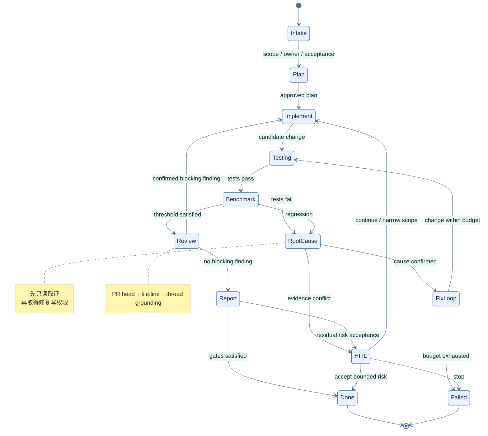

*图 7：X2-Bot SDLC 的受限状态机。它表达控制流与合法停止状态；*

状态机的价值不在图是否规整，而在它限制下一步。`TESTING` 只回答指定检查；失败后先进入只读取证的 `ROOT_CAUSE`，区分代码、环境、基线或测试自身，再给 `FIX_LOOP` 有限写权限。`BENCHMARK` 不被普通测试的绿色覆盖；`REVIEW` 提出和核实问题，不顺手接管 implement owner；`HITL_PAUSED` 保存进入前状态，恢复时才能回到正确边界；`FAILED` 是合法终点，不需要包装成“部分完成”。

X2-Bot 的提交历史也说明，画出状态枚举只是开头。状态机落地当天，后面紧跟着 injection、Git timeout、resume、blocking I/O、memory bound、scope 和 lifecycle failure 的修复；随后还修过“任务已经失败，生命周期仍继续”和错误测试命令导致 loop 不退出。异常写进日志，却没有改变 control flow，外部看到的仍会是成功。

一个可控 loop 至少要写清这些东西：

```yaml
state: root_cause
budget:
  attempts: 2
  elapsed_minutes: 15
  risk: read_only
evidence_input:
  - failing command
  - stack trace
  - current diff
  - relevant history
allowed_action:
  - inspect source and history
  - run targeted diagnostics
exit_condition:
  success: cause linked to reproducible evidence
  failure: evidence conflict or budget exhausted
failure_destination: HITL
```

预算不只是 token。它包括尝试次数、时间、成本和 risk budget。**第三次重复同一种失败方法，不应因为还有 token 就自动开始第四次；** 普通测试很快通过，也不能让 deploy、migration 或外部动作自动升级权限。 Loop 工程最大的问题在**在边界内Loop**。

319 秒丢 chunk 的 Review 事件又补了一课：timeout 不能只有一个全局数字。Diff-only、小型 grounded pass 和大型 chunk 工作量不同，应该有不同预算。把大型 chunk 延长到 600 秒只是半个修复；另半个是取消传播。Caller 已经超时或离开，底层任务必须一起结束。延长需要的时间和回收失去 owner 的任务，本质上是同一个 loop 决策。

状态机仍不是 sandbox。如果 runner 的文件、网络或凭据权限过大，逻辑上进入 HITL 也不能收回已经授予进程的能力。Process state、OS identity 和 external side effect 必须分开设计。当前核心生命周期的直接测试覆盖也仍有限，因此我把这套状态机写成已有实现和持续收口对象，不写成成熟通用框架。

# 0x05 确定性问题不要再问一次模型

另一次故障发生在生成式 Playbook 学习链路。

系统从执行 trace 里学习新 workflow。源任务中的域名在运行时解析成 IP，Learner 却把这个 derived value 当作稳定参数写进后续节点。换一个目标执行时，前面的域名已经变化，后面的动作仍然指向旧 IP。

这不是语法错误。生成结果结构完整，字段也合法；在原目标上回放，旧 IP 甚至可能继续可用。**让同一个模型“再检查一次”，很容易继续把格式正确和局部成功当成语义正确。**

最后的修复没有换更长 prompt，而是把可确定的部分移回普通代码：

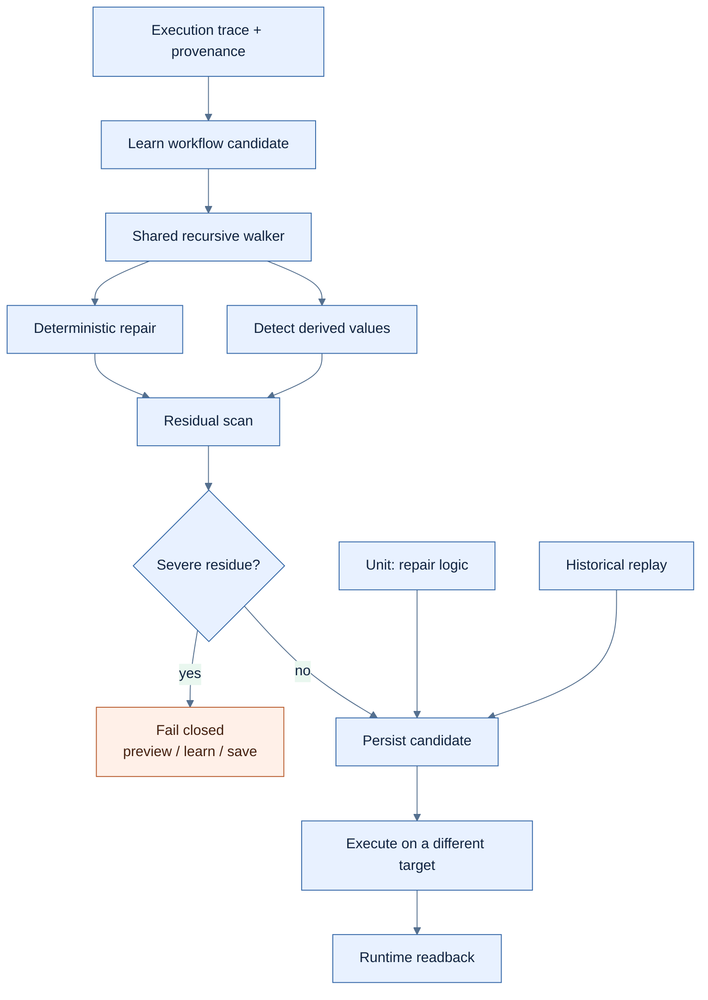

*图 8：Derived Value 的确定性修复与残留扫描。8→0 和换目标回放绑定该事件快照；*

Detection 与 repair 共用同一个 recursive walker 和 provenance。否则很容易出现检测器能看见嵌套字段，修复器只改顶层；preview 路径会拦，learn 或 save 路径又能漏过去。严重残留在三条持久化路径上都要停止，而不是保存以后等 runtime 再报错。

该事件的验证结果是硬编码节点从 8 降到 0，相关测试 577 passed、4 skipped，换目标回放没有发现旧 IP 残留。这个结果只绑定该修复快照，不代表所有生成式 workflow 已经安全，也不说明未来 schema 不会出现 walker 尚未覆盖的新位置。

**换目标回放很关键**。同一个目标上成功，只能说明旧值碰巧仍然有效；改变授权目标，derived value 是否被固化才会显出来。这个做法后来也影响了我的 Review 和 runtime proof：不要只让 producer 在自己熟悉的条件下重复一次，而要换一个观察点，主动寻找反例和残留。

这里还有一个更一般的分工原则。**让模型处理需要语义判断的部分，例如理解用户意图、提出候选步骤和解释失败；让 parser、schema、walker、provenance 和 residual scan 处理可确定的不变量。模型可以生成 candidate，不能靠自信覆盖确定性 gate。**

# 0x06 能读回来，为什么仍然不能说产品已经闭环

我们曾经有一份看上去很完整的 proof：验证器把测试数据写进事实层，再从 serving interface 按 stable ID 读回来。

这份证据有效。它证明 ingest/read plumbing 能工作，ID 可以定位对象，serving view 能返回匹配结果。它没有证明产品自己产生过这条数据。

如果 verifier 自己 seed、自己 read，闭环的是 verifier。报告把最后一句写成“产品 producer 已接通”，就把验证脚本的能力冒充成了产品能力。这个**错误危险在于前面的每一步都是真的，只有 claim 超出了证据。**

我后来把交付拆成四层：

| 层 | 能证明 | 不能证明 |
|---|---|---|
| Source | 代码进入指定 commit | 该 commit 已部署 |
| CI / Build | 指定测试和构建通过 | 运行实例使用该产物 |
| Deploy provenance | 进程或 image 对应某个版本 | 真实业务路径被触发 |
| Runtime readback | 一次执行产生对象并可回读 | 所有环境、规模与长期稳定性 |

PR merged、service active、HTTP 200 和 native readback 都有价值，也只证明各自的一段。部署检查还要回答 process/image、启动时间、cwd、commit/digest、配置和数据路径；部署脚本更新但旧进程仍在跑，service 依旧可能显示 active。

跨仓 proof 为什么容易被拼错，先要看这些仓库分别承担什么角色：

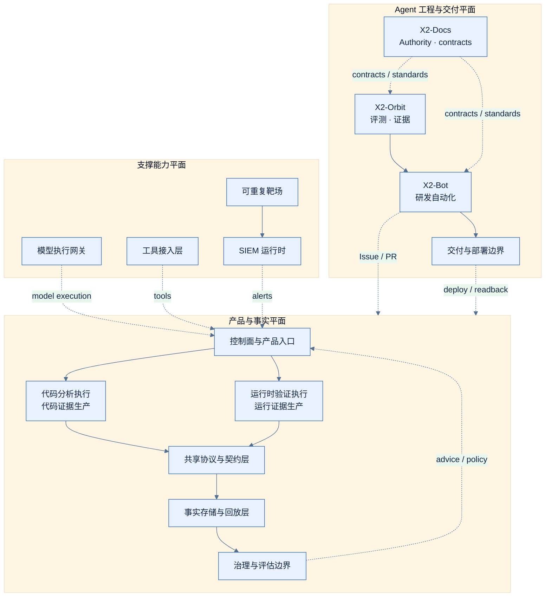

*图 9：与本文相关的三类责任平面。*

更强的 native producer proof 需要一条连续来源，并且要和 verifier 自写自读区分开：

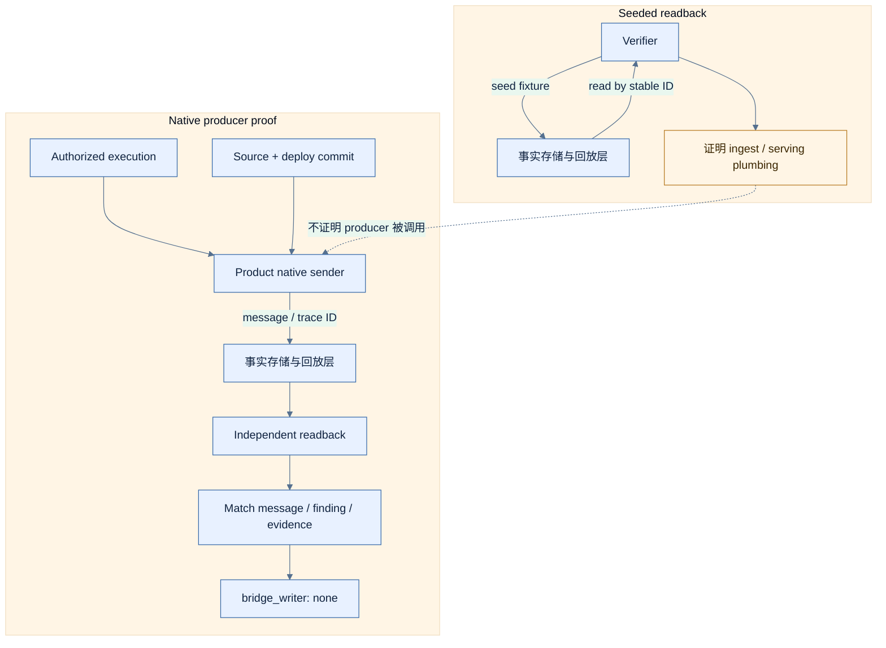

*图 10：Seeded Readback 与 Native Producer Proof 的证据差异。*

`bridge_writer: none` 用来排除中间脚本代写事实层。Accepted ID 连接 producer 与 ingest，deploy provenance 说明真实运行哪个产物，stable ID 让另一个 verifier 可以回读，matched evidence 防止读到一个同类型但不相关的对象。“授权执行”也在 proof 里；没有 scope 的运行时验证，即使技术上成功，也不是可接受交付。

跨仓系统尤其容易出现组合式幻觉：一个仓的测试证明 sender，另一个仓的测试证明 ingest，第三个样例证明 read，第四个 demo 又证明 decision。每段都绿，但 identity、trace、commit 和环境不是同一组。于是我们用 first-breakpoint：某条路径在第一个可信不变量处失败，就在那里停，后面写 `not reached`，不临时绕过 auth，再拿另一条 trace 拼成闭环。

X2-Docs 在 6 月 29 日到 7 月 1 日的一条 proof chain，给了我另一个比 24→2 更完整的案例。它没有从“闭环完成”开始，而是从真实启动失败开始：orchestrator 写的是已经失效的 bucket env 名，smoke 还在调用不存在的 endpoint，并使用会被共享协议与契约层v0.2 `extra=forbid` 拒绝的旧 envelope。修完这些以后，报告仍然明确留下第二个 embedding boot blocker，没有把“越过第一个错误”写成成功。

一段一段增加可归因证据：

| 阶段 | 新增的 proof slice | 当时仍不能证明 |
|---|---|---|
| Ingest path | HTTP ingest→Kafka→Landing→ClickHouse→replay polling | Core/Pulsar native producer 已接通 |
| Native adapter | 真实 Core adapter 与 Pulsar `sea_router` 分别产生 source-specific replay | fact 已影响下一次决策 |
| Consumer path | Pulsar→Core Redis response；修复异步 landing race | 影响来自某条具体 Sea fact |
| Same-ID provenance | seeded OutcomeRecord 得到 UP，未 seed 的 control 得到 HOLD；OutcomeRecord ID 穿过 frozen consumer mirror | production deployment 或一般化闭环 |
| Harness hardening | 修复被 settings 静默忽略的 flag、本地 embedding/proxy drift，并覆盖 token auth | proof harness 不会再次漂移，production secret custody 仍未完成 |
| Shadow rollout | Channel B 在 local-dev 以 shadow/observe-first 运行，并形成 enablement matrix | enforcement 已获授权或代码默认打开 |

这条链有几个很朴素的细节：
* 异步 landing 必须 polling，不能一次 GET；
* seeded lane 必须有未 seeded control，才能把 ratchet 差异归因给那条事实；
* 同一个 OutcomeRecord ID 要穿过 provenance 和 frozen consumer mirror，不能只看两边都有“成功”；
* feature flag 打开以后还要保留 flag-off lane；
* 行为链先 shadow，只记录 would-have-blocked，不能因为技术接通就自动获得阻断权。

这些都是授权本地环境中的 bounded proof。它们不等于生产规模、所有租户、长期稳定性或完整安全闭环。价值恰恰在于每个 PR 都知道自己多证明了一段，也知道下一段为什么还不能宣布。

一份长期保留的 proof artifact 至少要主动写边界：

```yaml
claim: product-native-evidence-readback
state: LIVE
snapshot: <event-date>
source_commit: <commit>
deployment_digest: <digest>
stable_trace_id: <redacted-reference>
readback_match:
  producer: true
  message: true
  evidence: true
bridge_writer: none
does_not_prove:
  - production scale
  - every deployment environment
  - long-term reliability
  - absence of unrelated regressions
```

`does_not_prove` 不是免责声明。它防止一条授权环境成功被语言外推成整个平台的当前能力。不是每个 PR 都要做到 runtime；普通改动停在 branch、test、CI 和 Review 完全合理。但当自动化会继续采取动作、数据会进入长期事实层、producer 与 verifier 分属不同仓，或者结果将用于提高 Agent 自主性时，runtime provenance 和 same-trace readback 就不能省。

# 0x07 Gate 全绿，也可能只是验证了错误对象

做工程的人习惯相信 gate。它比会议结论可靠，因为会执行、会失败、会挡住合并。但7月的平台固定快照审计却给了我一个很直接的反例。

X2-Docs 里的 legacy fixture gate 对 15 个 fixture 给出 15/15 通过；把同一批对象交给当前共享协议与契约层0.2.3 validator，结果是 0/15。

绿色 gate 没有撒谎。它忠实地验证了一个已经过时的兼容对象。问题在 verifier version、subject version 和 fixture origin 没有被绑定，流水线仍然把旧规则的绿色当作当前协议兼容。

这个结果也不能反向推出“当前 validator 一定正确”或“所有集成都失败”。它精确证明的是：原 blocking gate 没有验证当前权威对象。一个更完整的 gate 至少需要留下这些信息：

```yaml
gate:
  verifier_version: <tool-or-package-version>
  subject_version: <schema-producer-consumer-baseline>
  fixture_origin: <authoritative-source>
  command: <reproducible-command>
  failure_effect: block-state-transition
  exception:
    owner: <risk-owner>
    expires_at: <timestamp>
```

`failure_effect` 很容易被漏掉。脚本退出非零，**但 Makefile、CI wrapper 或上层 Agent 把它吞掉，gate 仍只是一条日志。** Exception 也要有 owner 和期限，否则一次临时兼容会慢慢变成新的默认协议。

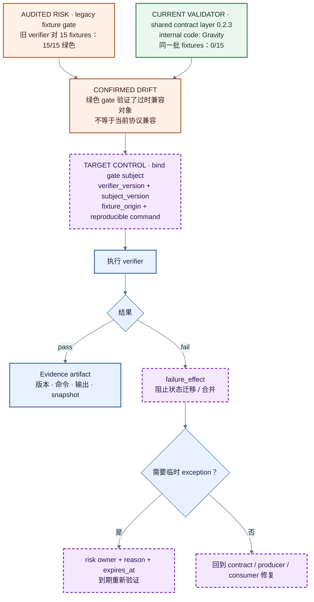

*图 11：从 legacy 绿色 gate 到 version-bound gate。15/15→0/15 只证明旧 blocking gate 没有验证当前权威对象；*

我以前把 Assurance 主要用在代码和 Agent 输出上：测试实现、Review 结论、部署和 runtime。这个案例说明 verifier 自己也会漂移。测试、schema validator、benchmark、架构检查、报告 checksum，甚至“final”这个状态，都应该回答自己验证了哪个对象、哪个版本，失败以后谁真的停下。

Authority 本身也必须接受反证。6 月 19 日，X2-Docs 为 Orbit A2 写下 Sea replay path 与 tenant/org scope；五天后的 Orbit E2E proof 发现该 contract 与 Sea、Pulsar 实现不一致。修复不是要求产品迎合旧文档，而是把权威 path 改回真实的 `get_replay`、把 scope 改成 tenant+user，并写出 Sea→Pulsar 的合并/部署顺序。平台文字可以先变成 LIVE，产品组合仍保持 PARTIAL，AWS proof 继续是 MISSING，直到部署完成并重建 artifact。Authority 决定契约冲突在哪里收口，不享有免于被 runtime 纠正的特权。

## Finding 不是结论，反证决定影响边界

2026 年 7 月，我们对固定的八仓提交做了一次平台实审，最后形成 96 个独立 current findings。原始 P0/P1 一共 43 条，随后交给独立 reviewer 主动找 counterevidence。复核结果是 29 条 supported、8 条 missing-counterevidence、6 条 overstated，共有 11 项 severity correction。

这里最重要的数字不是 43，也不是 11，而是 reviewer 的任务定义。 **它不负责把语气改得更统一，也不是再用一个模型重复读一遍同样的摘要。它要挑战影响边界：危险 sink 的源码事实是否成立，固定部署路径是否真的可达，身份和前置条件是什么，有没有现有控制降低影响，报告里哪些环节实际上没有执行。**

一条 finding 可以同时包含两个不同置信度：

```text
Fact confidence   = 代码或配置事实是否成立
Impact confidence = 该事实能否在当前交付与运行边界产生所述影响
```

有些条目保留了代码事实，但因为部署反例、不可达路径或缺少前置条件，影响等级需要降低；另一些条目没有找到足以改变 reachability 的反例，就继续保留高优先级。Counterevidence 的作用不是替系统辩护，而是防止安全语言把“存在危险语句”直接放大成“已经发生完整影响”。

**独立也不是简单换一个模型**。两个 Agent 如果共享同一份 chunk、同一个过期 STATUS 和同一种失败去向，只是在复制假设。Verifier independence 可以来自不同 evidence source、权限和职责：PR author 不能自批；Review candidate 回到源码、history 和测试；producer output 由 stable ID readback；高严重度 finding 由另一个角色主动寻找部署反例。

审计同样使用 first-breakpoint。跨产品路径在第一个可信不变量处失败，后面的阶段记作 `not reached`，不为了画出完整闭环而绕过失败点。这会让报告少一些漂亮的“端到端”，却让每个结论知道自己停在哪里。

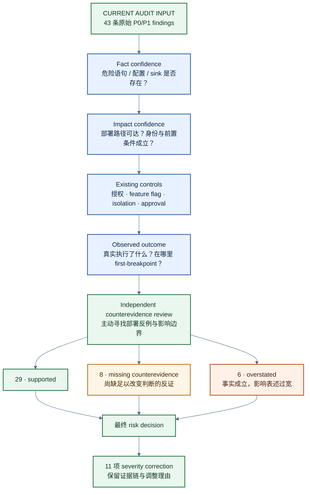

*图 12：Counterevidence Review 如何把事实置信度与影响置信度拆开。数字绑定固定八仓审计；*

前面三节说明了 evidence gate 为什么必须绑定对象、版本和失败效果。既然 verifier 和 gate 自己也会漂移，控制面里的其他制品——架构图、自动化 writer、风险 finding——同样不能因为“看起来完整”就获得 Current 身份。

# 0x08 33 张图都能渲染，但没有一张可以无条件代表 Current

旧版文章里，我写过一节“架构即代码”，语气像一套正式 gate 已经准备好。重新审计后，这个说法站不住。

之前的图审计暴露了旧 Architecture-as-Code 叙述的缺口：ADR、DSL parser、scope validation、Mermaid 和部分 scanner 已经存在，但当时还没有完整的 code-to-model reconciler，也没有进入产品 required CI。能生成图、能通过语法校验，不等于代码关系已经与模型对账。

到最新的 X2-Docs 已把这条线推进到 **foundation/advisory**。Structurizr desired graph、relationship identity、受治理的 UML sequence/state projection、schema、renderer、asset closure、mutation tests 以及 `uml-test` / `uml-check` 已经落地，Architecture-as-Code 从“值得做的原型”进入“可以开始试验的控制面”。

我们换了一个更笨也更可靠的做法：冻结 14 个仓库的远端提交，把 33 张既有 C4、PlantUML、生态图和目标图逐张放回入口代码、部署配置、当前状态和 ADR 中核对。结果是：

| 分类 | 数量 | 这次审计中的含义 |
|---|---:|---|
| Accurate | 0 | 没有原图能不带限定地作为完整当前事实 |
| Partial | 7 | 主边界仍成立，局部关系、条件或成熟度需修正 |
| Stale | 16 | 继续当作 Current 会误导实现或运行判断 |
| Target-only | 10 | 表达目标，不是当前实现 |

`0 Accurate` 不表示 33 张图都没有价值。Partial 图保留了不少正确边界，Target-only 图也可以清楚表达方向。真正的问题是状态丢了：Python package 被画成独立部署 container，异步链被画成同步调用，proposed API 和 L5 目标进入 Current 全景，默认关闭的 bridge 被写成不存在，已经变化的 owner 仍沿用旧叙述。

**XML 合法、SVG 非空、PNG 清晰，只证明制品可解析。它们不验证节点、边、authority、deployment 和 maturity。架构图本身也是一个 claim-bearing artifact。**

复审后生成了 22 张带状态语义的 Mermaid 视图，以及六张 code-audited 闭环详图。我们没有把它们统一涂成“正确”，而是把 Current、Conditional/Partial、Risk/Broken、Target/Proposed、Candidate/ADR Required 写进节点、边和图例。每张发布图还要带 subject snapshot、证据来源和 `does_not_prove`。

这次落地仍有明确边界：`architecture-uml` CI job 是 present/advisory，运行在 PR-controlled source 上，不是 trusted enforcement；还要继续做 production sequence/state scenario。required status、protected/trusted evaluator、runtime reconciliation 和产品级 adoption 。工具链必须继续接受真实代码、部署和产品证据的反证。

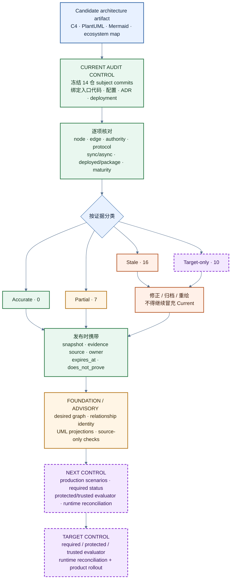

*图 13：**Architecture Artifact Assurance，而不是“能渲染即正确”的 Architecture-as-Code**。*

这件事改变了我对 Architecture-as-Code 的期待。DSL 和 reconciler 仍然值得做，但它们不是因为叫“code”就自动获得权威。模型、scanner 和 gate 都要绑定真实 subject；代码变了，图也会重新过期。**Architecture artifact 需要持续重建，而不是一次生成后永久正确。**

# 0x09 做到这里，我给这套实践命名

这些机制不是从一张框架图开始的。

`CLAUDE.md` 来自会话冷启动，X2-Docs 来自多仓 authority 压力，Ownership Lease 来自并发写入，Grounded Review 来自 24/2，deterministic repair 来自旧 IP，native proof 来自 seeded readback，gate audit 来自 15/15→0/15，architecture artifact state 来自 33 图复审。

回头看，它们分别落在五类问题上：

| Engineering | 它主要回答什么 |
|---|---|
| Prompt Engineering | 任务怎样表达 |
| Context Engineering | Agent 看见什么、依据什么 |
| Harness Engineering | Agent 能调用什么、怎样运行 |
| Loop Engineering | Agent 怎样继续、停止和失败 |
| Assurance Engineering | 为什么允许行动、判断和交付成为事实 |

我把从 X2 实践里抽出的第五类称为 **Agentic Assurance Engineering**。它围绕 Agent 的 authority、ownership、constraints、evidence 和 risk acceptance 设计工程控制。它不替代前四类：24/2 修复同时需要正确的 Review prompt、PR head 与 thread context、可用的 Git/grep/test harness、chunk 的时间与取消机制，以及 file:line、replay 和 verdict boundary。

**Evidence Engineering** 是 Assurance 的证据子域。它负责 provenance、独立验证、运行时回读、counterevidence 和 `does_not_prove`。它关心一项 candidate 怎样被验证、在哪一层成立、什么事实会推翻它。

**Proof-Carrying Delivery** 是交付机制。中文可以先说“交付必须携带证据”：一个变更不是靠总结宣布完成，而是带着 task scope、remote baseline、tests、Review、deploy provenance、runtime readback、未运行项和剩余风险进入下一状态。这个名字没有硬改成另一个 `Engineering`，因为它承担的层级不同。Prompt、Context、Harness、Loop、Assurance 是五类工程问题，PCD 是把其中一部分落进 delivery chain 的方式。

**X2 Agentic SDLC** 则是具体实现：X2-Docs 处理平台 authority，GitHub Issue 与 claim 处理任务和活动 owner，branch/worktree 保存隔离写入，X2-Bot 把任务变成有失败出口的状态机，X2-Orbit 处理评测与 proof contract，产品仓负责真实执行和证据生产。

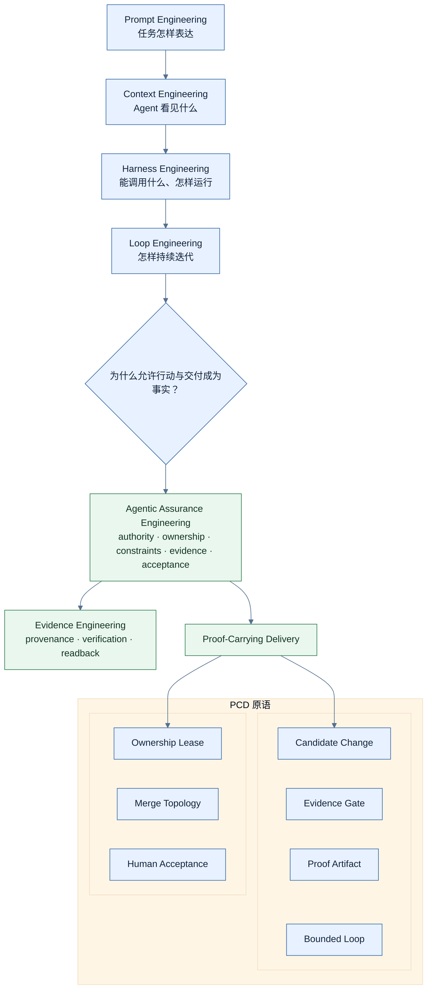

*图 14：方法层级的抽取结果，在基于Harness，Loop之上的最新实践*

这套层级对AI Coding很重要。它避免每遇到一个案例就再发明一个名字，也避免把所有问题都缩成“证据”。一个 Agent 有没有权行动，与它能不能为结果提供证据有关，但不是同一件事；一个 gate 有输出，也不代表它绑定了正确对象。

如果这些机制只能留在我的 workspace 里，它们只是个人工作习惯；只有当它们能被抽成稳定接口、接入已有的研发系统(其实已经是实践形成新的研发流程新的SDLC了），并在不同团队中重复运行，才具备产品价值。

我更愿意把它定义为 **Agentic Assurance Engineering** 不是另一个 Codiding Model，也不是把一个 Agent 包装成聊天窗口，而是位于 Issue、Git、CI、Review、部署和运行时之间的控制面。模型可以替换，这套工程实践的**核心是任务事实、权限边界、状态迁移、证据对象和风险接受**。

| 什么能力 | 接收什么 | 交付什么 | 解决什么 |
|---|---|---|---|
| Context Authority | 规则、状态、contract、任务事实 | 带来源和 freshness 的 context | Agent 不再依据过期或互相冲突的文本行动 |
| Scoped Execution | Issue、repo、branch、worktree、lease | 可接管的写入单元 | 多 Agent 并行时减少越界、覆盖和失联 |
| Grounded Review | PR head、源码、history、thread | file:line candidate 与可验证 verdict | 把 Review 从 pattern completion 拉回真实仓库 |
| Bounded Loop | 状态、预算、证据、失败条件 | HITL、FAILED、DONE 等合法出口 | Agent 在证据不足时停下，而不是无限重试 |
| Proof-Carrying Delivery | source、CI、deploy、runtime trace | provenance、readback、`does_not_prove` | 让“完成”变成可审计、可回滚的交付状态 |

这套工程实践是第一层接入 Issue、Git 和 Review，提供 advisory findings 与 handoff；第二层把 contract、测试和 policy gate 接入状态迁移，允许阻止合并或暂停 Agent；第三层再进入 deploy provenance、native producer 和 runtime readback。每一层都能独立产生价值，解决问题，也都保留清晰的证据边界。

适合采用它的不是只想让个人开发者多生成几段代码的团队，而是拥有多仓库、多 Agent、受监管交付或高风险运行时的组织。这些组织真正缺的不是另一个模型，而是一个能回答“谁允许行动、行动影响什么、什么证据可以接受、失败以后谁接管”的工程产品。

因此，**Agentic Coding 的护城河也不应该建立在某个模型或某个 Prompt 上。模型会变化，工具会替换，客户的仓库和 CI 也会不同**；可迁移的部分是 authority model、ownership protocol、evidence contract、policy gate 和 runtime proof。它们才是从内部工程实践抽取成商业产品的稳定内核。

最后的最后，我在AI工程时会问自己的七个问题：

* 谁定义目标和共享事实；
* Agent 以谁的身份、能影响哪里；
* 谁此刻在写；
* 最先应失败在哪里；
* 证据最多支持 source、CI、deploy 还是 runtime；
* 什么反例会推翻影响判断；
* 谁接受剩余风险、谁能提高 autonomy。

这些问题并不新。它们来自 principal、least privilege、separation of duties、negative testing、provenance 和 auditability。**AI 改变的是执行速度、并行规模和错误扩散方式，没有取消安全与软件工程的基本约束。**

对我来说，AI Coding 进入团队之后最重要的变化，不是让 Agent 得到更多自由，而是让它的每次行动都能被任务事实接住，被 Git 隔离，被 owner 认领，被 gate 验证，被 counterevidence 挑战，并在证据断掉时停下来。技术领导力也不在于讲出一套没有缺口的故事，而在于让系统清楚地知道：现在能证明什么，还不能证明什么，下一步由谁负责。
